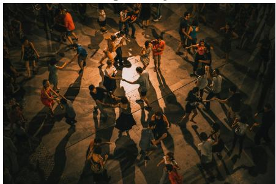
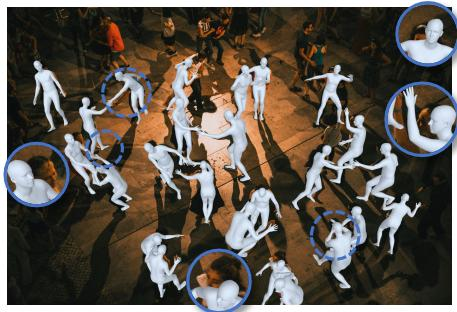
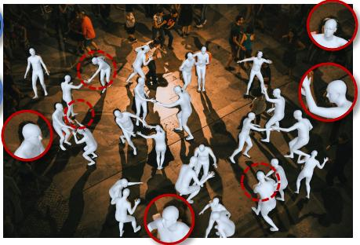
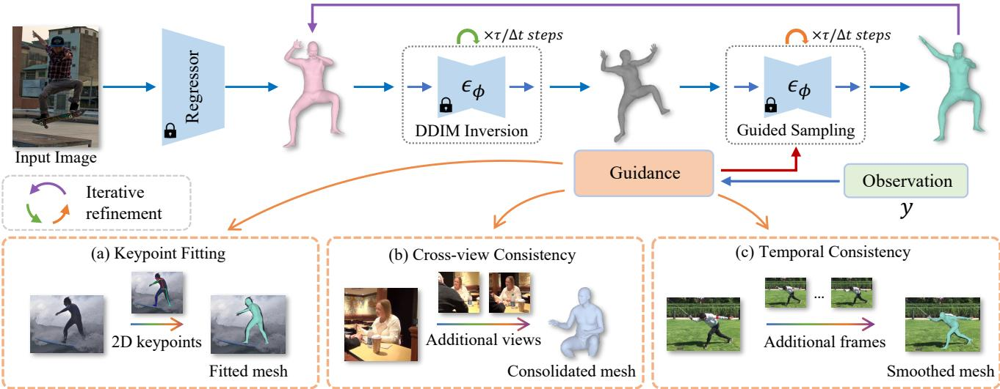
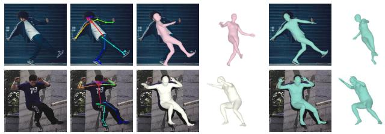
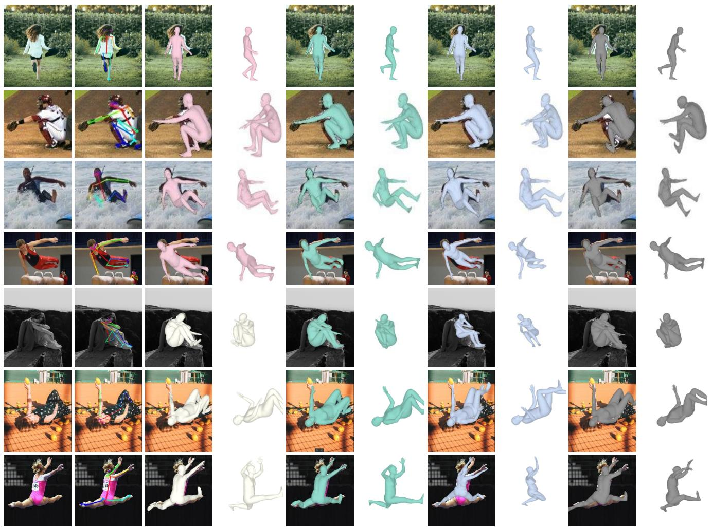

# Score-Guided Diffusion for 3D Human Recovery

Anastasis Stathopoulos Rutgers University

Ligong Han Rutgers University

  
Dimitris Metaxas Rutgers University

  
SOTA Method + Our Refinement

  
Figure 1. Although achieving remarkable 3D human reconstructions, a recent state-of-the-art monocular regression approach [13] may encounter challenges in aligning the human body model to the image (middle image). To address this, we propose an iterative refinement approach that utilizes image observations (e.g., 2D keypoint detections) and achieves better image-model alignment (right image).

## Abstract

We present Score-Guided Human Mesh Recovery (ScoreHMR), an approachfor solving inverse problemsfor 3D human pose and shape reconstruction. These inverse problems involve fitting a human body model to image observations, traditionally solved through optimization techniques. ScoreHMR mimics model fitting approaches, but alignment with the image observation is achieved through score guidance in the latent space of a diffusion model. The diffusion model is trained to capture the conditional distribution of the human model parameters given an input image. By guiding its denoising process with a taskspecific score, ScoreHMR effectively solves inverse problems for various applications without the need for retraining the task-agnostic diffusion model. We evaluate our approach on three settings/applications. These are: (i) singleframe model fitting; (ii) reconstruction from multiple uncalibrated views; (iii) reconstructing humans in video sequences. ScoreHMR consistently outperforms all optimization baselines on popular benchmarks across all settings. We make our code and models available on the project website: https://statho.github.io/ScoreHMR.

## 1. Introduction

Approaches for recovering the 3D human pose and shape from 2D evidence (e.g., image, 2D keypoints) typically predict the parameters of a human body model, such as SMPL [38], and solve the problem with regression [12, 13, 20, 25, 62] or optimization [2, 29, 40, 60]. The traditional approach estimates the model parameters by iteratively fitting the model to 2D measurements using hand crafted objectives and energy minimization techniques [2]. However, this optimization process contains multiple local minima, is sensitive to the choice of initialization and typically slow. To avoid those drawbacks, regression methods train a neural network to predict the human model parameters directly from images. But no existing feed-forward system achieves both accurate 3D reconstruction and imagemodel alignment, especially in the monocular setting. A synergy between the regression and optimization paradigms has been established [19, 26, 28], where the regression estimate is further refined through optimization given additional observations (e.g., 2D keypoint detections). However, even in that case the optimization remains challenging, riddled with multiple local minima, while several prior terms are necessary to obtain a meaningful solution.

Diffusion models [17, 50] have recently gained a lot of attention for their ability to capture complex data distributions [10, 43]. These models learn the implicit prior of the underlying data distribution x by matching the gradient of the log density $\nabla _ { \mathbf x }$ log p(x) [50], also known as the score function. This learned prior can be utilized when solving inverse problems that aim to recover x from the observations y by incorporating the gradient of the log likelihood $\nabla _ { \mathbf { x } } \log p ( \mathbf { y } | \mathbf { x } )$ , a.k.a score guidance term, during sampling/denoising. The denoising process in diffusion models, characterized by its iterative nature, presents these models as a data-driven substitute for the iterative minimization employed in optimization-based techniques. Thus far, diffusion models have primarily been utilized in the generation of human motions based on text descriptions [41, 52, 61], rather than being harnessed as a tool for addressing inverse problems in 3D human recovery applications.

In this paper, we address this gap by leveraging diffusion models to solve inverse problems related to Human Mesh Recovery (HMR). We introduce Score-Guided Human Mesh Recovery (ScoreHMR), an approach designed to refine initial, per-frame 3D estimates obtained from off-theshelf-regression networks [13, 20, 25, 26] based on additional observations. Our approach uses a diffusion model as a learned prior of a human body model (e.g., SMPL) parameters and guides its denoising process with a guidance term that aligns the human model with the available observation. The diffusion model, task-agnostic in nature, is trained on the generic task of capturing the distribution of plausible SMPL parameters conditioned on an input image. Given an initial regression estimate, we invert it to the corresponding latent of the diffusion model through DDIM [48] inversion. Then we perform deterministic DDIM sampling with guidance, where this guidance term acts as the data term in a standard optimization setting, and the diffusion model serves as a learned parametric prior. The DDIM inversion – DDIM guided sampling loop iterates until the body model aligns with the available observation. ScoreHMR can be conceptualized as a data-driven iterative fitting approach, achieving alignment with image observations through score guidance in the latent space of the diffusion model.

The diffusion model can be used in many downstream applications without any need for task-specific retraining. For instance, by incorporating guidance with a keypoint reprojection term, we align the human body model with 2D keypoint detections. In scenarios with multiple uncalibrated views of a person, we employ cross-view consistency guidance to recover a 3D human mesh that maintains consistency across all viewpoints. Furthermore, in the context of inferring human motion from a video sequence, temporal consistency guidance, and optionally keypoint reprojection guidance, refines per-frame regression estimates, resulting in temporally consistent human motions. A visual summary of ScoreHMR and its applications is provided in Figure 2.

We contribute ScoreHMR, a novel approach addressing inverse problems in 3D human recovery. We demonstrate the effectiveness of ScoreHMR with extensive experiments on the three inverse problems, refining an initial regression estimate with monocular images, multi-view images and video frames as input. Notably, our method surpasses existing optimization approaches across all datasets and evaluation settings without relying on task-specific designs or training. Beyond achieving superior results, ScoreHMR stands out as the only approach enhancing the 3D pose performance of the state-of-the-art monocular feed-forward system [13] in the single-frame model fitting setting. We make our code and models available to support future work. We provide qualitative results on video sequences on the project page.

## 2. Related Work

Regression for human mesh recovery. When learning to recover the 3D shape of articulated objects [51, 56, 59], most approaches have to simultaneously learn a representation for the shape. This is not the case for the human category, since parametric models [38, 58] of the human body exist, and most approaches in this paradigm learn to regress their parameters. HMR [20] uses MLP layers on top of image features from a CNN to regress the SMPL model [38] parameters and is the canonical example in this category. Subsequent research [11, 12, 14, 25, 31, 32, 34, 55, 62] has led to many improvements in the original method. Notably, PyMAF [62] proposes a more specialized design for the CNN backbone and incorporates a mesh alignment module for SMPL parameter regression. PARE [25] learns distinct features for the pose and shape parameters of SMPL and introduces a body-part-guided attention mechanism to handle occlusions. Recently, HMR 2.0 [13] proposes a fully “transformerized” version of HMR and can effectively reconstruct unusual poses that have been difficult for previous methods. Another line of work [5, 27, 35, 36], makes nonparametric predictions by directly regressing the vertices of the SMPL model. The SMPL parameters can be regressed from non-parametric predictions with an MLP without any loss in reconstruction performance [27]. In this work, we assume that an initial estimate in the form of SMPL parameters from a regression network is available and our goal is to improve it with our proposed approach.

Optimization for human mesh recovery. Methods falling under this category [2, 29, 40, 47, 57, 60] utilize iterative optimization to estimate the parameters of a human model [38, 40, 58]. The objective is often formulated as an energy minimization problem by fitting a parametric model to the available observations, and consists of data and prior terms. The data terms measure the deviation between the estimated and detected features, while the prior terms impose constraints on the model parameters. Parametric priors are important during the optimization in order to obtain a meaningful solution, and several works have proposed a variety of them [2, 9, 28, 40, 42, 53].

Nonetheless, optimization suffers from many difficulties, including sensitivity to parameter initialization, the existence of multiple local minima and the trade-off between the data and prior terms. Regression methods often serve as an initial point for an optimization-based method, which refines the estimated parameters until a convergence criterion is met [19, 26, 28]. This practice not only makes the optimization converge faster, but also typically results in a better solution since a lot of local minima are avoided. The need for multi-stage optimization procedures, as followed by early systems (e.g., SMPLify [2]), is also alleviated since the regressed parameters are typically close to a good solution. We evaluate our proposed approach in this setting, where our aim is to refine an initial regression estimate.

Repeat until aligned with observations  
  
Figure 2. Score-Guided Human Mesh Recovery and its applications. Top row: Overview of ScoreHMR, which iteratively refines an initial regression estimate in a DDIM inversion – DDIM guided sampling loop until the human body model aligns with the available observation. Bottom row: Applications. (a): Body model fitting to 2D keypoints. (b): Multi-view refinement of individual per-frame predictions with cross-view consistency guidance. (c): Recovering temporally consistent and smooth 3D human motion from a video sequence given initial per-frame estimates.

Solving inverse problems with diffusion models. Diffusion models [17, 46, 50] are used to represent complex distributions, exhibiting remarkable success in various applications such as text-to-image generation [43, 45], personalization [15, 44], image editing [16] and video inpainting [63]. Their state-of-the-art performance in image generation [10] has led to their usage as structural priors when solving inverse problems in image processing applications, such as image inpainting [7, 8, 49], super-resolution [49], deblurring [8] and colorization [7] among others. Diffusion models have not been used to solve inverse problems in the context of 3D human pose and shape estimation, and our work aims to bridge this gap.

## 3. Background

Diffusion models. We first offer some background for diffusion models, namely the denoising diffusion probabilistic model (DDPM) [17] formulation. Let $\mathbf { x } _ { 0 } \sim p _ { d a t a } ( \mathbf { x } )$ denote samples from the data distribution. Diffusion models progressively perturb data to noise – forward process – via Gaussian kernels for $T$ timesteps, creating latents $\{ { \bf x } _ { t } \} _ { t = 1 } ^ { T }$ The noise is added with a predefined variance schedule $\{ \zeta _ { t } \} _ { t = 1 } ^ { T }$ , such that we obtain a standard Gaussian distribution when $t = T , i . e . \ \mathbf { x } _ { T } \sim \mathcal { N } ( \mathbf { 0 } , \mathbf { I } )$ . Latents $\mathbf { x } _ { t }$ can be directly sampled from a data point x0 as $q ( \mathbf { x } _ { t } | \mathbf { x } _ { 0 } ) =$ $\mathcal { N } ( \sqrt { \alpha _ { t } } \mathbf { x } _ { 0 } , ( 1 - \alpha _ { t } ) \mathbf { I } )$ , where $\begin{array} { r } { \alpha _ { t } : = \prod _ { s = 1 } ^ { t } ( 1 - \zeta _ { s } ) } \end{array}$ ). A denoising model $\epsilon _ { \phi }$ is trained to predict the added noise to a clean sample via minimization of the following re-weighted evidence lower bound [17, 23]:

$$
\begin{array} { r } { \mathcal { L } _ { s i m p l e } ( \phi ) = \mathbb { E } _ { \mathbf { x } _ { 0 } , t , \epsilon } | | \epsilon _ { \phi } ( \mathbf { x } _ { t } , t ) - \epsilon | | ^ { 2 } , } \end{array}\tag{1}
$$

where t is sampled uniformly from $\{ 1 , . . , T \}$ , and noise ϵ is added to a clean sample $\mathbf { x } _ { 0 } \sim p _ { d a t a }$ to get a noisy sample $\mathbf { x } _ { t }$ . Once the denoising model $\epsilon _ { \phi }$ is learned, we can use it to generate samples from the diffusion model by sampling $\mathbf { x } _ { T } \sim \mathcal { N } ( \mathbf { 0 } , \mathbf { I } )$ and iteratively refining it with $\epsilon _ { \phi }$ . The predicted noise for a latent $\mathbf { x } _ { t }$ at timestep t (noise level) from the denoising model $\epsilon _ { \phi }$ is related to the score of the model at that timestep [50]:

$$
\begin{array} { r } { \epsilon _ { \phi } ( \mathbf x _ { t } , t ) = - \sqrt { 1 - \alpha _ { t } } \nabla _ { \mathbf x _ { t } } \log p ( \mathbf x _ { t } ) . } \end{array}\tag{2}
$$

Since the sampling process – reverse process – of the DDPM formulation is known to be slow [17, 48], Song et al. [48] proposed the denoising diffusion implicit model (DDIM) formulation for diffusion models, which defines the diffusion process as a non-Markovian process with the same forward marginals as DDPM. This enables faster sampling with the sampling steps given by:

$$
\mathbf { x } _ { t - 1 } = \sqrt { \alpha _ { t - 1 } } \hat { \mathbf { x } } _ { 0 } ( \mathbf { x } _ { t } ) + \sqrt { 1 - \alpha _ { t - 1 } - \sigma _ { t } ^ { 2 } } \epsilon _ { \phi } ( \mathbf { x } _ { t } , t ) + \sigma _ { t } \mathbf { z } ,\tag{3}
$$

where $\mathbf { z } \sim \mathcal { N } ( \mathbf { 0 } , \mathbf { I } ) , \sigma _ { t }$ is the variance of the noise used during sampling, and $\hat { \mathbf { x } } _ { 0 } ( \mathbf { x } _ { t } )$ denotes the predicted $\mathbf { x } _ { \mathrm { 0 } }$ from $\mathbf { x } _ { t }$ and is given by:

$$
\begin{array} { l } { \hat { { \mathbf { x } } } _ { 0 } ( { \mathbf { x } } _ { t } ) = \displaystyle \frac { 1 } { \sqrt { \alpha _ { t } } } ( { \mathbf { x } } _ { t } - \sqrt { 1 - \alpha _ { t } } \epsilon _ { \phi } ( { \mathbf { x } } _ { t } , t ) ) , } \\ { { \displaystyle \simeq \frac { 1 } { \sqrt { \alpha _ { t } } } ( { \mathbf { x } } _ { t } + ( 1 - \alpha _ { t } ) \nabla _ { { \mathbf { x } } _ { t } } \log p ( { \mathbf { x } } _ { t } ) ) . } } \end{array}\tag{4}
$$

By setting $\sigma _ { t }$ to $0 ,$ the sampling process becomes deterministic and enables inversion of samples from $p _ { d a t a }$ to their corresponding latents [48]. The same framework can be used for modeling conditional distributions, by incorporating the conditional information in the forward and reverse processes [10].

## 4. Method

Body model. SMPL [38] is a parametric human body model. It consists of pose $\theta \in \mathbb { R } ^ { 2 4 \times 3 }$ and shape $\beta \in \mathbb { R } ^ { 1 \bar { 0 } }$ parameters, and defines a mapping $\mathcal { M } ( \theta , \beta )$ from the human body parameters to a body mesh $\dot { M } \in \mathbb { R } ^ { N \times 3 }$ , where $N = 6 9 8 0$ is the number of mesh vertices. For a given output mesh M, the 3D body joints J can be computed as a linear combination of the mesh vertices $J = W M$ , where W is a pre-trained linear regressor.

Problem statement. Suppose we have observations ${ \textbf { y } } \in$ $\mathbb { R } ^ { n }$ that relate to some unknown signal $\mathbf { x } _ { 0 } \in \mathbb { R } ^ { m }$ through:

$$
\mathbf { y } = \mathcal { A } ( \mathbf { x } _ { 0 } ) + \eta ,\tag{5}
$$

where $\boldsymbol { \mathcal { A } } ( \cdot )$ is a forward operator and η is the observation noise. Our goal is to recover $\mathbf { x } _ { \mathrm { 0 } }$ from y, i.e. solve the inverse problem. We are interested in recovering the SMPL parameters $\mathbf { x } _ { 0 } ~ = ~ \{ \theta _ { 0 } , \beta _ { 0 } \}$ from observations y (e.g., 2D keypoint detections), from which the closed-form map to $\mathbf { x } _ { \mathrm { 0 } }$ is intractable. Solutions to this family of problems are given through iterative optimization by minimization:

$$
\underset { { \bf x } _ { 0 } } { \arg \operatorname* { m i n } } = \mathcal { L } _ { d a t a } ( { \bf x } _ { 0 } ) + \mathcal { L } _ { p r i o r } ( { \bf x } _ { 0 } ) ,\tag{6}
$$

where $\mathcal { L } _ { d a t a }$ measures the deviation between the estimated and detected features and L consists of several prior terms necessary to obtain a plausible solution.

In our setting, we are given an input image I of a person and the corresponding SMPL estimate $\mathbf { x } _ { r e g } = \{ \theta _ { r e g } , \beta _ { r e g } \}$ from regression. Our goal is to improve ${ \bf x } _ { r e g }$ in the presence of additional observations y. In order to achieve this we propose an approach that injects suitable information in the denoising process of a diffusion model through the log likelihood score, as described next.

## 4.1. Score-Guided Human Mesh Recovery

Our main objective is to explore how we can leverage diffusion models to solve inverse problems for human mesh recovery applications. Here, we assume that an initial estimate ${ \bf x } _ { r e g }$ for the SMPL parameters is acquired through any off-the-shelf regression network such as [13, 20, 26], while observations y are also automatically detected. Furthermore, we assume that we have access to a trained diffusion model $\epsilon _ { \phi } ( \mathbf { x } _ { t } , t , I )$ that sufficiently captures the conditional distribution of SMPL model parameters given an input image I. Our goal is to improve ${ \bf x } _ { r e g }$ with the help of the diffusion model and detected observations y.

To use the regression estimate $\mathbf { x } _ { r e g }$ as an initial point, we invert it to the latent xτ at noise level τ with the deterministic DDIM inversion process:

$$
\mathbf { x } _ { t + 1 } = \sqrt { \alpha _ { t + 1 } } \hat { \mathbf { x } } _ { 0 } ( \mathbf { x } _ { t } ) + \sqrt { 1 - \alpha _ { t + 1 } } \epsilon _ { \phi } ( \mathbf { x } _ { t } , t , I ) .\tag{7}
$$

Running the deterministic DDIM sampling starting from $\mathbf { x } _ { \tau }$ , we would get back the initial estimate ${ \bf x } _ { r e g }$ . We found that this reconstruction error is less than $1 0 ^ { - 3 }$ per dimension, which suggests that the DDIM inversion – DDIM sampling loop works as intended. However, we are not interested in getting back the initial regression estimate, but we wish to improve it based on the available observation y.

Ideally, we would like to use the conditional score $\nabla _ { \mathbf { x } _ { t } } \log p ( \mathbf { x } _ { t } | I , \mathbf { y } )$ during DDIM sampling instead of the score $\nabla _ { \mathbf { x } _ { t } } \log p ( \mathbf { x } _ { t } | I )$ of the data distribution. Using Bayes rule we can write the score $\nabla _ { \mathbf { x } _ { t } } \log p ( \mathbf { x } _ { t } | I , \mathbf { y } ) \ =$ $\nabla _ { \mathbf { x } _ { t } } \log p ( \mathbf { x } _ { t } | I ) + \nabla _ { \mathbf { x } _ { t } } \log p ( \mathbf { y } | I , \mathbf { x } _ { t } )$ , where the first term is the score of the diffusion model $\epsilon _ { \phi } ( \mathbf { x } _ { t } , t , I )$ . However, the issue with this posterior sampling approach is that there does not exist an analytical formulation for the likelihood score $\nabla _ { \mathbf { x } _ { t } } \log p ( \mathbf { y } | I , \mathbf { x } _ { t } )$ . To resolve this, a recent line of work estimates the likelihood under some mild assumptions [8, 49]. Inspired by [8], by assuming that the observation noise η in Eq. (5) is Gaussian, we get:

$$
\begin{array} { r l } & { \nabla _ { \mathbf x _ { t } } \log p ( \mathbf y | I , \mathbf x _ { t } ) \simeq \nabla _ { \mathbf x _ { t } } \log p ( \mathbf y | I , \hat { \mathbf x } _ { 0 } ( \mathbf x _ { t } ) ) } \\ & { \qquad = - \rho \nabla _ { \mathbf x _ { t } } \vert \vert \mathbf y - \boldsymbol { \mathcal A } ( \hat { \mathbf x } _ { 0 } ( \mathbf x _ { t } ) ) \vert \vert _ { 2 } ^ { 2 } , } \end{array}\tag{8}
$$

where $\rho$ can be viewed as a tunable step size. Approximating the likelihood score with Eq. (8), we apply guidance to the deterministic DDIM sampling process, with the sampling equations seen below:

$$
\begin{array} { r l r } {  { \hat { \mathbf { x } } _ { 0 } ^ { ' } ( \mathbf { x } _ { t } ) = \frac { 1 } { \sqrt { \alpha _ { t } } } ( \mathbf { x } _ { t } - \sqrt { 1 - \alpha _ { t } } \epsilon _ { \phi } ^ { ' } ( \mathbf { x } _ { t } , t , I ) ) , } } \\ & { } & { \mathbf { x } _ { t - 1 } = \sqrt { \alpha _ { t - 1 } } \hat { \mathbf { x } } _ { 0 } ^ { ' } ( \mathbf { x } _ { t } ) + \sqrt { 1 - \alpha _ { t - 1 } } \epsilon _ { \phi } ^ { ' } ( \mathbf { x } _ { t } , t , I ) . } \end{array}\tag{9}
$$

where $\epsilon _ { \phi } ^ { ' }$ is the modified noise prediction after guidance:

$$
\epsilon _ { \phi } ^ { ' } = \epsilon _ { \phi } ( \mathbf { x } _ { t } , t , I ) + \rho \sqrt { 1 - \alpha _ { t } } \nabla _ { \mathbf { x } _ { t } } | | \mathbf { y } - \mathcal { A } ( \hat { \mathbf { x } } _ { 0 } ( \mathbf { x } _ { t } ) ) | | _ { 2 } ^ { 2 } .\tag{10}
$$

We use DDIM inversion (Eq. (7)) followed by guided DDIM sampling (Eqs. (9) and (10)) in a loop, aligning the human body model with the detected observations. The loop stops when the relative change of the guidance loss $\mathcal { L } _ { g } = | | \mathbf { y } - \mathcal { A } ( \hat { \mathbf { x } } _ { 0 } ( \mathbf { x } _ { t } ) ) | | _ { 2 } ^ { 2 }$ is below a given threshold $\lambda _ { t h r }$ We provide a pseudo-code implementation of ScoreHMR in the supplemental.

## 4.2. Model Design and Training

Without loss of generality, we choose to model only the pose SMPL parameters with our diffusion model, i.e. $\mathbf { x } _ { 0 } \ = \ \theta _ { : }$ , to maintain a fair comparison with optimization methods utilizing a learned pose prior $( e . g .$ , ProHMR [28]). We emphasize that the shape parameters $\beta$ of SMPL can also be accommodated using the same approach and we present results from such experiments in the supplemental. However, we do not notice any performance improvement by including the SMPL $\beta$ in ScoreHMR. One plausible explanation is that inferring $\beta$ from a single image is relatively more straightforward compared to inferring θ for existing methods [13, 20, 26].

In our setting, we are given an input image I of a person, which we encode with a CNN backbone $g$ and obtain a context feature $\mathrm { ~ \bf ~ c ~ } = \mathrm { ~ \bf ~ g ( } I )$ . We model the distribution of plausible poses for that person conditioned on I with a diffusion model $\epsilon _ { \phi } ( \mathbf { x } _ { t } , t , c ~ = ~ g ( I ) )$ The backbone $g$ can be either trained end-to-end with $\epsilon _ { \phi }$ or remain frozen while training the diffusion model. In the latter case, we can use the features from the backbone of a regression network [20, 25, 26, 28]. We did not observe any performance improvement from training $g$ end-to-end with $\epsilon _ { \phi } ,$ , and therefore, we acquire the context feature c from a pretrained regression network in all of our experiments.

Architecture. We follow [64] and use the 6D representation for 3D rotations, thus $\mathbf { x } _ { \mathrm { 0 } }$ is a 144-dimensional vector. The denoising model $\epsilon _ { \phi }$ is comprised of 3 MLP blocks that are conditioned on the timestep t and image features c. The model is given a noisy sample $\mathbf { x } _ { t }$ for the pose parameters, the timestep t and image features c as input. First, we use a linear layer to project $\mathbf { x } _ { t }$ to the features $\mathbf { \bar { h } } ^ { ( 1 ) }$ given as input to the first MLP block. We condition the input features $\mathbf { h } ^ { ( i ) } \in \mathbb { R } ^ { 1 4 4 }$ of each MLP block on the timestep $t ,$ by applying scaling and shifting to get the features $\mathbf { h } _ { t } ^ { ( i ) } =$ $\mathbf { t } _ { s } \mathbf { h } ^ { ( i ) } + \mathbf { t } _ { b }$ , where $( \mathbf { t } _ { s } , \mathbf { t } _ { b } ) \ \in \ \mathbb { R } ^ { 2 \times 1 4 4 } \ = \ M L P ( \psi ( t ) )$ is the output of a MLP with a sinusoidal encoding function $\psi .$ Then, we condition each MLP block on the image features by concatenating $\mathbf { h } _ { t } ^ { ( i ) }$ and c. Additional details are provided in the supplemental.

Training. Let us assume that we have a collection of images paired with SMPL pose annotations. Then, we could train the diffusion model with its standard training loss:

$$
\mathcal { L } _ { D M } ( \phi ) = \mathbb { E } _ { ( I , \mathbf { x } _ { 0 } ) , t , \epsilon } | | \epsilon _ { \phi } ( \mathbf { x } _ { t } , t , I ) - \epsilon | | ^ { 2 } .\tag{11}
$$

Unfortunately, such paired annotations are not generally available, so we use pseudo ground-truth SMPL pose annotations from various datasets (see Sec. 5).

## 4.3. Applications of ScoreHMR

In this part we show how we can use our approach for solving HMR-related inverse problems. We highlight that for all these applications we use the same trained diffusion model with no per-task training.

Body model fitting. In this setting the detected image observations are 2D keypoints detections $\mathbf { y } _ { k p }$ and their confidences $\mathbf { y } _ { c o n f }$ Optimization approaches fit the SMPL body model to the 2D keypoints by minimizing $\lambda _ { J } E _ { J } +$ $\lambda _ { p r i o r } E _ { p r i o r } .$ , where $E _ { J }$ penalizes the deviations between the projected model joints and the detected joints and $E _ { p r i o r }$ include prior energy terms for the pose and shape parameters of SMPL.

Typically the predicted weak-perspective camera from a regression network is converted to a perspective camera $\pi = ( R , \gamma )$ based on the bounding box of a person and is also included as a variable to be optimized. The camera π has fixed focal length and intrinsics $K .$ . Since the parameters θ already include a global orientation, $R \in \mathbb { R } ^ { 3 \times 3 }$ is assumed to be identity and only the camera translation $\gamma \in \mathbb { R } ^ { 3 }$ is optimized along with the human body model parameters.

In this setting, the forward operator that relates the body model parameters with the detected joints is $\Pi _ { K } ( W \mathcal { M } ( \mathbf { x } _ { 0 } , \beta ) + \gamma )$ , where $\Pi _ { K }$ is the projection matrix with camera intrinsics $K$ and $W$ is a matrix that regresses the 3D model joints from the mesh vertices of the model. This means that the guidance loss in Eq. (10) becomes:

$$
\mathcal { L } _ { r e p r } = { \bf y } _ { c o n f } | | \Pi _ { K } ( W \mathcal { M } ( \hat { \bf x } _ { 0 } ( { \bf x } _ { t } ) , \beta ) + \gamma ) - { \bf y } _ { k p } | | _ { 2 } ^ { 2 } .\tag{12}
$$

The camera translation $\gamma$ is also optimized with $\mathcal { L } _ { \boldsymbol { r } \boldsymbol { e p r } }$ as in standard optimization procedures.

Multi-view refinement. In this setting we have a set $\{ I ^ { ( n ) } \} _ { n = 1 } ^ { N }$ of uncalibrated views of the same person, and their monocular regression estimate that we want to improve based on information from the other views. For each frame, we decompose the pose parameters $\mathbf { x } _ { 0 } ^ { ( n ) }$ to global orientation $\mathbf { x } _ { 0 , g l } ^ { ( n ) }$ and body pose parameters $\mathbf { x } _ { 0 , b } ^ { ( n ) }$ . We can consolidate all single-frame predictions to improve $\mathbf { x } _ { 0 , b } ^ { ( n ) }$ with a cross-view consistency guidance loss:

$$
\mathcal { L } _ { M V } = \sum _ { n = 1 } ^ { N } | | \hat { \mathbf { x } } _ { 0 , b } ^ { ( n ) } ( \mathbf { x } _ { t } ^ { ( n ) } ) - \bar { \mathbf { x } } _ { 0 , b } | | _ { 2 } ^ { 2 } ,\tag{13}
$$

where $\begin{array} { r } { \bar { \mathbf { x } } _ { 0 , b } ~ = ~ \frac { 1 } { N } \sum _ { n } ^ { N } \mathbf { x } _ { 0 , b } ^ { ( n ) } ( \mathbf { x } _ { t } ^ { ( n ) } ) } \end{array}$ and its minimization is equivalent to minimizing the squared distance between all pairs of body poses.

Human motion refinement. Although our model has been trained in the monocular setting, we can use the learned conditional distribution to obtain temporally consistent and smooth predictions in a video sequence $\dot { V } = \{ I ^ { ( n ) } \} _ { n = 1 } ^ { N } .$ In this setting, the forward operator is the identity function and the observations are the pose predictions of the previous frame in the sequence. We can enforce temporal consistency with the following guidance loss:

$$
\mathcal { L } _ { t e m p } = \sum _ { n = 2 } ^ { N } | | \hat { \mathbf { x } } _ { 0 } ^ { ( n ) } ( \mathbf { x } _ { t } ) - \hat { \mathbf { x } } _ { 0 } ^ { ( n - 1 ) } ( \mathbf { x } _ { t } ) | | _ { 2 } ^ { 2 } .\tag{14}
$$

Guidance with the previous loss can be considered as a learnable smoothing operation that makes sure that the smoothed parameters remain consistent with the image evidence under the image-conditional distribution captured by the diffusion model. We can optionally use additional guidance with the keypoint reprojection loss in Eq. (12) when 2D keypoint detections are available.

## 5. Experiments

Training. We use the typical datasets for training, i.e., Human3.6M [18], MPI-INF-3DHP [39], COCO [37] and MPII [1]. The quality of the pseudo ground-truth pose annotations plays an important role for training the diffusion model. We compare two models trained with pseudo ground-truth from SPIN [26] and EFT [19] respectively. To showcase that ScoreHMR can work with image features from various HMR models, we also train two different versions of $\epsilon _ { \phi }$ with image features from ProHMR [28] and PARE [25] respectively. When training with PARE features, we only use its pose features. Implementation details and hyper-parameters are provided in the supplemental.

Evaluation datasets. For the body model fitting to 2D keypoints and human motion refinement settings, we conduct evaluation on the test set of 3DPW [54] and on the split of EMDB [22] that contains the most challenging sequences (i.e., EMDB 1). For the multi-view refinement experiment, we report results on Human3.6M [18] and Mannequin Challenge [33]. For Mannequin Challenge we use the annotations produced by Leroy et al. [30] and employ the entire dataset for evaluation.

Evaluation setup. In order to demonstrate the efficacy of our approach in refining the regression estimates from various networks and accuracy levels, we use the predictions from the less accurate ProHMR’s regression network [28] and the highly accurate HMR 2.0 [13] as our starting points. For experiments with HMR 2.0, we use the HMR 2.0b model, which trains longer and on more data than HMR 2.0a, and can reconstruct humans in challenging and unusual poses.

## 5.1. Quantitative Evaluation

## 5.1.1 Body model fitting

We evaluate the accuracy of methods that fit the SMPL body model to 2D keypoint detections. The keypoints are detected with OpenPose [3].

<table><tr><td></td><td>Features</td><td>Fits</td><td>3DPW (14)</td><td>EMDB 1 (24)</td></tr><tr><td>ProHMR [28]</td><td></td><td></td><td>59.8</td><td>86.1</td></tr><tr><td>+ ScoreHMR</td><td>ProHMR</td><td>SPIN</td><td>55.7</td><td>77.8</td></tr><tr><td>+ ScoreHMR</td><td>ProHMR</td><td>EFT</td><td>55.5</td><td>77.4</td></tr><tr><td>+ ScoreHMR</td><td>PARE</td><td>SPIN</td><td>55.6</td><td>77.4</td></tr><tr><td>+ ScoreHMR</td><td>PARE</td><td>EFT</td><td>54.7</td><td>77.1</td></tr><tr><td>HMR 2.0 [13]</td><td></td><td></td><td>54.3</td><td>78.7</td></tr><tr><td>+ ScoreHMR</td><td>ProHMR</td><td>SPIN</td><td>52.4</td><td>76.5</td></tr><tr><td>+ ScoreHMR</td><td>ProHMR</td><td>EFT</td><td>51.3</td><td>76.4</td></tr><tr><td>+ ScoreHMR</td><td>PARE</td><td>SPIN</td><td>52.4</td><td>76.6</td></tr><tr><td>+ ScoreHMR</td><td>PARE</td><td>EFT</td><td>51.1</td><td>76.6</td></tr></table>

Table 1. Ablation study. ScoreHMR is initialized by the corresponding regression results. All numbers are PA-MPJPE in mm. Parenthesis denotes the number of body joints used to compute PA-MPJPE.

<table><tr><td></td><td>3DPW (14)</td><td>EMDB 1 (24)</td></tr><tr><td>LGD [47] LFMM [6]</td><td>55.9</td><td>81.1</td></tr><tr><td></td><td>52.2</td><td>86.1</td></tr><tr><td>ProHMR [28] + SMPLify [2]</td><td>59.8 60.9</td><td>84.6</td></tr><tr><td>+ fitting [28]</td><td>55.1</td><td>79.8</td></tr><tr><td>+ ScoreHMR-a</td><td>55.7</td><td>77.8</td></tr><tr><td>+ ScoreHMR-b</td><td>54.7</td><td>77.1</td></tr><tr><td></td><td></td><td></td></tr><tr><td>HMR 2.0 [13]</td><td>54.3</td><td>78.7</td></tr><tr><td>+ SMPLify [2]</td><td>60.1</td><td>83.5</td></tr><tr><td>+ fitting [28]</td><td>55.1</td><td>80.1</td></tr><tr><td>+ ScoreHMR-a</td><td>52.4</td><td>76.5</td></tr><tr><td>+ ScoreHMR-b</td><td>51.1</td><td>76.6</td></tr></table>

Table 2. Evaluation of different model fitting methods. The fitting algorithms are initialized by the corresponding regression results, except LGD [47] and LFMM [6]. All numbers are PA-MPJPE in mm. Parenthesis denotes the number of body joints used to compute PA-MPJPE.

Ablation study. First, we provide an ablation study of the core components of ScoreHMR. We benchmark ScoreHMR with diffusion models trained with frozen image features from ProHMR [28] and PARE [25], and pseudo groundtruth pose annotations from SPIN [26] and EFT [19]. We report results of iterative refinement with ScoreHMR using the keypoint reprojection loss $\mathcal { L } _ { \boldsymbol { r } \boldsymbol { e p r } }$ in Eq. (12). Following the typical protocols of prior work [26, 28] we use the PA-MPJPE metric for evaluation and present results in Table 1. From Table 1 we observe that running ScoreHMR on top of regression reduces the 3D pose errors in all cases. We also observe that iterative refinement with ScoreHMR is robust to the choice of image features and pseudo groundtruth. The diffusion model, trained with PARE image features and fits from EFT, attains the highest performance. We use ScoreHMR with our worst (ProHMR features & SPIN fits) and best (PARE features & EFT fits) models for evaluation in the rest of the paper, denoting them as ScoreHMR-a and ScoreHMR-b respectively.

<table><tr><td></td><td colspan="2">H36M (14)</td><td colspan="2">Mannequin (17)</td></tr><tr><td></td><td>MPJPE↓</td><td>PA-MPJPE↓</td><td>MPJPE↓</td><td>PA-MPJPE↓</td></tr><tr><td>ProHMR [28]</td><td>65.1</td><td>43.7</td><td>165.3</td><td>86.8</td></tr><tr><td>+ fitting [28]</td><td>59.6</td><td>34.5</td><td>162.6</td><td>80.2</td></tr><tr><td>+ ScoreHMR-a</td><td>55.8</td><td>34.1</td><td>162.0</td><td>81.1</td></tr><tr><td>+ ScoreHMR-b</td><td>51.9</td><td>34.2</td><td>157.7</td><td>80.2</td></tr><tr><td>HMR 2.0 [13]</td><td>52.8</td><td>35.6</td><td>156.0</td><td>90.1</td></tr><tr><td>+ fitting [28]</td><td>52.6</td><td>32.9</td><td>155.5</td><td>79.4</td></tr><tr><td>+ ScoreHMR-a</td><td>47.9</td><td>28.4</td><td>151.0</td><td>79.3</td></tr><tr><td>+ ScoreHMR-b</td><td>44.7</td><td>29.0</td><td>148.3</td><td>79.1</td></tr></table>

Table 3. Evaluation of multi-view refinement. We compare our proposed approach with the single-view 3D reconstruction and an optimization-based method [28]. Parenthesis denotes the number of body joints used to compute MPJPE and PA-MPJPE.

Comparison with optimization methods. Next, we compare with model fitting baselines that are trained to optimize starting from the canonical pose and shape (i.e., LGD [47], LFMM [6]) as well as with baselines that can use the parameters from a regression network as a starting point (i.e., SM-PLify [2], ProHMR-fitting [28]). We benchmark SMPLify (single-stage implementation from [26]) and ProHMRfitting starting from the predictions of the ProHMR’s regression network [28] and those of HMR 2.0 [13]. Results are reported in Table 2. Performing SMPLify on top of regression increases the 3D pose errors, while ProHMR-fitting fails to improve the performance of HMR 2.0. Iterative refinement with ScoreHMR reduces the 3D pose errors in all cases, and ScoreHMR-b outperforms all baselines.

## 5.1.2 Multi-view refinement

Next, we evaluate the capability of ScoreHMR at refining the per-view regression estimates when several uncalibrated views of the same person are available. For this task, we use guidance with the cross-view consistency loss ${ \mathcal { L } } _ { M V }$ in Eq. (13). We test our approach on the Human3.6M [18] and the Mannequin Challenge [33] (some YouTube videos were missing) datasets, reporting MPJPE and PA-MPJPE following [28]. We compare with the individual per-view regression predictions as well as with an optimization-based method [28]. Results are shown in Table 3. Results from Table 3 show that both ScoreHMR and ProHMR-fitting improve the per-frame predictions, but our approach consistently leads to lower MPJPE errors. This happens because refining the body poses at a given noise level also influences the global orientation in the next noise level of the diffusion model, as the model captures the joint distribution of SMPL poses θ. This is not possible with ProHMR-fitting, since only the body poses are updated during the optimization process. Notably, the runtime of ScoreHMR is remarkably swift, requiring only 1.5 minutes for the entire Mannequin Challenge dataset, which contains 20K frames.

<table><tr><td></td><td colspan="2">3DPW (14)</td><td colspan="2">EMDB 1 (24)</td></tr><tr><td></td><td>PA-MPJPE↓</td><td>Acc Err ↓</td><td>PA-MPJPE↓</td><td>Acc Err↓</td></tr><tr><td>Vibe [24]</td><td>56.7</td><td>31.5</td><td>85.7</td><td>43.8</td></tr><tr><td>Vibe-opt [24]</td><td>63.9</td><td>42.1</td><td>83.6</td><td>41.4</td></tr><tr><td>ProHMR [28]</td><td>59.8</td><td>25.0</td><td>86.1</td><td>37.7</td></tr><tr><td>+ fitting [28]</td><td>54.5</td><td>14.0</td><td>77.9</td><td>18.4</td></tr><tr><td>+ ScoreHMR-a</td><td>54.9</td><td>11.4</td><td>76.5</td><td>12.8</td></tr><tr><td>+ ScoreHMR-b</td><td>53.9</td><td>11.2</td><td>75.7</td><td>12.1</td></tr><tr><td>HMR 2.0 [13]</td><td>54.3</td><td>17.3</td><td>78.7</td><td>23.7</td></tr><tr><td>+ fitting [28]</td><td>53.8</td><td>14.1</td><td>76.2</td><td>20.0</td></tr><tr><td>+ ScoreHMR-a</td><td>51.7</td><td>10.7</td><td>75.1</td><td>11.9</td></tr><tr><td>+ ScoreHMR-b</td><td>50.5</td><td>11.1</td><td>75.3</td><td>11.9</td></tr></table>

Table 4. Evaluation of human motion refinement. We compare different model fitting algorithms and our proposed approach in a temporal setting. Parenthesis denotes the number of body joints used to compute PA-MPJPE and Acc Err.

  
Figure 3. Qualitative evaluation of ScoreHMR Pink: Regression with ProHMR [28]. White: Regression with HMR 2.0 [13]. Green: Regression + ScoreHMR (ours).

## 5.1.3 Human motion refinement

In this part, we evaluate ScoreHMR at refining the singleframe regression estimates in a video sequence with 2D keypoint detections. In this setting, we use guidance with $\mathcal { L } _ { \boldsymbol { r } \boldsymbol { e p r } }$ and $\mathcal { L } _ { t e m p }$ terms. Following prior work [21] we also report the acceleration error $( m m / s ^ { 2 } )$ , computed as the difference in acceleration between the ground-truth and predicted 3D joints. We use all SMPL body joints for computing this error in EMDB 1, in contrast to the evaluation in [22] that uses specific joints for some temporal metrics (e.g. Jitter).

We compare our approach with the temporal mesh optimization baselines (VIBE-opt [24], ProHMR-fitting [28]). VIBE-opt is initialized by the temporal mesh regression result of VIBE [24]. We run ProHMR-fitting [28] with the default hyperparameters adding a smoothness regularization term. We report results in Table 4. Our approach consistently outperforms all baselines across all datasets and metrics. Notably, ScoreHMR significantly enhances temporal consistency compared to prior works, resulting in a relative improvement of 21.3% (3DPW) and 40.5% (EMDB 1) in acceleration error compared to ProHMR-fitting, when both methods start from the monocular regression estimate of HMR 2.0. Finally, ScoreHMR exhibits exceptional runtime efficiency requiring only 14 minutes for the entire 3DPW test set, which contains 35K frames.

  
Figure 4. Body model fitting results. Pink: Regression (ProHMR [28]). White: Regression (HMR 2.0 [13]). Green: Regression + ScoreHMR (ours). Blue: Regression + ProHMR-fitting [28]. Grey: Regression + SMPLify [2].

## 5.2. Qualitative Results

We show qualitative results in body model fitting on top of ProHMR and HMR 2.0 regression in Figure 3. ScoreHMR effectively aligns the body model with the detected keypoints even when the initial regression estimate is inaccurate (e.g., example of first row). Our reconstructions are valid when seen from a novel view. In addition, we compare our approach with SMPLify and ProHMR-fitting in Figure 4. Our approach achieves more faithful reconstructions than the baselines. This is more evident in challenging poses (e.g., example of last row). SMPLify encounters challenges with inaccurate keypoint detections (e.g., example of second row). ProHMR-fitting faces difficulties when there is ambiguity in the image evidence (e.g., occlusion in the example of third row). A potential cause for this issue may be the mode supervision used during ProHMR training, which leads to capturing a less diverse pose distribution as shown in [4].

## 6. Conclusion

We present ScoreHMR, an approach for solving inverse problems for 3D human pose and shape reconstruction. ScoreHMR mirrors model fitting approaches, but alignment with the image observation is achieved through score guid ance in the latent space of a diffusion model. We demonstrate the effectiveness of our method with empirical results in several benchmarks and evaluation settings. ScoreHMR achieves strong performance in challenging datasets and outperforms optimization-based methods. Our work highlights the promising potential of score-guided diffusion processes as a better alternative to conventional optimizationbased approaches in addressing 3D human recovery inverse problems.

Acknowledgements: This research has been partially funded by research grants to D. Metaxas through NSF: 2310966, 2235405, 2212301, 2003874, and AFOSR-835531

## References

[1] Mykhaylo Andriluka, Leonid Pishchulin, Peter Gehler, and Bernt Schiele. 2d human pose estimation: New benchmark and state of the art analysis. In CVPR, 2014. 6

[2] Federica Bogo, Angjoo Kanazawa, Christoph Lassner, Peter Gehler, Javier Romero, and Michael J Black. Keep it smpl: Automatic estimation of 3d human pose and shape from a single image. In ECCV, 2016. 1, 2, 3, 6, 7, 8

[3] Zhe Cao, Gines Hidalgo, Tomas Simon, Shih-En Wei, and Yaser Sheikh. Openpose: Realtime multi-person 2d pose estimation using part affinity fields. IEEE TPAMI, 2019. 6

[4] Rongyu Chen, Linlin Yang, and Angela Yao. Mhentropy: Entropy meets multiple hypotheses for pose and shape recovery. In ICCV, 2023. 8

[5] Junhyeong Cho, Kim Youwang, and Tae-Hyun Oh. Crossattention of disentangled modalities for 3d human mesh recovery with transformers. In ECCV, 2022. 2

[6] Vasileios Choutas, Federica Bogo, Jingjing Shen, and Julien Valentin. Learning to fit morphable models. In ECCV, 2022. 6, 7

[7] Hyungjin Chung, Byeongsu Sim, Dohoon Ryu, and Jong Chul Ye. Improving diffusion models for inverse problems using manifold constraints. In NeurIPS, 2022. 3

[8] Hyungjin Chung, Jeongsol Kim, Michael T Mccann, Marc L Klasky, and Jong Chul Ye. Diffusion posterior sampling for general noisy inverse problems. In ICLR, 2023. 3, 4

[9] Andrey Davydov, Anastasia Remizova, Victor Constantin, Sina Honari, Mathieu Salzmann, and Pascal Fua. Adversarial parametric pose prior. In CVPR, 2022. 2

[10] Prafulla Dhariwal and Alexander Nichol. Diffusion models beat gans on image synthesis. In NeurIPS, 2021. 1, 3, 4

[11] Qi Fang, Kang Chen, Yinghui Fan, Qing Shuai, Jiefeng Li, and Weidong Zhang. Learning analytical posterior probability for human mesh recovery. In CVPR, 2023. 2

[12] Georgios Georgakis, Ren Li, Srikrishna Karanam, Terrence Chen, Jana Koseckˇ a, and Ziyan Wu. Hierarchical kinematic´ human mesh recovery. In ECCV, 2020. 1, 2

[13] Shubham Goel, Georgios Pavlakos, Jathushan Rajasegaran, Angjoo Kanazawa, and Jitendra Malik. Humans in 4d: Reconstructing and tracking humans with transformers. In ICCV, 2023. 1, 2, 4, 5, 6, 7, 8

[14] Riza Alp Guler and Iasonas Kokkinos. Holopose: Holistic 3d human reconstruction in-the-wild. In CVPR, 2019. 2

[15] Ligong Han, Yinxiao Li, Han Zhang, Peyman Milanfar, Dimitris Metaxas, and Feng Yang. Svdiff: Compact parameter space for diffusion fine-tuning. In ICCV, 2023. 3

[16] Ligong Han, Song Wen, Qi Chen, Zhixing Zhang, Kunpeng Song, Mengwei Ren, Ruijiang Gao, Anastasis Stathopoulos, et al. Proxedit: Improving tuning-free real image editing with proximal guidance. In WACV, 2024. 3

[17] Jonathan Ho, Ajay Jain, and Pieter Abbeel. Denoising diffusion probabilistic models. In NeurIPS, 2020. 1, 3

[18] Catalin Ionescu, Dragos Papava, Vlad Olaru, and Cristian Sminchisescu. Human3. 6m: Large scale datasets and predictive methods for 3d human sensing in natural environments. IEEE TPAMI, 2014. 6, 7

[19] Hanbyul Joo, Natalia Neverova, and Andrea Vedaldi. Exemplar fine-tuning for 3d human model fitting towards in-thewild 3d human pose estimation. In 3DV, 2021. 1, 3, 6

[20] Angjoo Kanazawa, Michael J Black, David W Jacobs, and Jitendra Malik. End-to-end recovery of human shape and pose. In CVPR, 2018. 1, 2, 4, 5

[21] Angjoo Kanazawa, Jason Y Zhang, Panna Felsen, and Jitendra Malik. Learning 3d human dynamics from video. In CVPR, 2019. 7

[22] Manuel Kaufmann, Jie Song, Chen Guo, Kaiyue Shen, Tianjian Jiang, Chengcheng Tang, Juan Jose Z´ arate, and Otmar´ Hilliges. Emdb: The electromagnetic database of global 3d human pose and shape in the wild. In ICCV, 2023. 6, 7

[23] Diederik P Kingma and Max Welling. Auto-encoding variational bayes. In ICLR, 2014. 3

[24] Muhammed Kocabas, Nikos Athanasiou, and Michael J Black. Vibe: Video inference for human body pose and shape estimation. In CVPR, 2020. 7

[25] Muhammed Kocabas, Chun-Hao P Huang, Otmar Hilliges, and Michael J Black. Pare: Part attention regressor for 3d human body estimation. In ICCV, 2021. 1, 2, 5, 6

[26] Nikos Kolotouros, Georgios Pavlakos, Michael J Black, and Kostas Daniilidis. Learning to reconstruct 3d human pose and shape via model-fitting in the loop. In ICCV, 2019. 1, 2, 3, 4, 5, 6, 7

[27] Nikos Kolotouros, Georgios Pavlakos, and Kostas Daniilidis. Convolutional mesh regression for single-image human shape reconstruction. In CVPR, 2019. 2

[28] Nikos Kolotouros, Georgios Pavlakos, Dinesh Jayaraman, and Kostas Daniilidis. Probabilistic modeling for human mesh recovery. In ICCV, 2021. 1, 2, 3, 5, 6, 7, 8

[29] Christoph Lassner, Javier Romero, Martin Kiefel, Federica Bogo, Michael J Black, and Peter V Gehler. Unite the people: Closing the loop between 3d and 2d human representations. In CVPR, 2017. 1, 2

[30] Vincent Leroy, Philippe Weinzaepfel, Romain Bregier,´ Hadrien Combaluzier, and Gregory Rogez. Smply bench-´ marking 3d human pose estimation in the wild. In 3DV, 2020. 6

[31] Jiefeng Li, Chao Xu, Zhicun Chen, Siyuan Bian, Lixin Yang, and Cewu Lu. Hybrik: A hybrid analytical-neural inverse kinematics solution for 3d human pose and shape estimation. In CVPR, 2021. 2

[32] Jiefeng Li, Siyuan Bian, Qi Liu, Jiasheng Tang, Fan Wang, and Cewu Lu. Niki: Neural inverse kinematics with invertible neural networks for 3d human pose and shape estimation. In CVPR, 2023. 2

[33] Zhengqi Li, Tali Dekel, Forrester Cole, Richard Tucker, Noah Snavely, Ce Liu, and William T Freeman. Learning the depths of moving people by watching frozen people. In CVPR, 2019. 6, 7

[34] Zhihao Li, Jianzhuang Liu, Zhensong Zhang, Songcen Xu, and Youliang Yan. Cliff: Carrying location information in full frames into human pose and shape estimation. In ECCV, 2022. 2

[35] Kevin Lin, Lijuan Wang, and Zicheng Liu. End-to-end human pose and mesh reconstruction with transformers. In CVPR, 2021. 2

[36] Kevin Lin, Lijuan Wang, and Zicheng Liu. Mesh graphormer. In CVPR, 2021. 2

[37] Tsung-Yi Lin, Michael Maire, Serge Belongie, James Hays, Pietro Perona, Deva Ramanan, Piotr Dollar, and C Lawrence´ Zitnick. Microsoft coco: Common objects in context. In ECCV, 2014. 6

[38] Matthew Loper, Naureen Mahmood, Javier Romero, Gerard Pons-Moll, and Michael J Black. Smpl: A skinned multiperson linear model. ACM TOG, 2015. 1, 2, 4

[39] Dushyant Mehta, Helge Rhodin, Dan Casas, Pascal Fua, Oleksandr Sotnychenko, Weipeng Xu, and Christian Theobalt. Monocular 3d human pose estimation in the wild using improved cnn supervision. In 3DV, 2017. 6

[40] Georgios Pavlakos, Vasileios Choutas, Nima Ghorbani, Timo Bolkart, Ahmed AA Osman, Dimitrios Tzionas, and Michael J Black. Expressive body capture: 3d hands, face, and body from a single image. In CVPR, 2019. 1, 2

[41] Sigal Raab, Inbal Leibovitch, Guy Tevet, Moab Arar, Amit H Bermano, and Daniel Cohen-Or. Single motion diffusion. In ICLR, 2024. 2

[42] Davis Rempe, Tolga Birdal, Aaron Hertzmann, Jimei Yang, Srinath Sridhar, and Leonidas J Guibas. Humor: 3d human motion model for robust pose estimation. In ICCV, 2021. 2

[43] Robin Rombach, Andreas Blattmann, Dominik Lorenz, Patrick Esser, and Bjorn Ommer. High-resolution image syn-¨ thesis with latent diffusion models. In CVPR, 2022. 1, 3

[44] Nataniel Ruiz, Yuanzhen Li, Varun Jampani, Yael Pritch, Michael Rubinstein, and Kfir Aberman. Dreambooth: Fine tuning text-to-image diffusion models for subject-driven generation. In CVPR, 2023. 3

[45] Chitwan Saharia, William Chan, Saurabh Saxena, Lala Li, Jay Whang, Emily Denton, et al. Photorealistic text-toimage diffusion models with deep language understanding. In NeurIPS, 2022. 3

[46] Jascha Sohl-Dickstein, Eric Weiss, Niru Maheswaranathan, and Surya Ganguli. Deep unsupervised learning using nonequilibrium thermodynamics. In ICML, 2015. 3

[47] Jie Song, Xu Chen, and Otmar Hilliges. Human body model fitting by learned gradient descent. In ECCV, 2020. 2, 6, 7

[48] Jiaming Song, Chenlin Meng, and Stefano Ermon. Denoising diffusion implicit models. In ICLR, 2021. 2, 3, 4

[49] Jiaming Song, Arash Vahdat, Morteza Mardani, and Jan Kautz. Pseudoinverse-guided diffusion models for inverse problems. In ICLR, 2023. 3, 4

[50] Yang Song, Jascha Sohl-Dickstein, Diederik P Kingma, Abhishek Kumar, Stefano Ermon, and Ben Poole. Score-based generative modeling through stochastic differential equations. In ICLR, 2021. 1, 3

[51] Anastasis Stathopoulos, Georgios Pavlakos, Ligong Han, and Dimitris Metaxas. Learning articulated shape with keypoint pseudo-labels from web images. In CVPR, 2023. 2

[52] Guy Tevet, Sigal Raab, Brian Gordon, Yonatan Shafir, Daniel Cohen-Or, and Amit H Bermano. Human motion diffusion model. In ICLR, 2023. 2

[53] Garvita Tiwari, Dimitrije Antic, Jan Eric Lenssen, Nikolaos´ Sarafianos, Tony Tung, and Gerard Pons-Moll. Pose-ndf: Modeling human pose manifolds with neural distance fields. In ECCV, 2022. 2

[54] Timo Von Marcard, Roberto Henschel, Michael J Black, Bodo Rosenhahn, and Gerard Pons-Moll. Recovering accurate 3d human pose in the wild using imus and a moving camera. In ECCV, 2018. 6

[55] Yufu Wang and Kostas Daniilidis. Refit: Recurrent fitting network for 3d human recovery. In ICCV, 2023. 2

[56] Shangzhe Wu, Ruining Li, Tomas Jakab, Christian Rupprecht, and Andrea Vedaldi. Magicpony: Learning articulated 3d animals in the wild. In CVPR, 2023. 2

[57] Donglai Xiang, Hanbyul Joo, and Yaser Sheikh. Monocular total capture: Posing face, body, and hands in the wild. In CVPR, 2019. 2

[58] Hongyi Xu, Eduard Gabriel Bazavan, Andrei Zanfir, William T Freeman, Rahul Sukthankar, and Cristian Sminchisescu. Ghum & ghuml: Generative 3d human shape and articulated pose models. In CVPR, 2020. 2

[59] Gengshan Yang, Minh Vo, Natalia Neverova, Deva Ramanan, Andrea Vedaldi, and Hanbyul Joo. Banmo: Building animatable 3d neural models from many casual videos. In CVPR, 2022. 2

[60] Vickie Ye, Georgios Pavlakos, Jitendra Malik, and Angjoo Kanazawa. Decoupling human and camera motion from videos in the wild. In CVPR, 2023. 1, 2

[61] Ye Yuan, Jiaming Song, Umar Iqbal, Arash Vahdat, and Jan Kautz. Physdiff: Physics-guided human motion diffusion model. In CVPR, 2023. 2

[62] Hongwen Zhang, Yating Tian, Xinchi Zhou, Wanli Ouyang, Yebin Liu, Limin Wang, and Zhenan Sun. Pymaf: 3d human pose and shape regression with pyramidal mesh alignment feedback loop. In CVPR, 2021. 1, 2

[63] Zhixing Zhang, Bichen Wu, Xiaoyan Wang, Yaqiao Luo, Luxin Zhang, Yinan Zhao, Peter Vajda, Dimitris Metaxas, and Licheng Yu. Avid: Any-length video inpainting with diffusion model. In CVPR, 2024. 3

[64] Yi Zhou, Connelly Barnes, Jingwan Lu, Jimei Yang, and Hao Li. On the continuity of rotation representations in neural networks. In CVPR, 2019. 5