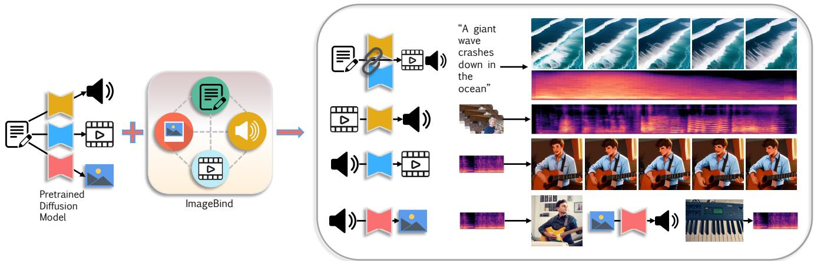
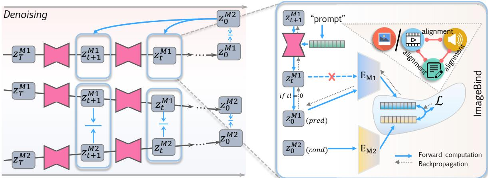
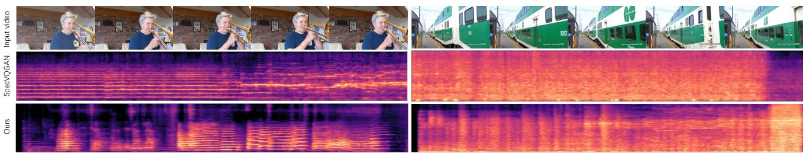
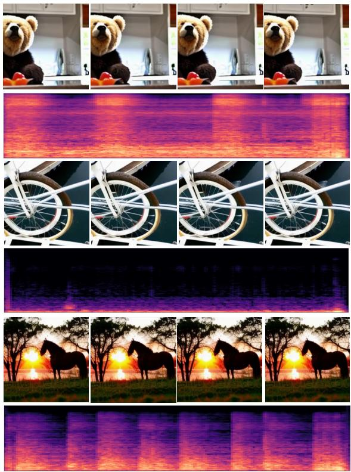
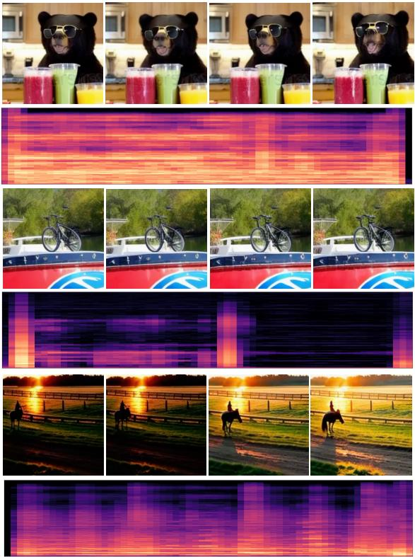
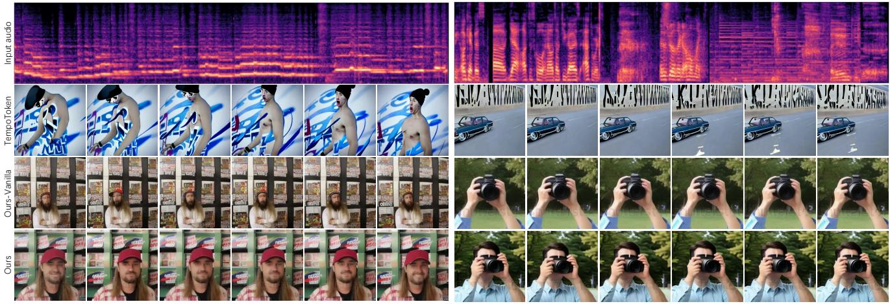
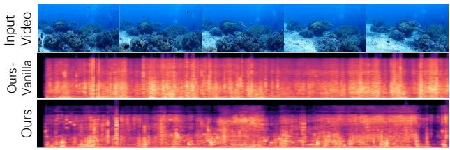
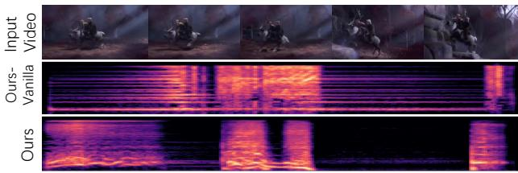

# Seeing and Hearing: Open-domain Visual-Audio Generation with Diffusion Latent Aligners

Yazhou Xing1\* Yingqing He1∗ Zeyue Tian1∗ Xintao Wang2 Qifeng Chen1 1HKUST 2ARC Lab, Tencent PCG

## Abstract

Video and audio content creation serves as the core technique for the movie industry and professional users. Recently, existing diffusion-based methods tackle video and audio generation separately, which hinders the technique transfer from academia to industry. In this work, we aim at filling the gap, with a carefully designed optimizationbased framework for cross-visual-audio and joint-visualaudio generation. We observe the powerful generation ability ofoff-the-shelfvideo or audio generation models. Thus, instead of training the giant models from scratch, we propose to bridge the existing strong models with a shared latent representation space. Specifically, we propose a multimodality latent aligner with the pre-trained ImageBind model. Our latent aligner shares a similar core as the classifier guidance that guides the diffusion denoising process during inference time. Through carefully designed optimization strategy and loss functions, we show the superior performance of our method on joint video-audio generation, visual-steered audio generation, and audio-steered visual generation tasks. The project website can be found at https://yzxing87.github.io/Seeing-and-Hearing/.

## 1. Introduction

Recently, AI-generated content has made significant advances in creating diverse and high-realistic images [4, 9, 22, 32, 34], videos [4, 7, 15, 19, 20, 22, 38], or sound [25, 28–30, 46], based on the input descriptions from users. However, existing works primarily concentrate on generating content within a single modality, disregarding the multimodal nature of the real world. Consequently, the generated videos lack accompanying audio, and the generated audio lacks synchronized visual effects. This research gap restricts users from creating content with greater impact, such as producing films that necessitate the simultaneous creation of both visual and audio modalities. In this work, we study the visual-audio generation task for crafting both

video and audio content.

One potential solution to this problem is to generate visual and audio content in two stages. For example, users can first generate the video based on the input text prompt utilizing existing text-to-video (T2V) models [7, 18]. Then, a video-to-audio (V2A) model can be employed to generate aligned audio. Alternatively, a combination of text-toaudio (T2A) and audio-to-video (A2V) models can be used to generate paired visual-audio content. However, existing V2A and A2V generation methods [26, 48] either have limited capability to specific downstream domains or exhibit poor generation performance. Moreover, the task of joint video-audio generation (Joint-VA) has received limited attention, and existing work [36] shows limited generation performance even within a small domain and also lacks semantic control.

In this work, we propose a new generation paradigm for open-domain visual-audio generation. We observe that: (1) There are well-trained single-modality text-conditioned generation models that demonstrate excellent performance. Leveraging these pre-trained models can avoid expensive training for synthesizing each modality. (2) We have noticed that the pre-trained model ImageBind [17] possesses remarkable capability in establishing effective connections between different data modalities within a shared semantic space. Our objective is to explore how we can leverage ImageBind as a bridge to connect and integrate various modalities effectively.

Leveraging these observations, we propose to utilize ImageBind as an aligner in the diffusion latent space of different modalities. During the generation of one modality, we input the noisy latent and the guided condition of another modality to our aligner to produce a guidance signal that influences the generation process. By gradually injecting the guidance into the denoising process, we bridge the generated content closer to the input condition in the ImageBind embedding space. For Joint-VA generation, we make the guidance bidirectional to impact the generation processes of both modalities.

With our design, we successfully bridge the pre-trained single-modality generation models into an organic system and achieve a versatile and flexible visual-audio generation. In addition, our approach does not require training on largescale datasets, making our approach very resource-friendly. Besides the generality and low cost of our approach, we validate our performance on four tasks and show the superiority over baseline approaches.

  
Figure 1. Overview. Our approach is versatile and can tackle four tasks: joint video-audio generation (Joint-VA), video-to-audio (V2A), audio-to-video (A2V), and image-to-audio (I2A). By leveraging a multimodal binder, e.g., pretrained ImageBind, we establish a connection between isolated generative models that are designed for generating a single modality. This enables us to achieve both bidirectional conditional and joint video/audio generation.

In summary, our key contributions are as follows:

• We propose a novel paradigm that bridges pre-trained diffusion models of single modality together to achieve audio-visual generation.

• We introduce diffusion latent aligner to gradually align diffusion latent of visual and audio modalities in a multimodal embedding space.

• We conduct extensive experiments on four tasks including V2A, I2A, A2V, and Joint-VA, demonstrating the superiority and generality of our approach.

• To the best of our knowledge, we present the first work for text-guided joint video-audio generation.

## 2. Related Work

## 2.1. Conditional Audio Generation

Audio generation is an emerging field that focuses on modeling the creation of diverse audio content. This includes tasks such as generating audio conditioned on various inputs like text [11, 16, 24, 25, 28, 46], images [37], and videos [12, 26, 31, 39]. In the field of text-to-audio research, AudioGen [28] proposes an auto-regressive generative model that operates on discrete audio representations, Diff-Sound [46] utilizes non-autoregressive token-decoder to address the limitations of unidirectional generation in autoregressive models. Other works like Make-An-Audio [25] and AudioLDM [29], employ latent diffusion methods for audio generation. More recently, some approaches leverage Large Language Models (LLMs) to enhance the performance of audio generation models, such as Make-an-Audio2 [24], AudioLDM2 [30], and TANGO [16]. Research focusing on audio generation that is conditioned on images and videos, exemplified by works like Im2Wav [37] and SpecVQGAN [26], has also captured significant interest within the scholarly community. Utilizing the semantics of a pre-trained CLIP model for visual representation (Contrastive Language–Image Pre-training) [33], Im2Wav [37] first crafts a foundational audio representation via a language model, then employs an additional language model to upsample these audio tokens into high-fidelity sound samples. SpecVQGAN [26] utilizes a transformer to generate new spectrograms from a pre-trained codebook based on input video features. It then reconstructs the waveform from these spectrograms using a pre-trained vocoder.

## 2.2. Conditional Visual Generation

The task of text-to-image generation has seen significant achievements recently [2, 35, 42, 49]. This progress has sparked interest in a new research domain focusing on audio-to-image generation [40]. Wan et al. [44] propose a method to generate images from audio recordings, employing Generative Adversarial Networks (GANs). Wav2CLIP [45] adopts a CLIP-inspired approach to learn joint representations for audio-image pairs, which can subsequently facilitate image generation using VQ-GAN [13]. Text-to-video has also achieved remarkable progress recently [1, 4, 7, 15, 19, 22, 23, 25, 50, 51]. The mainstream idea is to incorporate temporal modeling modules in the U-Net to learn the temporal dynamics [1, 19, 23, 38, 51] in the video pixel space [22, 23] or the latent space [4, 19]. In this work, we leverage the open-source latent-based textto-video model as our base model for the video generation counterpart. There also exist Audio-to-video generation methods, such as Sound2sight [5], TATS [14], and Tempotokens [47]. While [5] focuses on extending videos in a way that aligns with the audio, Tempotokens [47] takes a different approach by exclusively generating videos from the audio input. TATS [14] introduces a technique for creating videos synchronized with audio, but despite its remarkable aspects, the variety in the videos it produces is significantly constrained.

## 2.3. Multimodal Joint Generation

Some research has already begun exploring the area of Multimodal Joint Generation [36, 41, 52]. MM-Diffusion [36] introduces the first framework for simultaneous audio-video generation, designed to synergistically enhance both visual and auditory experiences cohesively and engagingly. However, it’s unconditional and can only generate results in the training set domain, which will limit the generation diversity. MovieFactory [52] employs ChatGPT to elaborately expand user-input text into detailed sequential scripts for generating movies, which are then vividly actualized both visually and acoustically through vision generation and audio retrieval techniques. However, a notable constraint of MovieFactory lies in its reliance on audio retrieval, limiting its capacity to generate audio that is more intricately tailored to the specific scenes.

## 3. Method

## 3.1. Preliminaries

## 3.1.1 Latent diffusion models

We adopt latent-based diffusion models (LDM) for our generation model. The diffusion process follows the standard formulation in DDPM [21] that consists of a forward diffusion and a backward denoising process. Given a data sample $\mathbf { x } \sim p ( \mathbf { x } )$ , an autoencoder consisting an encoder $\mathcal { E }$ and a decoder D first project the x into latent z via ${ \bf z } = \mathcal { E } ( { \bf x } )$ Then, the diffusion and denoising process are conducted in the latent space. Once the denoising is completed at timestep 0, the sample will be decoded via $\mathbf { x } = \mathcal { D } ( \tilde { \mathbf { z } _ { 0 } } )$ ). The forward diffusion is a fixed Markov process of T timesteps that yields latent variables $\mathbf { z } _ { t }$ based on the latent variable at previous timestep $\mathbf { z } _ { t - 1 }$ via

$$
\small q ( \mathbf { z } _ { t } | \mathbf { z } _ { t - 1 } ) = \mathcal { N } ( \mathbf { z } _ { t } ; \sqrt { 1 - \beta _ { t } } \mathbf { z } _ { t - 1 } , \beta _ { t } \mathbf { I } ) ,\tag{1}
$$

where $\beta _ { t }$ is a predefined variance at each step t. Finally, the clean data $\mathbf { z } _ { 0 }$ becomes $\mathbf { z } _ { T }$ , which is indistinguishable from a Gaussian noise. The $\mathbf { z } _ { t }$ can be directly derived from $\mathbf { z } _ { 0 }$ in a closed form:

$$
\begin{array} { r } { q ( \mathbf { z } _ { t } | \mathbf { z } _ { 0 } ) = \mathcal { N } ( \mathbf { z } _ { t } ; \sqrt { \bar { \alpha } _ { t } } \mathbf { z } _ { 0 } , ( 1 - \bar { \alpha } _ { t } ) \mathbf { I } ) , } \end{array}\tag{2}
$$

where $\begin{array} { r } { \bar { \alpha } _ { t } = \prod _ { i = 1 } ^ { t } \alpha _ { i } } \end{array}$ , and $\alpha _ { t } = 1 - \beta _ { t }$ . Leveraging the reparameterization trick, the $\mathbf { z } _ { t }$ can be computed via

$$
\mathbf { z } _ { t } = \sqrt { \bar { \alpha } _ { t } } \mathbf { z } _ { 0 } + ( 1 - \bar { \alpha } _ { t } ) \boldsymbol { \epsilon } ,\tag{3}
$$

where ϵ is a random Gaussian noise. The backward denoising process leverages a trained denoiser θ to obtain less noisy data $\mathbf { z } _ { t - 1 }$ from the noisy input $\mathbf { z } _ { t }$ at each timestep:

$$
p _ { \theta } \left( \mathbf { z } _ { t - 1 } \mid \mathbf { z } _ { t } \right) = \mathcal { N } \left( \mathbf { z } _ { t - 1 } ; \mu _ { \theta } \left( \mathbf { z } _ { t } , t , p \right) , \boldsymbol { \Sigma } _ { \theta } \left( \mathbf { z } _ { t } , t , p \right) \right) .\tag{4}
$$

Here $\mu _ { \theta }$ and $\Sigma _ { \theta }$ are determined through a denoiser network $\epsilon _ { \theta } \left( { \bf z } _ { t } , t , p \right)$ , where $p$ represents input prompt. The training objective of θ is a noise estimation loss, formulated as

$$
\operatorname* { m i n } _ { \theta } \mathbb { E } _ { t , \mathbf { z } _ { t } , \epsilon } \left\| \epsilon - \epsilon _ { \theta } \left( \mathbf { z } _ { t } , t , p \right) \right\| _ { 2 } ^ { 2 } .\tag{5}
$$

## 3.1.2 Classifier guidance

Classifier guidance [10] is a conditional generation mechanism that leverages the unconditional diffusion model to generate samples with the desired category. Given an unconditional diffusion model $p _ { \theta } ( \mathbf { z } _ { t } | \mathbf { z } _ { t + 1 } )$ , in order to condition it on a class label $y ,$ it can be approximated via

$$
\begin{array} { r } { p _ { \theta , \phi } ( \mathbf { z } _ { t } \vert \mathbf { z } _ { t + 1 } , y ) = \mathcal { Z } p _ { \theta } ( \mathbf { z } _ { t } \vert \mathbf { z } _ { t + 1 } ) p _ { \phi } ( y \vert \mathbf { z } _ { t } , t ) , } \end{array}\tag{6}
$$

where $\mathcal { Z }$ is a constant coefficient for normalization, ϕ is a trained time-aware noisy classifier for the approximation of label distribution of each sample of $\mathbf { z } _ { t }$ . The guidance from the classifier $\phi$ is the gradient of $\mathbf { z } _ { t }$ with respect to y and is applied to the original $\mathbf { z } _ { t }$ predicted from $\epsilon _ { \theta } \mathbf { : }$

$$
\hat { \epsilon } ( \mathbf { z } _ { t } ) = \epsilon _ { \theta } \big ( \mathbf { z } _ { t } \big ) - \sqrt { 1 - \hat { \alpha } _ { t } } \nabla _ { \mathbf { z } _ { t } } \log p _ { \phi } ( y | \mathbf { z } _ { t } \big ) .\tag{7}
$$

## 3.1.3 Linking multiple modalities

We aim to force the generated samples in different modalities to become closer in a joint semantic space. To achieve this goal, we choose ImageBind [17] as the aligner since it learns an effective joint embedding space for multiple modalities. ImageBind learns a joint semantic embedding space that binds multiple different modalities including image, text, video, audio, depth, and thermal. Given a pair of data with different modalities $( M _ { 1 } , M _ { 2 } ) , \mathbf { e . g . }$ , (video, audio), the encoder of the corresponding modality $\mathbf { E } _ { i }$ takes the data as input and predicts its embedding $\mathbf { e } _ { i }$ . The ImageBind is trained with a contrastive learning objective formulated as follows:

$$
\mathcal { L } _ { M _ { 1 } , M _ { 2 } } = - \log \frac { \exp ( \mathbf { q } _ { i } ^ { \intercal } \mathbf { k } _ { i } / \tau ) } { \exp ( \mathbf { q } _ { i } ^ { \intercal } \mathbf { k } _ { i } / \tau ) + \sum _ { j \neq i } \exp ( \mathbf { q } _ { i } ^ { \intercal } \mathbf { k } _ { j } / \tau ) } ,\tag{8}
$$

where $\tau$ is a temperature factor to control the smoothness of the Softmax distribution, and j represents the negative sample, which is the data from another pair. By projecting samples of different modalities into embeddings in a shared space, minimizing the distance of the embeddings from the same data pair, and maximizing the distance of the embeddings from different data pairs, the ImageBind model achieves semantic alignment capability and thus can be served as a desired tool for multimodal alignment.

  
Figure 2. The proposed diffusion latent aligner. During the denoising process of generating one specific modality (visual/audio), we adopt the condition information (audio/video) to guide the denoising process. By leveraging the pretrained ImageBind model, we calculate the distance of the generative latent $\mathbf { z } _ { t } ^ { M _ { 1 } }$ with the condition $\mathbf { z } _ { 0 } ^ { M _ { 2 } }$ in the shared embedding space of ImageBind. Then we backpropagate the distance value to obtain the gradient of $\mathbf { z } _ { t } ^ { M _ { 1 } }$ with respect to the distance.

## 3.2. Diffusion Latent Aligner

## 3.2.1 Problem formulation

Consider two modalities $M _ { 1 } , M _ { 2 }$ , where $M _ { 2 }$ is the conditional modality and M is the generative modality. Given a latent diffusion model (LDM) θ that produces data of $M _ { 1 }$ our objective is to leverage the information from the condition $\mathbf { \bar { x } } ^ { M _ { 2 } } \sim p ( \mathbf { x } ^ { M _ { 2 } } )$ to steer the generation process to a desired content, i.e., aligned the intermediate generative content with the input condition. To achieve this goal, we devise a diffusion latent aligner that guides the intermediate noisy latent towards a target direction to the content that the condition depicted during the denoising process. Formally, given a sequence of latent variables $\mathbf { z } _ { t } , \mathbf { z } _ { t - 1 } , . . . , \mathbf { z } _ { 0 }$ from an LDM, the diffusion latent aligner A takes the corresponding latent $\mathbf { z } _ { t }$ at arbitrary timestep t alongside the guided condition $\mathbf { x } ^ { M _ { 2 } }$ , and produce a modified latent $\hat { \mathbf { z } } _ { t }$ which has better alignment with the condition.

$$
\hat { \mathbf { z } } _ { t } ^ { M _ { 1 } } = \mathcal { A } ( \mathbf { z } _ { t } ^ { M 1 } , \mathbf { x } ^ { M _ { 2 } } ) .\tag{9}
$$

For joint visual-audio generation, the aligner should simultaneously obtain information from the two modalities and provide guidance signals to these latents:

$$
( \hat { \mathbf { z } } _ { t } ^ { M _ { 1 } } , \hat { \mathbf { z } } _ { t } ^ { M _ { 2 } } ) = \mathcal { A } ( \mathbf { z } _ { t } ^ { M _ { 1 } } , \mathbf { z } _ { t } ^ { M _ { 2 } } ) .\tag{10}
$$

After the sequential denoising process, the goal of our aligner is to minimize the $\mathcal { F } ( \bar { \mathcal { D } } ( \mathbf { z } _ { 0 } ^ { M _ { 1 } } ) , \mathbf { x } ^ { M _ { 2 } } )$ , for unidirectional guidance, and $\mathcal { F } ( \mathcal { D } ( \mathbf { z } _ { 0 } ^ { M _ { 1 } } ) , \mathcal { D } ( \mathbf { z } _ { 0 } ^ { M _ { 2 } } ) )$ for synchronized bidirectional guidance, where $\mathcal { F }$ indicates a distance function to measure the degree of alignment between samples with two modalities. The updatable parameters in this process can be latent variables, embedding vectors, or neural network parameters.

## 3.2.2 Multimodal guidance

To design such a latent aligner stated in Section 3.2.1, we propose a training-free solution that leverages the great capability of a multimodal model trained for representation learning, i.e., ImageBind [17] to provide rational guidance on the denoising process. Specifically, given latent variables $\mathbf { z } _ { t }$ at each timestep t, the predicted $\mathbf { z } _ { 0 }$ can be derived from $\mathbf { z } _ { t }$ and the predicted noise ϵˆ via

$$
\tilde { \mathbf { z } } _ { 0 } = \mathcal { G } ( \mathbf { z } _ { t } ) = \frac { 1 } { \sqrt { \bar { \alpha } _ { t } } } \mathbf { z } _ { t } - \sqrt { \frac { 1 - \bar { \alpha } _ { t } } { \bar { \alpha } _ { t } } } \hat { \epsilon } ,\tag{11}
$$

where $\hat { \epsilon } ~ = ~ \epsilon _ { \theta } ( \mathbf { z } _ { t } , t )$ With such a clean prediction, we can leverage the external models that are trained on normal data without retraining them on noisy data like the classifier guidance is needed. We feed the $\mathbf { z } _ { 0 }$ and the guiding condition to the ImageBind model to compute their distance in the ImageBind embedding space. The obtained distance can then serve as a penalty, which can be used to backpropagate the computation graph and obtain a gradient on the latent variable $\mathbf { z } _ { t } \mathbf { : }$

$$
\mathcal { L } ( \tilde { \mathbf { z } } _ { 0 } , \mathbf { x } ^ { M _ { 2 } } ) = 1 - \mathcal { F } ( \mathbf { E } ^ { M _ { 1 } } ( \tilde { \mathbf { z } } _ { 0 } ) , \mathbf { E } ^ { M _ { 2 } } ( \mathbf { x } ^ { M _ { 2 } } ) ) .\tag{12}
$$

Then we update the $\mathbf { z } _ { t }$ via

$$
\begin{array} { r } { \hat { \mathbf { z } } _ { t } = \mathbf { z } _ { t } - \lambda _ { 1 } \nabla _ { \mathbf { z } _ { t } } \mathcal { L } ( \mathcal { D } ( \tilde { \mathbf { z } } _ { 0 } ) , \mathbf { x } ^ { M _ { 2 } } ) , } \end{array}\tag{13}
$$

where $\lambda _ { 1 }$ serves as the learning rate of each optimization step. In this way, we alter the sampling trajectory at each timestep through our multimodal guidance signal to achieve both audio-to-visual and visual-to-audio. This procedure only costs a small amount of extra sampling time, without any additional datasets and expensive network training.

Algorithm 1 Multimodal guidance for joint-VA generation   
Require: Learning rate $\lambda _ { 1 } , \ \lambda _ { 2 } ,$ optimization steps $N ,$   
warmup steps $K ,$ prompt p   
1: $\mathbf { y } = \operatorname { E M B } ( p )$   
2: for $t = T$ to 0 do   
3: $\mathbf z _ { t } ^ { v } \gets \mathrm { D E N O I S E } ( \mathbf z _ { t + 1 } ^ { v } , \mathbf y )$   
4: $\mathbf z _ { t } ^ { a } \gets \mathrm { D E N O I S E } \big ( \mathbf z _ { t + 1 } ^ { a } , \mathbf y \big )$   
5: $\mathbf { i f } t < K$ then   
6: for $n = 0$ to N do   
7: $\begin{array} { r } { \widetilde { \mathbf { z } } _ { 0 } ^ { v } = \frac { 1 } { \sqrt { \bar { \alpha } _ { t } ^ { v } } } \left( \mathbf { z } _ { t } ^ { v } - \sqrt { 1 - \bar { \alpha } _ { t } ^ { v } } \epsilon _ { t } ^ { v } \right) } \end{array}$   
8: $\begin{array} { r } { \tilde { \mathbf { z } } _ { 0 } ^ { a } = \frac { \bar { \mathbf { \rho } } _ { 1 } } { \sqrt { \bar { \alpha } _ { t } ^ { a } } } \left( \mathbf { z } _ { t } ^ { a } - \sqrt { 1 - \bar { \alpha } _ { t } ^ { a } } \epsilon _ { t } ^ { a } \right) } \end{array}$   
9: $\mathbf { e } _ { a } , \mathbf { e } _ { v } , \mathbf { \dot { e } } _ { p } = \operatorname { I M A G E B I N D } ( \tilde { \mathbf { z } } _ { 0 } ^ { a } , \tilde { \mathbf { z } } _ { 0 } ^ { v } , p )$   
10: $\mathcal { L } _ { \mathrm { j o i n t - v a } } = \mathcal { F } ( \mathbf { e } _ { v } , \mathbf { e } _ { p } ) + \mathcal { F } ( \mathbf { e } _ { v } , \mathbf { e } _ { a } ) + \mathcal { F } ( \mathbf { e } _ { a } , \mathbf { e } _ { p } )$   
11: $\mathbf { z } _ { t } ^ { v } = \mathbf { z } _ { t } ^ { v } - \lambda _ { 1 } \nabla _ { \mathbf { z } _ { t } ^ { v } } \mathcal { L } _ { \mathrm { j } }$ joint-va   
12: $\begin{array} { r } { \mathbf { z } _ { t } ^ { a } = \mathbf { z } _ { t } ^ { a } - \lambda _ { 1 } \nabla _ { \mathbf { z } _ { t } ^ { a } } \mathcal { L } } \end{array}$ joint-va   
13: $\mathbf { y } = \mathbf { y } - \lambda _ { 2 } \nabla _ { \mathbf { y } } \mathcal { L } _ { \mathrm { j } }$ oint-va   
14: end for   
15: end if   
16: end for   
17: return ${ \bf z } _ { 0 } ^ { v } , { \bf z } _ { 0 } ^ { a }$

## 3.2.3 Dual/Triangle loss function

We observed that audio often lacks enough semantic information such as some audio is pure background music, while the paired video contains rich semantic information such as multiple objects and environment sound. Using this type of condition to guide visual generation is not enough and may provide useless guidance information. To solve this, we incorporate another modality, e,g., text, to provide a comprehensive measurement as

$$
\mathcal { L } _ { a 2 v } = \mathcal { F } ( \mathbf { e } _ { v } , \mathbf { e _ { a } } ) + \mathcal { F } ( \mathbf { e } _ { v } , \mathbf { e _ { p } } ) .\tag{14}
$$

The $\mathbf { e } _ { v } , \mathbf { e } _ { a }$ and $\mathbf { e } _ { p }$ are the corresponding embeddings in the multimodal space of ImageBind. The $\mathcal { F }$ represents the distance function between two embedding vectors which is one minus cosine similarity between them. Similarly, the loss for V2A can be written as

$$
\begin{array} { r } { \mathcal { L } _ { v 2 a } = \mathcal { F } ( \mathbf { e } _ { a } , \mathbf { e } _ { \mathbf { v } } ) + \mathcal { F } ( \mathbf { e } _ { a } , \mathbf { e } _ { \mathbf { p } } ) . } \end{array}\tag{15}
$$

For visual-audio joint generation, the loss turns into a triangle:

$$
\mathcal { L } _ { \mathrm { j o i n t - v a } } = \mathcal { F } ( \mathbf { e } _ { v } , \mathbf { e } _ { p } ) + \mathcal { F } ( \mathbf { e } _ { v } , \mathbf { e } _ { a } ) + \mathcal { F } ( \mathbf { e } _ { a } , \mathbf { e } _ { p } ) .\tag{16}
$$

The text can be input by the user to provide a user-guided interactive system or can be extracted via audio captioning models. As stated before, the audio tends to present incomplete semantic information. Thus, the extracted caption should be worse than that. However, we empirically find that our approach helps to correct these semantic errors, and improves the semantic alignment.

## 3.2.4 Guided prompt tuning

Using the aforementioned multimodal latent guidance, we successfully achieved good generation quality and better content alignment on visual-to-audio generation. However, we observed that when applying this approach to audioto-visual generation, the guidance has a neglectable effect. Meanwhile, when leveraging the audio to generate corresponding audios, the generated video becomes less temporal consistent due to the gradient of each frame having no ensure of temporal coherence. Therefore, to overcome this issue, we further propose guided prompt tuning by optimizing the input text embedding vector of the generative model, which is formulated as

$$
\hat { \mathbf { y } } = \mathbf { y } - \lambda _ { 2 } \nabla _ { \mathbf { y } } \mathcal { L } .\tag{17}
$$

The $\lambda _ { 2 }$ indicates the learning rate for the prompt embedding. Specifically, we detach the prompt text embedding at the beginning of predicting the noise and retain a computational graph from the text embedding to the calculation of multimodal loss. Then we backpropagate the computational graph to obtain the gradient of the prompt embedding w.r.t. the multimodal loss. The updated embedding is shared across all timesteps to provide consistent semantic guidance information.

## 4. Experiments

## 4.1. Experimental Setup

Dataset We utilize the VGGSound dataset [6] and Landscape dataset [36] for evaluation on video-to-audio, audioto-video, and audio-video joint generation task. Since our method is an optimization-based solution, there is no need to utilize the entire dataset for evaluation. Instead, we randomly sample 3k video-audio pairs from the VGGSound dataset for video-to-audio generation, 3k pairs for audio-tovideo generation, and 3k pairs for image-to-audio generation respectively. We extract the key frame from each video for the image-to-audio generation task. We also randomly sample 200 video-audio pairs from the Landscape dataset for video-audio joint generation.

Implementation details We utilize the pretrained AudioLDM [29] for video-to-audio and image-to-audio generation, the AnimateDiff [18] for audio-to-video generation. We use both the pre-trained AudioLDM and AnimateDiff for the joint audio-video generation. We set the denoising step to 30 for video-to-audio generation, 25 for audio-tovideo generation, and 25 for audio-video joint generation, respectively. We use the learning rate 0.1 for guiding the AudioLDM denoising and 0.01 for guiding the Animate-Diff denoising, which applies to all the tasks. We fixed the random seed of the optimization process for fair comparisons. All the experiments are conducted on NVIDIA Geforce RTX 3090 GPUs.

<table><tr><td>Task</td><td>Method</td><td colspan="4">Metric</td></tr><tr><td rowspan="4">V2A</td><td rowspan="4">SpecVQGAN [26] Ours-vanilla Ours</td><td>KL↓</td><td>ISc↑</td><td>FD↓</td><td>FAD↓</td></tr><tr><td>3.290</td><td>5.108</td><td>37.269</td><td>7.736</td></tr><tr><td>3.203</td><td>5.625</td><td>40.457</td><td>6.850</td></tr><tr><td>2.619</td><td>5.831</td><td>32.920</td><td>7.316</td></tr><tr><td rowspan="4">I2A</td><td rowspan="4">Im2Wav [37] Ours-vanilla Ours</td><td>KL↓</td><td>ISc↑</td><td>FD↓</td><td>FAD↓</td></tr><tr><td>2.612</td><td>7.055</td><td>19.627</td><td>7.576</td></tr><tr><td>3.115</td><td>4.986</td><td>33.049</td><td>7.364</td></tr><tr><td>2.691</td><td>6.149</td><td>20.958</td><td>6.869</td></tr><tr><td rowspan="4">A2V</td><td rowspan="4">TempoToken [48] Ours-vanilla Ours</td><td>FVD↓</td><td>KVD↓</td><td>AV-align↑</td><td></td></tr><tr><td>1866.285</td><td>389.096</td><td>0.423</td><td></td></tr><tr><td>417.398</td><td>36.262</td><td>0.518</td><td></td></tr><tr><td>402.385</td><td>34.764</td><td>0.522</td><td></td></tr><tr><td rowspan="6">Joint VA Generation</td><td rowspan="3">Landscape: MM [36] Landscape: MM [36] + Ours</td><td>FVD↓</td><td>KVD↓</td><td>FAD↓</td><td></td></tr><tr><td>1141.009</td><td>135.368</td><td>7.752</td><td></td></tr><tr><td>1174.856</td><td>135.422</td><td>6.463</td><td></td></tr><tr><td rowspan="3">Open-domain: MM[36]</td><td>AV-alignbind↑</td><td>VT-alignbind ↑ N/A</td><td>AT-alignbind ↑</td><td>AV-align ↑</td></tr><tr><td>N/A</td><td></td><td>N/A</td><td>N/A</td></tr><tr><td>Open-domain: Ours-vanilla 0.074 Open-domain: Ours 0.096</td><td>0.322 0.324</td><td>0.081 0.138</td><td>0.226 0.283</td></tr></table>

Table 1. Quantitative comparison with baselines on four tasks.  
  
Figure 3. Compared with baseline on the video-to-audio generation task. SpecVQGAN fails to generate realistic and aligned audio with the input video. Our method can produce aligned audio with the input video rhythm.

## 4.2. Baselines

Video-to-Audio We choose SpecVQGAN [26] as the baseline of Video-to-Audio generation task. We used the pretrained model, which was trained using ResNet-50 with 5 features on VGGSound [26] as our inference model and compared our method with SpecVQGAN on 3k VGGSound sample datasets.

Image-to-Audio We choose Im2Wav as the baseline of the Image-to-Audio generation task and used the pre-trained model provided by the authors [37], test on 3k Paprika style transferred VGGSound samples transferred by AnimeGANv2 [8].

Audio-to-Video We choose TempoTokens as the baseline of the Audio-to-Video generation task and used the pretrained model provided by the authors [48], test on 3k VG-GSound samples.

Joint video and audio generation As MM-Diffusion [36] is the state-of-the-art of unconditional video and audio joint generation task, We choose it as the baseline of unconditional video and audio joint generation task in the limit Landscape domain with 200 Landscape samples using the model pre-trained on Landscape datasets. On the open domain, we compare our Ours-with-guidance model with the Ours-vanilla model, as, to the best of our knowledge, there is no established baseline for this task.

Ours-Vanilla We design several vanilla models of our tasks with the combination of existing tools. For the video-toaudio task, we extract the key frame [27] and use a pretrained image caption model [3] to obtain the caption for the video. We then use the extracted caption to generate audio with the AudioLDM model. For the audio-to-video task, we use an audio caption model and feed the extracted caption to the AnimateDiff to generate the videos for the input audio. For the joint audio and video generation task, we directly take the test prompt as input to the AudioLDM model and AnimateDiff model to compose the joint generation results.

A bear with sunglasses making smoothies in a kitchen.  
A bicycle on top of a boat  
A man is riding a horse in sunset  

  
Ours

Ours-vanilla  
Figure 4. Compared with baseline on the joint video-and-audio generation task. Our method can produce better text-aligned visual content than the vanilla model. Besides, our generated audio is also of better quality and better alignment with the generated videos.  
  
Figure 5. Compared with baseline on the audio-to-video task. Given the input audio, the generated videos by TempoToken are not aligned with the input audio and the generation with poor visual quality. Our method can produce visually much better and semantically aligned content with the input condition.

## 4.3. Visual-to-Audio Generation

Visual-to-audio generation includes video-to-audio generation and image-to-audio generation tasks. The image-toaudio generation requires audio-visual alignment from the semantic level, whereas temporal alignment is additionally needed for video-to-audio generation. Moreover, the generated audio also needs to be high-fidelity. To quantitatively evaluate our performance on these aspects, we utilize the MKL metric [26] for audio-video relevance, Inception score (ISc), Frechet distance (FD), and Frechet audio distance (FAD) for audio fidelity evaluation. From Tab. 1, we can see that even though our method is training-free, we can still outperform the baseline which requires large-scale training on audio-video pairs. When compared with the text-to-audio baseline, we could see that our method consistently improves the audio-video relevance and the audio generation quality. When compared with our vanilla baseline, we find our method can significantly improve the audio quality, especially by reducing irrelevant sound and background noise, as shown in Fig. 6.

  
Figure 6. Compared with our vanilla model on the video-to-audio generation task. Our method can significantly reduce the background and irrelevant sound and thus achieve better audio quality, which is also reflected in Tab. 1.

## 4.4. Audio-to-Video Generation

Audio-to-video generation requires the generated videos to be high-quality, as well as semantically and temporally aligned with the input audio. To quantitatively evaluate the visual quality of the generated videos, we adopt the Frechet Video Distance (FVD) and Kernel Video Distance (KVD) [43] as the metrics. We also use the audio-video alignment (AV-align) [48] metric to measure the alignment of the generated video and the input audio. We show our quantitative results in Tab. 1. We observe that our trainingfree method can outperform the training-based baseline in terms of both semantic alignment and video quality. Besides, compared with the text-to-video method, our method can achieve better audio-video alignment while maintaining a comparable visual quality performance. We show our qualitative results in Fig. 5. We observe that TempoToken struggles with visual quality and audio-visual alignment, and thus the generated videos are not relevant to the input audio and the generated quality is relatively poor. Although the text-to-video method can achieve good performance on the visual quality of the generated videos, it struggles to accurately align with the input audio content. Our trainingfree method, utilizing a shared audio-visual representation space, can achieve a good tradeoff between visual quality and audio-visual alignment.

## 4.5. Joint Video and Audio Generation

The practical joint video and audio generation task should take the text as the input, produce high-fidelity videos and audio, maintain the audio-video alignment, and maintain the text-audio and text-video relevance. Specifically, we adopt the FVD for video quality, FAD for audio quality, AV-align [48] for audio-video relevance, TAalign for text-audio alignment, and the TV-align for textvideo alignment. Our quantitative evaluation is shown in Tab. 1. Our latent aligner can be plugged into existing unconditional audio-video joint generation framework MM-Diffusion [36]. The results show that compared with the original MM-Diffusion, our latent aligner can boost the audio generation quality when maintaining the video generation performance. We also verify our method of textconditioned joint video and audio generation. We bridge the video diffusion model AnimateDiff [18] and audio diffusion model AudioLDM [29] with our diffusion latent aligner. We randomly collect 100 prompts from the web to condition our generation. Compared with separate text-to-video and textto-audio models, our aligner can improve text-video alignment, text-audio alignment, and video-audio alignment. We show the qualitative comparison in Fig. 4. More qualitative results can be found in the Supplementary.

  
Figure 7. We visualize the effect of our guided prompt tuning. The automatic caption generated is “frozen 2 - screenshot”, which fails to capture the meaningful visual content, and thus, the textto-audio method fails to produce meaningful sounds. Our prompt tuning can inspect the visual information to complement the semantic information to generate meaningful sounds.

## 5. Conclusion

We propose an optimization-based method for the opendomain audio and visual generation task. Our method can enable video-to-audio generation, audio-to-video generation, video-audio joint generation, image-to-audio generation, and audio-to-image generation tasks. Instead of training giant models from scratch, we utilize the a shared multimodality embedding space provided by ImageBind to bridge the pre-trained visual generation and audio generation diffusion models. Through extensive experiments on several evaluation datasets, we show the advantages of our method, especially in terms of improving the audio generation fidelity and audio-visual alignment.

Acknowlegement This project was supported by the National Key R&D Program of China under grant number 2022ZD0161501.

## References

[1] Jie An, Songyang Zhang, Harry Yang, Sonal Gupta, Jia-Bin Huang, Jiebo Luo, and Xi Yin. Latent-shift: Latent diffusion with temporal shift for efficient text-to-video generation. arXiv preprint arXiv:2304.08477, 2023. 2

[2] Omri Avrahami, Thomas Hayes, Oran Gafni, Sonal Gupta, Yaniv Taigman, Devi Parikh, Dani Lischinski, Ohad Fried, and Xi Yin. Spatext: Spatio-textual representation for controllable image generation. In Proceedings of the IEEE/CVF Conference on Computer Vision and Pattern Recognition, pages 18370–18380, 2023. 2

[3] Jinze Bai, Shuai Bai, Yunfei Chu, Zeyu Cui, Kai Dang, Xiaodong Deng, Yang Fan, Wenbin Ge, Yu Han, Fei Huang, Binyuan Hui, Luo Ji, Mei Li, Junyang Lin, Runji Lin, Dayiheng Liu, Gao Liu, Chengqiang Lu, Keming Lu, Jianxin Ma, Rui Men, Xingzhang Ren, Xuancheng Ren, Chuanqi Tan, Sinan Tan, Jianhong Tu, Peng Wang, Shijie Wang, Wei Wang, Shengguang Wu, Benfeng Xu, Jin Xu, An Yang, Hao Yang, Jian Yang, Shusheng Yang, Yang Yao, Bowen Yu, Hongyi Yuan, Zheng Yuan, Jianwei Zhang, Xingxuan Zhang, Yichang Zhang, Zhenru Zhang, Chang Zhou, Jingren Zhou, Xiaohuan Zhou, and Tianhang Zhu. Qwen technical report. arXiv preprint arXiv:2309.16609, 2023. 6

[4] Andreas Blattmann, Robin Rombach, Huan Ling, Tim Dockhorn, Seung Wook Kim, Sanja Fidler, and Karsten Kreis. Align your latents: High-resolution video synthesis with latent diffusion models. In Proceedings of the IEEE/CVF Conference on Computer Vision and Pattern Recognition, pages 22563–22575, 2023. 1, 2

[5] Moitreya Chatterjee and Anoop Cherian. Sound2sight: Generating visual dynamics from sound and context. In Computer Vision–ECCV 2020: 16th European Conference, Glasgow, UK, August 23–28, 2020, Proceedings, Part XXVII 16, pages 701–719. Springer, 2020. 2, 3

[6] Honglie Chen, Weidi Xie, Andrea Vedaldi, and Andrew Zisserman. Vggsound: A large-scale audio-visual dataset. In ICASSP 2020-2020 IEEE International Conference on Acoustics, Speech and Signal Processing (ICASSP), pages 721–725. IEEE, 2020. 5

[7] Haoxin Chen, Menghan Xia, Yingqing He, Yong Zhang, Xiaodong Cun, Shaoshu Yang, Jinbo Xing, Yaofang Liu, Qifeng Chen, Xintao Wang, Chao Weng, and Ying Shan. Videocrafter1: Open diffusion models for high-quality video generation, 2023. 1, 2

[8] Xin Chen. Animeganv2. https://github.com/ TachibanaYoshino/AnimeGANv2/, 2022. 6

[9] Xiaoliang Dai, Ji Hou, Chih-Yao Ma, Sam Tsai, Jialiang Wang, Rui Wang, Peizhao Zhang, Simon Vandenhende, Xiaofang Wang, Abhimanyu Dubey, et al. Emu: Enhancing image generation models using photogenic needles in a haystack. arXiv preprint arXiv:2309.15807, 2023. 1

[10] Prafulla Dhariwal and Alexander Nichol. Diffusion models beat gans on image synthesis. Advances in neural information processing systems, 34:8780–8794, 2021. 3

[11] Hao-Wen Dong, Xiaoyu Liu, Jordi Pons, Gautam Bhattacharya, Santiago Pascual, Joan Serra, Taylor Berg-\` Kirkpatrick, and Julian McAuley. Clipsonic: Text-to-audio

synthesis with unlabeled videos and pretrained languagevision models. arXiv preprint arXiv:2306.09635, 2023. 2

[12] Yuexi Du, Ziyang Chen, Justin Salamon, Bryan Russell, and Andrew Owens. Conditional generation of audio from video via foley analogies. In Proceedings of the IEEE/CVF Conference on Computer Vision and Pattern Recognition, pages 2426–2436, 2023. 2

[13] Patrick Esser, Robin Rombach, and Bjorn Ommer. Taming transformers for high-resolution image synthesis. In Proceedings of the IEEE/CVF conference on computer vision and pattern recognition, pages 12873–12883, 2021. 2

[14] Songwei Ge, Thomas Hayes, Harry Yang, Xi Yin, Guan Pang, David Jacobs, Jia-Bin Huang, and Devi Parikh. Long video generation with time-agnostic vqgan and timesensitive transformer. In European Conference on Computer Vision, pages 102–118. Springer, 2022. 2, 3

[15] Songwei Ge, Seungjun Nah, Guilin Liu, Tyler Poon, Andrew Tao, Bryan Catanzaro, David Jacobs, Jia-Bin Huang, Ming-Yu Liu, and Yogesh Balaji. Preserve your own correlation: A noise prior for video diffusion models. arXiv preprint arXiv:2305.10474, 2023. 1, 2

[16] Deepanway Ghosal, Navonil Majumder, Ambuj Mehrish, and Soujanya Poria. Text-to-audio generation using instruction-tuned llm and latent diffusion model. arXiv preprint arXiv:2304.13731, 2023. 2

[17] Rohit Girdhar, Alaaeldin El-Nouby, Zhuang Liu, Mannat Singh, Kalyan Vasudev Alwala, Armand Joulin, and Ishan Misra. Imagebind: One embedding space to bind them all. In Proceedings of the IEEE/CVF Conference on Computer Vision and Pattern Recognition, pages 15180–15190, 2023. 1, 3, 4

[18] Yuwei Guo, Ceyuan Yang, Anyi Rao, Yaohui Wang, Yu Qiao, Dahua Lin, and Bo Dai. Animatediff: Animate your personalized text-to-image diffusion models without specific tuning. arXiv preprint arXiv:2307.04725, 2023. 1, 5, 8

[19] Yingqing He, Tianyu Yang, Yong Zhang, Ying Shan, and Qifeng Chen. Latent video diffusion models for high-fidelity video generation with arbitrary lengths. arXiv preprint arXiv:2211.13221, 2022. 1, 2

[20] Yingqing He, Menghan Xia, Haoxin Chen, Xiaodong Cun, Yuan Gong, Jinbo Xing, Yong Zhang, Xintao Wang, Chao Weng, Ying Shan, et al. Animate-a-story: Storytelling with retrieval-augmented video generation. arXiv preprint arXiv:2307.06940, 2023. 1

[21] Jonathan Ho, Ajay Jain, and Pieter Abbeel. Denoising diffusion probabilistic models. Advances in neural information processing systems, 33:6840–6851, 2020. 3

[22] Jonathan Ho, William Chan, Chitwan Saharia, Jay Whang, Ruiqi Gao, Alexey Gritsenko, Diederik P Kingma, Ben Poole, Mohammad Norouzi, David J Fleet, et al. Imagen video: High definition video generation with diffusion models. arXiv preprint arXiv:2210.02303, 2022. 1, 2

[23] Jonathan Ho, Tim Salimans, Alexey Gritsenko, William Chan, Mohammad Norouzi, and David J Fleet. Video diffusion models. arXiv preprint arXiv:2204.03458, 2022. 2

[24] Jiawei Huang, Yi Ren, Rongjie Huang, Dongchao Yang, Zhenhui Ye, Chen Zhang, Jinglin Liu, Xiang Yin, Zejun Ma,

and Zhou Zhao. Make-an-audio 2: Temporal-enhanced textto-audio generation. arXiv preprint arXiv:2305.18474, 2023. 2

[25] Rongjie Huang, Jiawei Huang, Dongchao Yang, Yi Ren, Luping Liu, Mingze Li, Zhenhui Ye, Jinglin Liu, Xiang Yin, and Zhou Zhao. Make-an-audio: Text-to-audio generation with prompt-enhanced diffusion models. arXiv preprint arXiv:2301.12661, 2023. 1, 2

[26] Vladimir Iashin and Esa Rahtu. Taming visually guided sound generation. arXiv preprint arXiv:2110.08791, 2021. 1, 2, 6, 7

[27] KeplerLab. Tool for automating common video key-frame extraction, video compression and image auto-crop/imageresize tasks. https://github.com/keplerlab/ katna, 2021. 6

[28] Felix Kreuk, Gabriel Synnaeve, Adam Polyak, Uriel Singer, Alexandre Defossez, Jade Copet, Devi Parikh, Yaniv Taig-´ man, and Yossi Adi. Audiogen: Textually guided audio generation. arXiv preprint arXiv:2209.15352, 2022. 1, 2

[29] Haohe Liu, Zehua Chen, Yi Yuan, Xinhao Mei, Xubo Liu, Danilo Mandic, Wenwu Wang, and Mark D Plumbley. Audioldm: Text-to-audio generation with latent diffusion models. arXiv preprint arXiv:2301.12503, 2023. 2, 5, 8

[30] Haohe Liu, Qiao Tian, Yi Yuan, Xubo Liu, Xinhao Mei, Qiuqiang Kong, Yuping Wang, Wenwu Wang, Yuxuan Wang, and Mark D Plumbley. Audioldm 2: Learning holistic audio generation with self-supervised pretraining. arXiv preprint arXiv:2308.05734, 2023. 1, 2

[31] Simian Luo, Chuanhao Yan, Chenxu Hu, and Hang Zhao. Diff-foley: Synchronized video-to-audio synthesis with latent diffusion models. arXiv preprint arXiv:2306.17203, 2023. 2

[32] Alex Nichol, Prafulla Dhariwal, Aditya Ramesh, Pranav Shyam, Pamela Mishkin, Bob McGrew, Ilya Sutskever, and Mark Chen. Glide: Towards photorealistic image generation and editing with text-guided diffusion models. arXiv preprint arXiv:2112.10741, 2021. 1

[33] Alec Radford, Jong Wook Kim, Chris Hallacy, Aditya Ramesh, Gabriel Goh, Sandhini Agarwal, Girish Sastry, Amanda Askell, Pamela Mishkin, Jack Clark, et al. Learning transferable visual models from natural language supervision. In International conference on machine learning, pages 8748–8763. PMLR, 2021. 2

[34] Aditya Ramesh, Prafulla Dhariwal, Alex Nichol, Casey Chu, and Mark Chen. Hierarchical text-conditional image generation with clip latents. arXiv preprint arXiv:2204.06125, 1 (2):3, 2022. 1

[35] Robin Rombach, Andreas Blattmann, Dominik Lorenz, Patrick Esser, and Bjorn Ommer. High-resolution image syn-¨ thesis with latent diffusion models. In IEEE/CVF Conference on Computer Vision and Pattern Recognition, CVPR 2022, New Orleans, LA, USA, June 18-24, 2022, pages 10674– 10685. IEEE, 2022. 2

[36] Ludan Ruan, Yiyang Ma, Huan Yang, Huiguo He, Bei Liu, Jianlong Fu, Nicholas Jing Yuan, Qin Jin, and Baining Guo. Mm-diffusion: Learning multi-modal diffusion models for joint audio and video generation. In Proceedings of

the IEEE/CVF Conference on Computer Vision and Pattern Recognition, pages 10219–10228, 2023. 1, 3, 5, 6, 8

[37] Roy Sheffer and Yossi Adi. I hear your true colors: Image guided audio generation. In ICASSP 2023-2023 IEEE International Conference on Acoustics, Speech and Signal Processing (ICASSP), pages 1–5. IEEE, 2023. 2, 6

[38] Uriel Singer, Adam Polyak, Thomas Hayes, Xi Yin, Jie An, Songyang Zhang, Qiyuan Hu, Harry Yang, Oron Ashual, Oran Gafni, et al. Make-a-video: Text-to-video generation without text-video data. arXiv preprint arXiv:2209.14792, 2022. 1, 2

[39] Kun Su, Kaizhi Qian, Eli Shlizerman, Antonio Torralba, and Chuang Gan. Physics-driven diffusion models for impact sound synthesis from videos. In Proceedings of the IEEE/CVF Conference on Computer Vision and Pattern Recognition, pages 9749–9759, 2023. 2

[40] Kim Sung-Bin, Arda Senocak, Hyunwoo Ha, Andrew Owens, and Tae-Hyun Oh. Sound to visual scene generation by audio-to-visual latent alignment. In Proceedings of the IEEE/CVF Conference on Computer Vision and Pattern Recognition, pages 6430–6440, 2023. 2

[41] Zineng Tang, Ziyi Yang, Chenguang Zhu, Michael Zeng, and Mohit Bansal. Any-to-any generation via composable diffusion. Advances in Neural Information Processing Systems, 36, 2024. 3

[42] Ming Tao, Bing-Kun Bao, Hao Tang, and Changsheng Xu. Galip: Generative adversarial clips for text-to-image synthesis. In Proceedings of the IEEE/CVF Conference on Computer Vision and Pattern Recognition, pages 14214–14223, 2023. 2

[43] Thomas Unterthiner, Sjoerd Van Steenkiste, Karol Kurach, Raphael Marinier, Marcin Michalski, and Sylvain Gelly. Towards accurate generative models of video: A new metric & challenges. arXiv preprint arXiv:1812.01717, 2018. 8

[44] Chia-Hung Wan, Shun-Po Chuang, and Hung-Yi Lee. Towards audio to scene image synthesis using generative adversarial network. In ICASSP 2019-2019 IEEE International Conference on Acoustics, Speech and Signal Processing (ICASSP), pages 496–500. IEEE, 2019. 2

[45] Ho-Hsiang Wu, Prem Seetharaman, Kundan Kumar, and Juan Pablo Bello. Wav2clip: Learning robust audio representations from clip. In ICASSP 2022-2022 IEEE International Conference on Acoustics, Speech and Signal Processing (ICASSP), pages 4563–4567. IEEE, 2022. 2

[46] Dongchao Yang, Jianwei Yu, Helin Wang, Wen Wang, Chao Weng, Yuexian Zou, and Dong Yu. Diffsound: Discrete diffusion model for text-to-sound generation. IEEE/ACM Transactions on Audio, Speech, and Language Processing, 2023. 1, 2

[47] Guy Yariv, Itai Gat, Sagie Benaim, Lior Wolf, Idan Schwartz, and Yossi Adi. Diverse and aligned audio-to-video generation via text-to-video model adaptation. arXiv preprint arXiv:2309.16429, 2023. 3

[48] Guy Yariv, Itai Gat, Sagie Benaim, Lior Wolf, Idan Schwartz, and Yossi Adi. Diverse and aligned audio-to-video generation via text-to-video model adaptation. arXiv preprint arXiv:2309.16429, 2023. 1, 6, 8

[49] Maciej Zelaszczyk and Jacek Ma ˙ ndziuk. Audio-to-image´ cross-modal generation. In 2022 International Joint Conference on Neural Networks (IJCNN), pages 1–8. IEEE, 2022. 2

[50] David Junhao Zhang, Jay Zhangjie Wu, Jia-Wei Liu, Rui Zhao, Lingmin Ran, Yuchao Gu, Difei Gao, and Mike Zheng Shou. Show-1: Marrying pixel and latent diffusion models for text-to-video generation. arXiv preprint arXiv:2309.15818, 2023. 2

[51] Daquan Zhou, Weimin Wang, Hanshu Yan, Weiwei Lv, Yizhe Zhu, and Jiashi Feng. Magicvideo: Efficient video generation with latent diffusion models. arXiv preprint arXiv:2211.11018, 2022. 2

[52] Junchen Zhu, Huan Yang, Huiguo He, Wenjing Wang, Zixi Tuo, Wen-Huang Cheng, Lianli Gao, Jingkuan Song, and Jianlong Fu. Moviefactory: Automatic movie creation from text using large generative models for language and images. arXiv preprint arXiv:2306.07257, 2023. 3