# Selectively Informative Description can Reduce Undesired Embedding Entanglements in Text-to-Image Personalization

Jimyeong Kim1 Jungwon Park1 Wonjong Rhee1,2,3 Department of Intelligence and Information1 & IPAI2 & RICS3, Seoul National University {wlaud1001, quoded97, wrhee}@snu.ac.kr

## Abstract

In text-to-image personalization, a timely and crucial challenge is the tendency of generated images overfitting to the biases present in the reference images. We initiate our study with a comprehensive categorization ofthe biases into background, nearby-object, tied-object, substance (in style re-contextualization), and pose biases. These biases manifest in the generated images due to their entanglement into the subject embedding. This undesired embedding entanglement not only results in the reflection of biases from the reference images into the generated images but also notably diminishes the alignment ofthe generated images with the given generation prompt. To address this challenge, we propose SID (Selectively Informative Description), a text description strategy that deviates from the prevalent approach of only characterizing the subject’s class identification. SID is generated utilizing multimodal GPT-4 and can be seamlessly integrated into optimization-based models. We present comprehensive experimental results along with analyses of cross-attention maps, subject-alignment, non-subject-disentanglement, and text-alignment.

## 1. Introduction

Text-to-image diffusion models [5, 7, 11, 25, 30, 35, 40, 42, 43, 46] have demonstrated remarkable generation capabilities that align with textual descriptions across various applications. One such application is text-to-image personalization [12, 24, 45], where models are tailored to generate novel renditions of subjects described in a few reference images. Recent works, such as DreamBooth [45] or Custom Diffusion [24], stand out for their exceptional personalized generation results. They achieve this by fine-tuning a pretrained text-to-image diffusion model with a small number of reference images using a text description in the format of “a [v] [class name]” or “photo of a [v] [class name].” In this context, [v] represents the subject’s unique identifier, which uses a rare token with minimal semantic significance, while the class descriptor [class name] represents a coarse category for the subject.

Recent developments in text-to-image personalization can be categorized into optimization-based approaches [12, 15, 24, 45, 57] and encoder-based approaches [21, 26, 50, 62]. For both types of approaches, a problem typically addressed as ‘overfitting’ has emerged [2, 15, 21, 26, 45, 57]. It is a phenomenon where objects, other than the subject of interest, in the reference images affect the generated image in an undesired way. For the sake of clarity, we refer to such an entity as ‘non-subject’ or ‘undesired object’. The cause of this phenomenon is closely related to the embedding of the identifier token [v] for optimization-based approaches and the embedding of the subject for encoder-based models, where the information related to any non-subject seeps into the embeddings. Rather than referring to it as overfitting, we formally address this phenomenon as undesired embedding entanglement.

The phenomenon of undesired embedding entanglement has been noticed, but it has been only superficially understood so far. A potential explanation for the limited understanding is the rarity of this phenomenon in straightforward scenarios. Instances where reference images encompass diverse subject views and minimal undesired objects are much less prone to this phenomenon. However, such an ideal scenario is highly unlikely in real-world applications. Therefore, it is crucial to comprehensively understand the biases and develop counter methods to address them effectively. In an effort to gain a more thorough understanding of the prevalent biases contributing to these entanglements, we conducted exhaustive paper reviews followed by extensive experiments utilizing state-of-the-art models. The resulting identification of the five most commonly encountered biases is presented in Fig. 1. While we have chosen DreamBooth [45] for generating the examples in Fig. 1, additional examples for Custom Diffusion [24], SVDiff [15], ELITE [62] and BLIP-Diffusion [26] will be provided later.

In prior studies, several models [2, 21, 26, 50, 62] have employed segmentation masks. However, depending exclusively on segmentation masks comes with limitations, as we will demonstrate with additional examples in subsequent sections. Notably, these limitations become apparent in the cases of substance, tied-object, and pose biases. To tackle all of the key biases, we introduce SID (Selectively Informative Description) that requires only modifications in the train text descriptions of the reference images. The idea is very simple. Starting with an optimization-based model, we diverge from the prevalent approach of only characterizing the subject’s class identification as observed in the existing works. Our approach involves integrating informative specifications of the “undesired objects” into the train descriptions. This modification significantly diminishes the probability of undesired entanglement between the subject embedding [v] and the non-subject information in the reference images. As the text-to-image diffusion models are trained for alignments, adding text descriptions that match non-subjects can greatly help the non-subject parts in the reference images to align with the corresponding text descriptions. This prevents the undesired objects from accidentally becoming aligned with [v]. In contrast, such an accidental alignment can quite easily occur in the absence of the matching text descriptions. Our method is selective because we deliberately avoid incorporating informative spec ifications of the “subject” itself into the train descriptions. Such incorporation could negatively affect the preservation of the subject’s identity, as will be elucidated in Sec. 3.1. SID can be readily integrated with any optimization-based model, such as DreamBooth [45], Custom Diffusion [24], or SVDiff [15]. For the automated generation of SID, we utilize the multimodal GPT-4 [37] by guiding it with an appropriate instruction. Surprisingly, the proposed SID integration significantly reduces embedding entanglement, especially in critically biased scenarios.

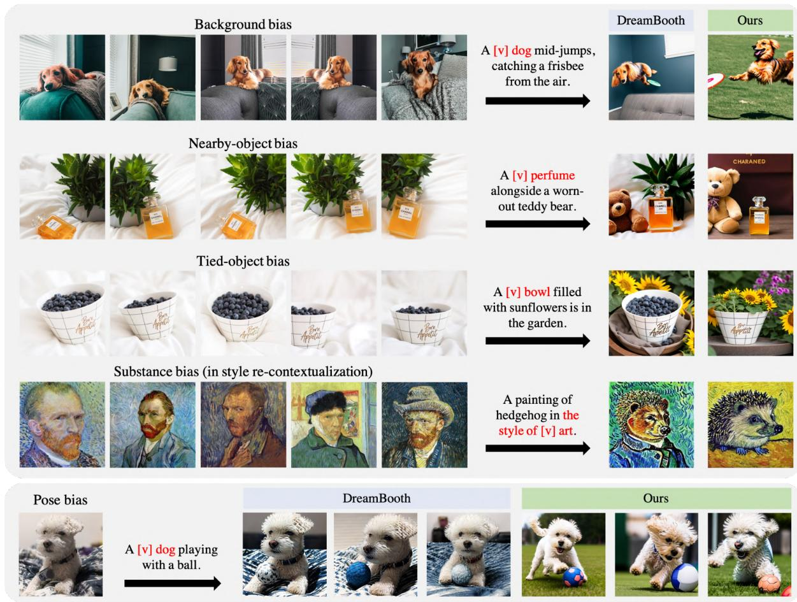  
Figure 1. Five key biases – background, nearby-object, tied-object, substance (in style re-contextualization), and pose biases. Th first four rows depict scenarios with multiple reference images, while the last row illustrates a single reference image scenario. The pose bias is particularly prone to manifest in scenarios involving a single reference image, although it can also occur when multiple reference images depict the subject in poses that are similar. In the generation prompt, the subject of interest is highlighted in red. The integration of our method into DreamBooth [45] effectively resolves embedding entanglements associated with the five key biases (rightmost column).

## 2. Related Work

Text-to-image diffusion models. Diffusion models [19, 54, 55] have demonstrated remarkable generative capabilities across a wide range of modalities, including images [10, 35, 46], audios [8, 22, 28], videos [18, 32, 66], and 3D shapes [23, 68, 69]. Within this diverse spectrum, prominent text-to-image diffusion models, such as Stable Diffusion [43], Imagen [46], and DALL-E 2 [42], have exhibited exceptional proficiency in the synthesis of highquality images closely aligned with textual descriptions. Subsequently, significant efforts [5, 7, 11, 25, 30, 40] have been dedicated to enhancing the text-to-image alignment in the field of text-to-image generation. Our study, based on the Stable Diffusion model [43], improves the alignment between textual descriptions and images in personalized image synthesis, focusing on accurately preserving subject identity without any entanglement with undesired objects.

Vision-language models. The vision-language model (VLM) handles tasks like text-to-image retrieval [61], visual question answering [1], and image captioning [65]. VLMs can also play a crucial role as a building block, as seen with CLIP [41] in tasks such as text-to-image generation [35, 42, 43], image segmentation [31], image retrieval [4], and more [34, 38, 51, 52]. In our work, we need an image captioning VLM capable of closely following detailed instructions. While models like BLIP-2 [27] and OpenFlamingo [3] offer image captioning with text conditioning, they often struggle to adhere closely to detailed instructions. In contrast, large models such as LLaVA [29] and multi-modal GPT-4 [37] have demonstrated their ability to generate precise captions closely aligned with detailed instructions. Among these options, multi-modal GPT-4 exhibits the most powerful capability in generating instruction-following captions.

Personalized image synthesis. Personalizing text-toimage diffusion models [2, 9, 12, 13, 21, 24, 26, 45, 50, 57, 62] has become a central focus in text-to-image generation. These models generate high-quality, diverse renditions of a subject using either a few reference images (usually 3 to 7) or just a single reference image. These models can be broadly categorized into two groups: optimizationbased and encoder-based models. Optimization-based models [2, 12, 15, 24, 45, 57], like DreamBooth [45], involve per-subject optimization, where they fine-tune identifier tokens or segments of diffusion models to encode a subject’s identity. On the other hand, encoder-based models [13, 21, 26, 50, 62] pre-train separate identity encoders and utilize them to encode a subject’s identity without the need for per-subject optimization.

## 3. Method

Our proposed method can be readily integrated with any optimization-based models that utilize description of the reference images. The overall process, presented in Fig. 2, entails the generation of SID (Selectively Informative Description) for each reference image using an instructionfollowing vision-language model (VLM). These SIDs are integrated into the reconstruction learning process as part of the per-subject optimization. Depending on the underlying optimization-based model, additional loss functions may be incorporated together with the main reconstruction loss. The additional loss functions, such as the class prior preservation loss [45] introduced in DreamBooth, are applied in the same manner as in their respective baseline models without any modification. The effect of SID is addressed in Sec. 3.1. The choice of VLM and its accompanying instruction are addressed in Sec. 3.2.

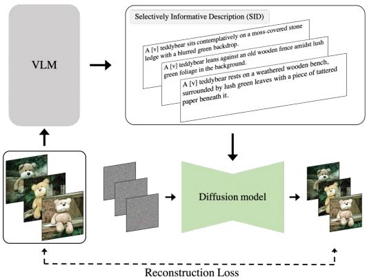  
Figure 2. Personalization with SID. We propose integrating SID (Selectively Informative Description) into the per-subject optimization, where an instruction-following VLM (Vison-Language Model) is utilized to generate a selectively informative description for each reference image.

## 3.1. SID for reducing embedding entanglement

The existing text-to-image personalization approaches [12, 15, 24, 45], especially optimization-based methods like DreamBooth [45], often rely on simplistic textual descriptions that closely follow the format of “a [v] [class name]”, where [v] denotes the unique identifier for the subject, in order to extract the subject’s identity. In our method, our goal is to come up with train descriptions that have an appropriate level of information such that we can effectively isolate the subject of interest even when the reference images are biased. According to the findings in DreamBooth [45], specifying the subject’s correct class in the train description is instrumental in accurately preserving the subject’s identity. With the correct class information, the model’s prior knowledge of the subject’s class can significantly enhance the editing capabilities of the model. Based on the findings, we consider the case where the train description only contains the subject’s class identification as the baseline and subsequently explore additionally informative cases that are listed in Tab. 1. In Tab. 1, the term undesired object generally encompasses any object within reference images, excluding the subject of interest. For the examples in Fig. 1, the undesired objects can be readily recognized for background, nearby-object, and tied-object biases. For the substance bias, that is applicable only when performing a style re-contextualization, all the objects in the reference images are considered to be undesirable because the intention is to transfer the style only. For pose bias, it is inherent to the subject itself.

Generated images  
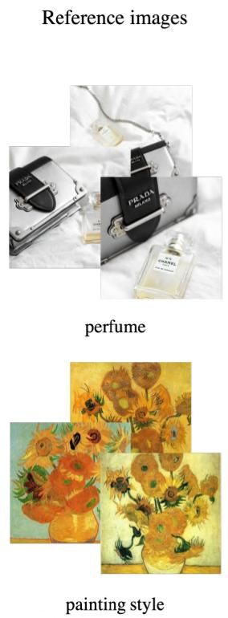

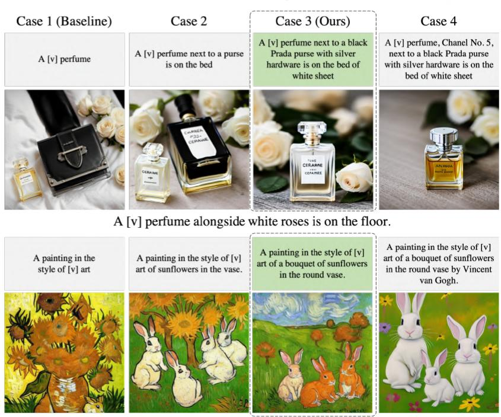  
A painting of bunnies in the meadow in the style of [v] art

Figure 3. Two examples for comparing the four cases of descriptions. For each case, the choice of train description follows the guidelines in Tab. 1. The common generation prompt for each example is shown below the generated images. Additional examples can be found in Appendix E.1.
<table><tr><td rowspan="3">Descriptions</td><td colspan="2">Subject</td><td colspan="2">Undesired objects</td></tr><tr><td>Class Identification</td><td>Informative Specifications</td><td>Class Identification</td><td>Informative Specifications</td></tr><tr><td>Case 1 (Baseline)</td><td>0</td><td>X</td><td>X</td><td>X</td></tr><tr><td>Case 2</td><td>0</td><td>X</td><td>0</td><td>X</td></tr><tr><td>Case 3 (Ours)</td><td>0</td><td>X</td><td>0</td><td>0</td></tr><tr><td>Case 4</td><td>0</td><td>0</td><td>0</td><td>0</td></tr></table>

Table 1. Four cases of train descriptions. The four cases are categorized based on whether they provide class identification only or additional informative specifications of the subject and undesired objects. We define SID as the description of Case 3 (Ours).

For the four cases in Tab. 1, two examples are investigated in Fig. 3 where two sets of the resulting images are shown. For the simplicity of this investigation, reference images were chosen to share the same set of undesired objects and thus allowing us to use a single train description for all reference images. Case 1 (Baseline) uses the format “a [v] [class name]”, where only the subject’s class identification is included in the train description. In this case, the model often struggles with the bias in the reference images (e.g., the subject can co-appear with undesired objects). This is because of the embedding entanglement in [v] as will be analyze further in Sec. 5. To reduce the undesired embedding entanglement, we introduce Case 2 where the train description contains the class identifications of the undesired objects. Case 3 is similar to Case 2, but the train description additionally contain informative specifications of the undesired objects. As shown in Fig. 3, both Case 2 and Case 3 can provide a significant improvement over Case 1. Case 3, however, often outperforms Case 2 in terms of entanglement reduction as is the case for the two examples in Fig. 3.

For the subject itself, it is also possible to include informative specifications of the subject. Case 4 corresponds to this possibility. With the inclusion, however, the subject details described in the informative specifications are disentangled from the [v]. This occurs because of the alignment between the subject’s informative specifications in the text and the subject details in the images. Because preserving the subject details in the [v] is crucial in personalized image synthesis, we have opted for Case 3 as our definition of SID.

## 3.2. VLM for generating SID

Generating SID for each reference image can be demanding and time-consuming for humans. Therefore, we have chosen to utilize image captioning VLM for an automatic generation of SID. To identify a suitable VLM capable of effectively generating SIDs, we evaluated three well-known image captioning VLMs: BLIP-2 [27], LLaVA [29], and multi-modal GPT-4 [37]. In Fig. 4, we illustrate a caption generation example in which the subject is explicitly defined as a cat within the image. For BLIP-2, it struggles to comprehend detailed instructions and it can often produce sequences of meaningless characters. Therefore, we exclusively conditioned BLIP-2 for the subject of interest while providing the detailed instructions to both LLaVA and GPT-4 for generating SID.

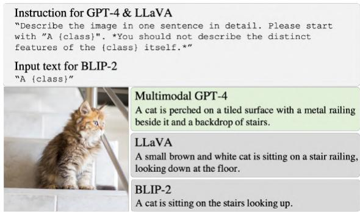  
Figure 4. Comparison of three instruction-following VLMs for generating SID. For the reference image of a cat and the instructions shown in the top, the three VLMs generate image captions shown in the right side of the image. Subsequently, the unique identifier [v] is inserted and the resulting captions are used for conditioning the diffusion model as the train descriptions. For painting/cartoon style re-contextualization, we used a slightly different instruction, as detailed in Appendix C.1. Additional fifteen examples for VLM-generated SIDs are available in Appendix E.2.

Captions generated by BLIP-2 significantly fall short of the desired SID, lacking informative specifications, i.e., detailed features, of any undesired objects (objects other than the cat in Fig. 4 example) in the images. Although LLaVA generates descriptions better aligned with the instructions, it still falls substantially short, tending to describe the subject excessively or fail to provide sufficient details about undesired objects. Compared to the other two, multi-modal GPT-4 stands out for its ability to follow instructions, delivering descriptions that closely align with the concept of SID. The quantitative comparisons between these VLMs are shown in Appendix E.2, where multi-modal GPT-4 shows the best subject and text alignment. Therefore, we have chosen multi-modal GPT-4 as the VLM for SID generation.

## 4. Experiments

We have performed comprehensive experiments to verify the enhancement resulting from SID. For the experiment datasets, images from previous works [12, 24, 45] and three websites [39, 59, 63] were examined. As the main experiment, we have integrated SID with four optimizationbased models – DreamBooth [45], Custom Diffusion [24], SVDiff [15], and Textual Inversion (TI) [12]. The superior effectiveness of SID is readily apparent across a broad spectrum of examples as shown in Fig. 5. In the presence of a single reference image only, we have also compared

SID-integrated DreamBooth (Ours) with two encoder-based models, ELITE [62] and BLIP-Diffusion [26], along with DreamBooth in Fig. 6. Implementation details for each model are provided in Appendix C.2.

## 5. Analysis of cross-attention map

The cross-attention map of each text token is known to highlight the pixels the text token describes [17, 56]. We visualized averaged cross-attention maps for the identifier [v], which is trained to encode the subject’s identity. The crossattention maps are averaged over all the timestamps, layers, and heads to show the single image that can be overlayed on the generated image, following the previous convention [56]. In Fig. 7, we compared cross-attention maps for DreamBooth and SID-integrated DreamBooth across four distinct biases: background, nearby-object, tied-object, and substance biases. While DreamBooth’s identifier tends to erroneously focus on undesired objects across all biased scenarios, our method consistently displays highly accurate attention focused on the subject. To extend this analysis, we conducted a comparison between the four cases of train descriptions (detailed in Fig. 3, top row) in Fig. E.2. These analyses confirm that integrating SID does reduce undesired embedding entanglements.

## 6. Analysis of three key measures

Image-alignment and text-alignment have become popular measures in recent personalized image synthesis [2, 9, 12, 13, 21, 24, 26, 45, 50, 57, 62]. However, we have found that the widely used image-alignment score tends to be significantly influenced by background entanglement, making it an inappropriate measure for analyzing undesired embedding entanglements. Therefore, we first define two customized measures, subject-alignment and non-subjectdisentanglement, by adapting image-alignment specifically for text-to-image personalization. Further details can be found in Appendix A, where we demonstrate the crucial importance of these two measures in assessing subject preservation and reduction in undesired embedding entanglement. Using the two measures, along with text-alignment, we conduct a quantitative analysis of SID.

Customizing image-alignment measure. Consider a set of reference images $R = \{ r _ { 1 } , r _ { 2 } , \cdot \cdot \cdot , r _ { N } \}$ and a set of generated images $G = \{ g _ { 1 } , g _ { 2 } , \cdot \cdot \cdot , g _ { M } \}$ . Each image in G is generated using R as the reference images with a common generation prompt p. Define $f _ { i } : \mathcal { X } _ { i m a g e } \ :  \ : \mathbb { R } ^ { D }$ and $f _ { t } : \bar { \mathcal { X } } _ { t e x t } \to \mathbb { R } ^ { \bar { D } }$ as the CLIP image and text encoders [41] followed by a unit-norm normalization, respectively. Also, define a subject segmentation function $s ~ : ~ \mathcal { X } _ { i m a g e } ~ $ $\{ 0 , 1 \} ^ { H \times W }$ , implemented as Grounded-SAM [14] conditioned on the subject’s class name. A mask over the image resolution space is output by s where 1 indicates the subject’s pixel and 0 indicates the non-subject’s pixel.

Reference images

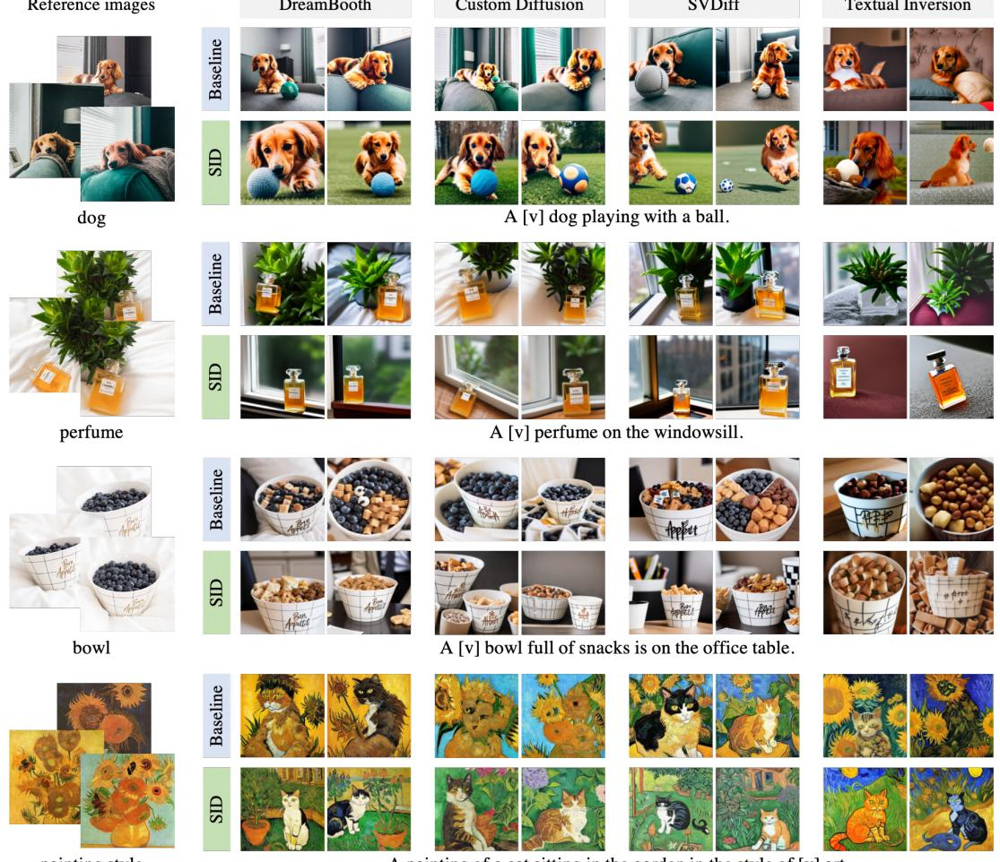  
painting style  
A painting of a cat sitting in the garden in the style of [v] art.

Figure 5. Enhancement by SID. For four optimization-based models (DreamBooth [45], Custom Diffusion [24], SVDiff [15], and Textual Inversion [12]), the baseline results are shown together with SID-integrated results. SID-integration effectively resolves entanglement issues in scenarios with high biases, represented by indoor background (1st row), nearby potted plant (2nd row), filled-in blueberries (3rd row), and sunflower substances (last row). Additional examples can be found in Appendix E.4.  
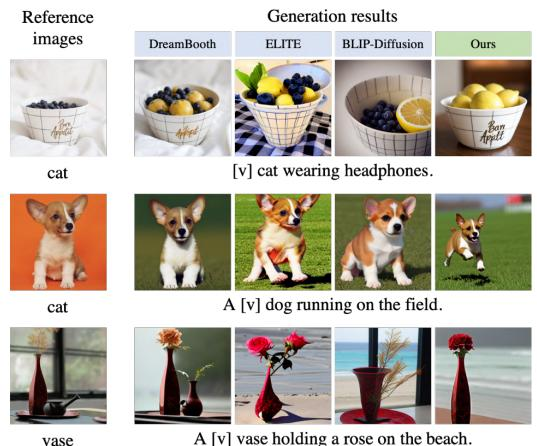  
Figure 6. Enhancement by SID for a single reference image. Two encoder-based models, ELITE [62] and BLIP-Diffusion [26], are compared with DreamBooth [45] and our SID-integrated DreamBooth. Notably, in the second row, our approach effectively addresses pose bias. Additional examples can be found in $\mathsf { A p - }$ pendix E.5.

The subject-alignment SA is defined as the average pairwise cosine similarity between generated images and subject segments of reference images in the CLIP-embedding space. The non-subject-disentanglement NSD is defined as the 1 minus the non-subject segment similarity in CLIPembedding space. They can be formally expressed as:

$$
\begin{array} { r l r } { S \mathcal { A } = } & { { } } & { A v g ( f _ { i } ( r _ { n } \odot s ( r _ { n } ) ) ^ { \top } \cdot f _ { i } ( g _ { m } ) ) , } \end{array}\tag{1}
$$

$$
\begin{array} { r } { \mathcal { N S D } = 1 - A v g ( f _ { i } ( r _ { n } \odot ( 1 - s ( r _ { n } ) ) ) ^ { \mathsf { T } } \cdot f _ { i } ( g _ { m } ) ) , } \end{array}\tag{2}
$$

where $A v g ( \cdot )$ denotes the average operation over all possible pair selections between $n ~ = ~ 1 , \ldots , N$ and $\begin{array} { r l } { m } & { { } = } \end{array}$ $1 , \ldots , M$ . Additionally, we evaluate text-alignment TA shown below.

$$
\mathcal { T A } = A v g ( f _ { t } ( p ) ^ { \mathrm { T } } \cdot f _ { i } ( g _ { m } ) ) .\tag{3}
$$

The identifier [v] is removed from the generation prompt p when evaluating T A.

DreamBooth Custom Diffsuion SVDiff ★ Mean  
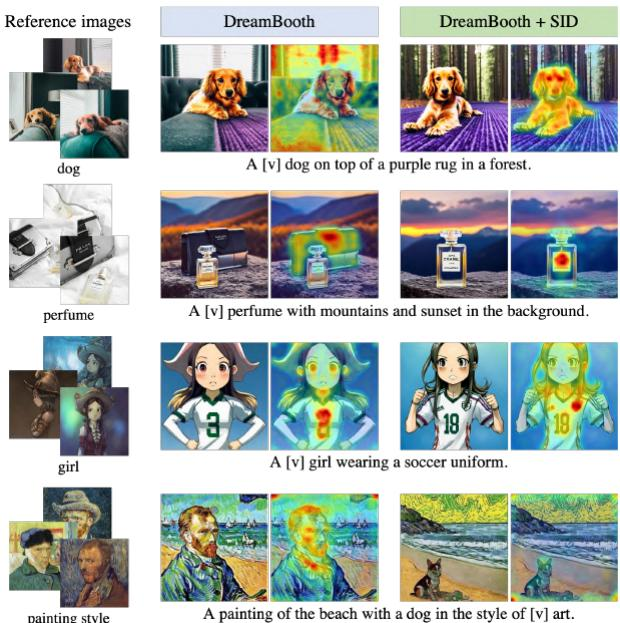  
Figure 7. Cross-attention map. Averaged cross-attention maps for the identifier [v] are shown. They are overlayed on the generated images. The undesirably entangled embeddings of Dream-Booth [45] can be confirmed from the erroneous focusing on the undesirable objects. On the contrary, SID-integrated DreamBooth accurately highlights the subjects of interest: dog, perfume, girl, and painting style. Image credit: David Revoy (3rd row)

Analysis of SID. The three measures have straightforward interpretations. A higher subject-alignment indicates superior preservation of the subject’s identity. Elevated nonsubject-disentanglement values signify a reduction in undesired embedding entanglements. Increased text-alignment suggests that the generated images align more closely with the generation prompt. Using the three measures, we have evaluated the three optimization-based models and their SID-integrated counterparts as shown in Fig. 8. For the single reference images, we evaluated ELITE [62] and BLIP-Diffusion [26] together with the three optimization-based models and the results are shown in Fig. 9. From the figures, it can be observed that all of the best performing, or Pareto optimal, models are the SID-integrated models. The average improvements of the three key metrics exhibit positive values with a substantial margin in all cases, except for subject alignment in Fig. 9. A potential explanation for this observation is the occurrence of subject overfitting in the existing models, particularly evident in cases such as pose bias. The implementation of SID mitigates subject overfitting, even when only a single reference image is provided. For the evaluation, we have utilized commonly used personalization datasets [12, 24, 45] to generate 7500 images. The details are articulated in Appendix C.4.

Human evaluation. We further assess the effectiveness of SID over its baseline by conducting human evaluation. Human evaluation was performed involving 130 participants, 10 subjects per participant, and 4 questions per subject (a total of 5,200 responses). Tab. B.2 shows that the survey results for subject-alignment, non-subject disentanglement, and text-alignment are consistent with the metric analysis in Fig. 8, supporting our metric analysis. The results and additional details are provided in Appendix B

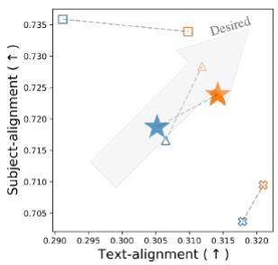

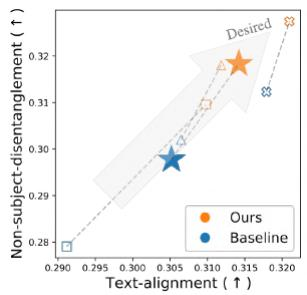  
DreamBooth Custom Diffsuion SVDiff ★ Mean

Figure 8. Pair-wise metric visualization for multiple reference images. The best performing ones are the SID-integrated models and they form the Pareto boundary.  
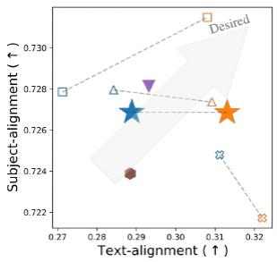

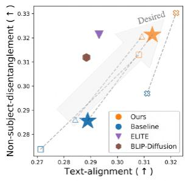  
Figure 9. Pair-wise metric visualization for single reference image. The best performing ones are the SID-integrated optimization-based models and they form the Pareto boundary. They also outperform the two encoder-based models.

## 7. Discussion

## 7.1. Negative prompt and segmentation

Negative prompt for classifier-free guidance [20] and segmentation can be considered as the alternatives of SID. Negative prompt is typically used to prevent the generation of unwanted features [49, 58, 64]. Segmentation mask has been used in several previous works for the purpose of isolating subject [2, 21, 26, 50, 62]. Instead of adopting SID, negative prompt can be used during inference or the subject’s segmentation mask can be applied before persubject optimization. In Fig. 10, SID-integration is compared to these two approaches. Negative prompts exhibit unsatisfactory disentanglement, suggesting that severely entangled representations cannot be easily unraveled during inference. Segmentation masks also exhibit its own limitations, and face challenges in dynamically editing the pose of the subject or faithfully following the generation prompt. SID shows higher non-subject-disentanglement and textalignment than the two alternatives.

Reference images  
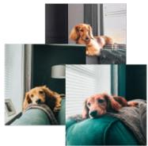  
dog

Negative prompt  

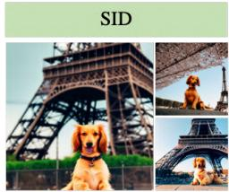  
A [v] dog sitting in front of the Eiffel Tower.

  
perfume

  
A [v] perfume on a park bench.

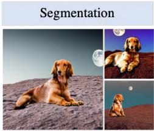

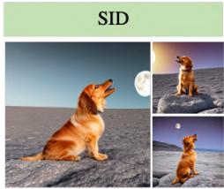  
A [v] dog howling at the moon on a rocky, barren landscape

  
A [v] perfume on a windowsill of an old cottage, overlooking a meadow.

Figure 10. Comparison with negative prompt and segmentation. DreamBooth [45] is used as the base model. Compared to the two alternatives, SID-integration demonstrates superior non-subject-disentanglement and text-alignment. Negative prompts used: “sitting on the fluffy blanket and green couch’’ in the upper row example, “next to a black Prada purse with silver hardware on a bed of white sheets” in the lower row example. Additional examples can be found in Appendix E.6  
Reference images  

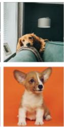  
dog

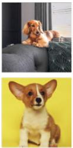

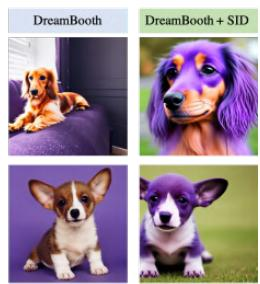  
A purple [v] dog  
Figure 11. Subject editing. Two examples are shown for editing subject’s color. DreamBooth [45] erroneously changes the color of non-subject elements (sofa in the upper row example, background in the lower row example), while SID-integrated DreamBooth accurately edits the subject (dog).

## 7.2. Enhancing subject editing

The identifier [v], specifically trained to encode the subject’s identity, enables us to modify the properties of the subject through a textual guidance. Undesired embedding entanglements, however, can lead to misaligned modifications. In Fig. 11, an example of subject’s color editing is shown. DreamBooth [45], influenced by embedding entanglements, fails to edit the subject and instead modifies the color of an undesired object or background. In contrast, SID-integrated DreamBooth precisely modifies the subject itself, following the provided color guidance.

## 7.3. Limitations of SID

A limitation of our approach is associated with the imperfections of VLM. While the multi-modal GPT-4 [37] generally generates descriptions that closely align with the provided instructions, occasional failures do occur. Although these instances are rare and may not be easily generalized, we have listed some of these failure cases in Appendix D.1. Another limitation is the undesired entanglement of the subject’s strong facial expressions. We discovered that this failure arises when the VLM-generated SID lacks informative specifications of facial expressions. This issue can be addressed by including undesired information in the SID, a solution detailed further in Appendix D.2. Finally, SID is exclusively integrated with optimization-based models in this study. Yet, there is potential for its integration into encoderbased models, particularly during encoder pre-training.

## 8. Conclusion

In this study, we have introduced a robust strategy to mitigate undesired embedding entanglement in text-to-image personalization. Beginning with the identification of five key biases, we have proposed SID (Selectively Informative Description) as an effective solution to address these biases. Our cross-attention analysis demonstrates the successful removal of entanglements, while alignment analysis indicates notable enhancements in non-subject-disentanglement and text-alignment. The proposed SID strategy holds potential applicability to other multi-modal applications where managing embedding entanglements is crucial.

Acknowledgement This work was supported by the following grants funded by the Korea government: NRF (NRF-2020R1A2C2007139, NRF-2022R1A6A1A03063039) and IITP ([NO.2021-0-01343, Artificial Intelligence Graduate School Program (Seoul National University)], [No. RS-2023-00235293]).

## References

[1] Stanislaw Antol, Aishwarya Agrawal, Jiasen Lu, Margaret Mitchell, Dhruv Batra, C Lawrence Zitnick, and Devi Parikh. Vqa: Visual question answering. In Proceedings of the IEEE international conference on computer vision, pages 2425– 2433, 2015.

[2] Omri Avrahami, Kfir Aberman, Ohad Fried, Daniel Cohen-Or, and Dani Lischinski. Break-a-scene: Extracting multiple concepts from a single image. arXiv preprint arXiv:2305.16311, 2023.

[3] Anas Awadalla, Irena Gao, Josh Gardner, Jack Hessel, Yusuf Hanafy, Wanrong Zhu, Kalyani Marathe, Yonatan Bitton, Samir Gadre, Shiori Sagawa, et al. Openflamingo: An opensource framework for training large autoregressive visionlanguage models. arXiv preprint arXiv:2308.01390, 2023.

[4] Alberto Baldrati, Marco Bertini, Tiberio Uricchio, and Alberto Del Bimbo. Effective conditioned and composed image retrieval combining clip-based features. In Proceedings of the IEEE/CVF Conference on Computer Vision and Pattern Recognition, pages 21466–21474, 2022.

[5] Kevin Black, Michael Janner, Yilun Du, Ilya Kostrikov, and Sergey Levine. Training diffusion models with reinforcement learning. arXiv preprint arXiv:2305.13301, 2023.

[6] Mathilde Caron, Hugo Touvron, Ishan Misra, Herve J ´ egou,´ Julien Mairal, Piotr Bojanowski, and Armand Joulin. Emerging properties in self-supervised vision transformers. In Proceedings of the IEEE/CVF international conference on computer vision, pages 9650–9660, 2021.

[7] Hila Chefer, Yuval Alaluf, Yael Vinker, Lior Wolf, and Daniel Cohen-Or. Attend-and-excite: Attention-based semantic guidance for text-to-image diffusion models. ACM Transactions on Graphics (TOG), 42(4):1–10, 2023.

[8] Nanxin Chen, Yu Zhang, Heiga Zen, Ron J Weiss, Mohammad Norouzi, and William Chan. Wavegrad: Estimating gradients for waveform generation. arXiv preprint arXiv:2009.00713, 2020.

[9] Wenhu Chen, Hexiang Hu, Yandong Li, Nataniel Rui, Xuhui Jia, Ming-Wei Chang, and William W Cohen. Subject-driven text-to-image generation via apprenticeship learning. arXiv preprint arXiv:2304.00186, 2023.

[10] Prafulla Dhariwal and Alexander Nichol. Diffusion models beat gans on image synthesis. Advances in neural information processing systems, 34:8780–8794, 2021.

[11] Weixi Feng, Xuehai He, Tsu-Jui Fu, Varun Jampani, Arjun Akula, Pradyumna Narayana, Sugato Basu, Xin Eric Wang, and William Yang Wang. Training-free structured diffusion guidance for compositional text-to-image synthesis. arXiv preprint arXiv:2212.05032, 2022.

[12] Rinon Gal, Yuval Alaluf, Yuval Atzmon, Or Patashnik, Amit H Bermano, Gal Chechik, and Daniel Cohen-Or. An image is worth one word: Personalizing text-toimage generation using textual inversion. arXiv preprint arXiv:2208.01618, 2022.

[13] Rinon Gal, Moab Arar, Yuval Atzmon, Amit H Bermano, Gal Chechik, and Daniel Cohen-Or. Encoder-based domain tuning for fast personalization of text-to-image models. ACM Transactions on Graphics (TOG), 42(4):1–13, 2023.

[14] Grounded-SAM Contributors. Grounded-Segment-

Anything. https : / / github . com / IDEA - Research / Grounded - Segment - Anything, Apr. 2023.

[15] Ligong Han, Yinxiao Li, Han Zhang, Peyman Milanfar, Dimitris Metaxas, and Feng Yang. Svdiff: Compact parameter space for diffusion fine-tuning. arXiv preprint arXiv:2303.11305, 2023.

[16] Haotian Liu. liuhaotian/llava-v1-0719-336px-lora-mergevicuna-13b-v1.3. https : / / huggingface . co / liuhaotian / llava - v1 - 0719 - 336px - lora - merge-vicuna-13b-v1.3, 2023.

[17] Amir Hertz, Ron Mokady, Jay Tenenbaum, Kfir Aberman, Yael Pritch, and Daniel Cohen-Or. Prompt-to-prompt image editing with cross attention control. arXiv preprint arXiv:2208.01626, 2022.

[18] Jonathan Ho, William Chan, Chitwan Saharia, Jay Whang, Ruiqi Gao, Alexey Gritsenko, Diederik P Kingma, Ben Poole, Mohammad Norouzi, David J Fleet, et al. Imagen video: High definition video generation with diffusion models. arXiv preprint arXiv:2210.02303, 2022.

[19] Jonathan Ho, Ajay Jain, and Pieter Abbeel. Denoising diffusion probabilistic models. Advances in neural information processing systems, 33:6840–6851, 2020.

[20] Jonathan Ho and Tim Salimans. Classifier-free diffusion guidance. arXiv preprint arXiv:2207.12598, 2022.

[21] Xuhui Jia, Yang Zhao, Kelvin CK Chan, Yandong Li, Han Zhang, Boqing Gong, Tingbo Hou, Huisheng Wang, and Yu-Chuan Su. Taming encoder for zero fine-tuning image customization with text-to-image diffusion models. arXiv preprint arXiv:2304.02642, 2023.

[22] Zhifeng Kong, Wei Ping, Jiaji Huang, Kexin Zhao, and Bryan Catanzaro. Diffwave: A versatile diffusion model for audio synthesis. arXiv preprint arXiv:2009.09761, 2020.

[23] Juil Koo, Seungwoo Yoo, Minh Hieu Nguyen, and Minhyuk Sung. Salad: Part-level latent diffusion for 3d shape generation and manipulation. In Proceedings of the IEEE/CVF International Conference on Computer Vision, pages 14441– 14451, 2023.

[24] Nupur Kumari, Bingliang Zhang, Richard Zhang, Eli Shechtman, and Jun-Yan Zhu. Multi-concept customization of textto-image diffusion. In Proceedings of the IEEE/CVF Conference on Computer Vision and Pattern Recognition, pages 1931–1941, 2023.

[25] Kimin Lee, Hao Liu, Moonkyung Ryu, Olivia Watkins, Yuqing Du, Craig Boutilier, Pieter Abbeel, Mohammad Ghavamzadeh, and Shixiang Shane Gu. Aligning textto-image models using human feedback. arXiv preprint arXiv:2302.12192, 2023.

[26] Dongxu Li, Junnan Li, and Steven CH Hoi. Blipdiffusion: Pre-trained subject representation for controllable text-to-image generation and editing. arXiv preprint arXiv:2305.14720, 2023.

[27] Junnan Li, Dongxu Li, Silvio Savarese, and Steven Hoi. Blip-2: Bootstrapping language-image pre-training with frozen image encoders and large language models. arXiv preprint arXiv:2301.12597, 2023.

[28] Haohe Liu, Zehua Chen, Yi Yuan, Xinhao Mei, Xubo Liu, Danilo Mandic, Wenwu Wang, and Mark D Plumbley. Audioldm: Text-to-audio generation with latent diffusion models.

arXiv preprint arXiv:2301.12503, 2023.

[29] Haotian Liu, Chunyuan Li, Qingyang Wu, and Yong Jae Lee. Visual instruction tuning. arXiv preprint arXiv:2304.08485, 2023.

[30] Nan Liu, Shuang Li, Yilun Du, Antonio Torralba, and Joshua B Tenenbaum. Compositional visual generation with composable diffusion models. In European Conference on Computer Vision, pages 423–439. Springer, 2022.

[31] Timo Luddecke and Alexander Ecker. Image segmenta-¨ tion using text and image prompts. In Proceedings of the IEEE/CVF Conference on Computer Vision and Pattern Recognition, pages 7086–7096, 2022.

[32] Zhengxiong Luo, Dayou Chen, Yingya Zhang, Yan Huang, Liang Wang, Yujun Shen, Deli Zhao, Jingren Zhou, and Tieniu Tan. Videofusion: Decomposed diffusion models for high-quality video generation. In Proceedings of the IEEE/CVF Conference on Computer Vision and Pattern Recognition, pages 10209–10218, 2023.

[33] Makoto Shing. svdiff-pytorch. https://github.com/ mkshing/svdiff-pytorch, 2023.

[34] Nasir Mohammad Khalid, Tianhao Xie, Eugene Belilovsky, and Tiberiu Popa. Clip-mesh: Generating textured meshes from text using pretrained image-text models. In SIGGRAPH Asia 2022 conference papers, pages 1–8, 2022.

[35] Alex Nichol, Prafulla Dhariwal, Aditya Ramesh, Pranav Shyam, Pamela Mishkin, Bob McGrew, Ilya Sutskever, and Mark Chen. Glide: Towards photorealistic image generation and editing with text-guided diffusion models. arXiv preprint arXiv:2112.10741, 2021.

[37] OpenAI. Gpt-4 technical report, 2023.

[36] OpenAI. ChatGPT. https://openai.com/blog/ chatgpt/, 2023.

[38] Or Patashnik, Zongze Wu, Eli Shechtman, Daniel Cohen-Or, and Dani Lischinski. Styleclip: Text-driven manipulation of stylegan imagery. In Proceedings of the IEEE/CVF International Conference on Computer Vision, pages 2085–2094, 2021.

[39] Peper and Carrot. https://www.peppercarrot. com/.

[40] Quynh Phung, Songwei Ge, and Jia-Bin Huang. Grounded text-to-image synthesis with attention refocusing. arXiv preprint arXiv:2306.05427, 2023.

[41] Alec Radford, Jong Wook Kim, Chris Hallacy, Aditya Ramesh, Gabriel Goh, Sandhini Agarwal, Girish Sastry, Amanda Askell, Pamela Mishkin, Jack Clark, et al. Learning transferable visual models from natural language supervision. In International conference on machine learning, pages 8748–8763. PMLR, 2021.

[42] Aditya Ramesh, Prafulla Dhariwal, Alex Nichol, Casey Chu, and Mark Chen. Hierarchical text-conditional image generation with clip latents. arXiv preprint arXiv:2204.06125, 1(2):3, 2022.

[43] Robin Rombach, Andreas Blattmann, Dominik Lorenz, Patrick Esser, and Bjorn Ommer. High-resolution image¨ synthesis with latent diffusion models. In Proceedings of the IEEE/CVF conference on computer vision and pattern recognition, pages 10684–10695, 2022.

[44] Olaf Ronneberger, Philipp Fischer, and Thomas Brox. Unet: Convolutional networks for biomedical image segmen-

tation. In Medical Image Computing and Computer-Assisted Intervention–MICCAI 2015: 18th International Conference, Munich, Germany, October 5-9, 2015, Proceedings, Part III 18, pages 234–241. Springer, 2015.

[45] Nataniel Ruiz, Yuanzhen Li, Varun Jampani, Yael Pritch, Michael Rubinstein, and Kfir Aberman. Dreambooth: Fine tuning text-to-image diffusion models for subject-driven generation. In Proceedings of the IEEE/CVF Conference on Computer Vision and Pattern Recognition, pages 22500– 22510, 2023.

[46] Chitwan Saharia, William Chan, Saurabh Saxena, Lala Li, Jay Whang, Emily L Denton, Kamyar Ghasemipour, Raphael Gontijo Lopes, Burcu Karagol Ayan, Tim Salimans, et al. Photorealistic text-to-image diffusion models with deep language understanding. Advances in Neural Information Processing Systems, 35:36479–36494, 2022.

[47] Salesforce. LAVIS. https : / / github . com / salesforce / LAVIS / tree / main / projects / blip-diffusion, 2023.

[48] Salesforce. Salesforce/blip2-opt-2.7b. https : / / huggingface.co/Salesforce/blip2- opt- 2. 7b, 2023.

[49] Patrick Schramowski, Manuel Brack, Bjorn Deiseroth, and¨ Kristian Kersting. Safe latent diffusion: Mitigating inappropriate degeneration in diffusion models. In Proceedings of the IEEE/CVF Conference on Computer Vision and Pattern Recognition, pages 22522–22531, 2023.

[50] Jing Shi, Wei Xiong, Zhe Lin, and Hyun Joon Jung. Instantbooth: Personalized text-to-image generation without testtime finetuning. arXiv preprint arXiv:2304.03411, 2023.

[51] Mohit Shridhar, Lucas Manuelli, and Dieter Fox. Cliport: What and where pathways for robotic manipulation. In Conference on Robot Learning, pages 894–906. PMLR, 2022.

[52] Uriel Singer, Adam Polyak, Thomas Hayes, Xi Yin, Jie An, Songyang Zhang, Qiyuan Hu, Harry Yang, Oron Ashual, Oran Gafni, et al. Make-a-video: Text-to-video generation without text-video data. arXiv preprint arXiv:2209.14792, 2022.

[53] Jiaming Song, Chenlin Meng, and Stefano Ermon. Denoising diffusion implicit models. arXiv preprint arXiv:2010.02502, 2020.

[54] Yang Song and Stefano Ermon. Generative modeling by estimating gradients of the data distribution. Advances in neural information processing systems, 32, 2019.

[55] Yang Song, Jascha Sohl-Dickstein, Diederik P Kingma, Abhishek Kumar, Stefano Ermon, and Ben Poole. Score-based generative modeling through stochastic differential equations. arXiv preprint arXiv:2011.13456, 2020.

[56] Raphael Tang, Linqing Liu, Akshat Pandey, Zhiying Jiang, Gefei Yang, Karun Kumar, Pontus Stenetorp, Jimmy Lin, and Ferhan Ture. What the daam: Interpreting stable diffusion using cross attention. arXiv preprint arXiv:2210.04885, 2022.

[57] Yoad Tewel, Rinon Gal, Gal Chechik, and Yuval Atzmon. Key-locked rank one editing for text-to-image personalization. In ACM SIGGRAPH 2023 Conference Proceedings, pages 1–11, 2023.

[58] Narek Tumanyan, Michal Geyer, Shai Bagon, and Tali Dekel. Plug-and-play diffusion features for text-driven

image-to-image translation. In Proceedings ofthe IEEE/CVF Conference on Computer Vision and Pattern Recognition, pages 1921–1930, 2023.

[59] Unsplash. https://unsplash.com/.

[60] Patrick von Platen, Suraj Patil, Anton Lozhkov, Pedro Cuenca, Nathan Lambert, Kashif Rasul, Mishig Davaadorj, and Thomas Wolf. Diffusers: State-of-the-art diffusion models.

[61] Zihao Wang, Xihui Liu, Hongsheng Li, Lu Sheng, Junjie Yan, Xiaogang Wang, and Jing Shao. Camp: Cross-modal adaptive message passing for text-image retrieval. In Proceedings ofthe IEEE/CVF international conference on computer vision, pages 5764–5773, 2019.

[62] Yuxiang Wei, Yabo Zhang, Zhilong Ji, Jinfeng Bai, Lei Zhang, and Wangmeng Zuo. Elite: Encoding visual concepts into textual embeddings for customized text-to-image generation. arXiv preprint arXiv:2302.13848, 2023.

[63] Wikiart. https://www.wikiart.org/.

[64] Xiaoshi Wu, Keqiang Sun, Feng Zhu, Rui Zhao, and Hongsheng Li. Human preference score: Better aligning text-toimage models with human preference. In Proceedings of the IEEE/CVF International Conference on Computer Vision, pages 2096–2105, 2023.

[65] Kelvin Xu, Jimmy Ba, Ryan Kiros, Kyunghyun Cho, Aaron Courville, Ruslan Salakhudinov, Rich Zemel, and Yoshua Bengio. Show, attend and tell: Neural image caption generation with visual attention. In International conference on machine learning, pages 2048–2057. PMLR, 2015.

[66] Ruihan Yang, Prakhar Srivastava, and Stephan Mandt. Diffusion probabilistic modeling for video generation. arXiv preprint arXiv:2203.09481, 2022.

[67] Yuxiang Wei. ELITE. https : / / github . com / csyxwei/ELITE, 2023.

[68] Xiaohui Zeng, Arash Vahdat, Francis Williams, Zan Gojcic, Or Litany, Sanja Fidler, and Karsten Kreis. Lion: Latent point diffusion models for 3d shape generation. arXiv preprint arXiv:2210.06978, 2022.

[69] Linqi Zhou, Yilun Du, and Jiajun Wu. 3d shape generation and completion through point-voxel diffusion. In Proceedings of the IEEE/CVF International Conference on Computer Vision, pages 5826–5835, 2021.