# Semantic Human Mesh Reconstruction with Textures

Xiaoyu Zhan1, Jianxin Yang1, Yuanqi Li1, Jie Guo1, Yanwen Guo1∗, and Wenping Wang2 1 Nanjing University 2 Texas A&M University

{zhanxy,jianxin-yang,yuanqili}@smail.nju.edu.cn, {guojie,ywguo}@nju.edu.cn, wenping@tamu.edu https://zhanxy.xyz/projects/shert

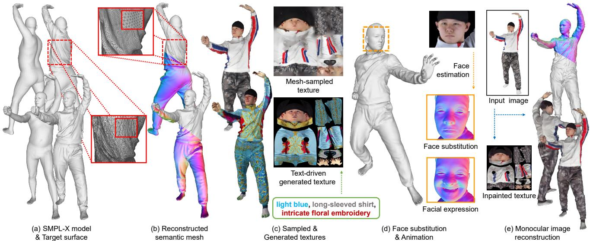  
Figure 1. Semantic Human mEsh Reconstruction with Textures (SHERT): (a) Given a target surface and the corresponding semantic guider, (b) SHERT reconstructs a detailed semantic model, which has stable UV unwrapping and skinning weights with high-quality triangle meshes. (c) It can either sample a texture map from the target surface or generate from the text prompts. (d) Based on our semantic representation, SHERT allows for high-precision facial reconstruction and animation of the body, face, and hands. (e) Moreover, SHERT is capable of inferring a fully textured avatar from a monocular image.

## Abstract

Thefield of3D detailed human mesh reconstruction has made significant progress in recent years. However, current methods stillface challenges when used in industrial applications due to unstable results, low-quality meshes, and a lack ofUV unwrapping and skinning weights. In this paper, we present SHERT, a novel pipeline that can reconstruct semantic human meshes with textures and high-precision details. SHERTapplies semantic- and normal-based sampling between the detailed surface (e.g. mesh and SDF) and the corresponding SMPL-X model to obtain a partially sampled semantic mesh and then generates the complete semantic mesh by our specifically designed self-supervised completion and refinement networks. Using the complete semantic mesh as a basis, we employ a texture diffusion model to create human textures that are driven by both images and texts. Our reconstructed meshes have stable UV unwrapping, high-quality triangle meshes, and consistent semantic

information. The given SMPL-X model provides semantic information and shape priors, allowing SHERT to perform well even with incorrect and incomplete inputs. The semantic information also makes it easy to substitute and animate different body parts such as theface, body, and hands. Quantitative and qualitative experiments demonstrate that SHERT is capable of producing high-fidelity and robust semantic meshes that outperform state-of-the-art methods.

## 1. Introduction

Recovering highly realistic details and textures of a human mesh from monocular images is crucial for various applications such as gaming, movies, cartoons, VR, virtual try-on, and digital avatars. Current approaches [1, 2, 4, 23, 24, 26, 39, 54, 55, 57, 61, 63, 64, 67, 70] primarily focus on the recovery of the geometric details that are associated with images, but their results are not yet practical for real-world applications. Recent advancements in parametric and explicit clothing models [12, 19, 29, 50, 62, 75] have shown promise in clothing reconstruction. However, they have limitations in accurately fitting different geometries and details. Implicit reconstruction approaches [23, 54, 55, 63, 64, 67, 70] excel at capturing clothing details but perform poorly in hands and face reconstruction. They may also generate incomplete and geometrically inseparable results.

In this work, our goal is to reconstruct fully textured semantic human meshes through given detailed surfaces and corresponding semantic guiders. Our semantic human mesh is complete, animatable, and edit-friendly for both users and designers. It ensures that each vertex has deterministic semantic information and predefined skinning weights. This allows for easy substitution and animation of different body parts such as the face, body, and hands. The semantic information also guarantees stable and reasonable UV unwrapping, which is advantageous for editing and image-based texture generation.

Specifically, we propose SHERT, which generates a semantic human mesh from the detailed surface and its corresponding SMPL-X [46] model and optionally infers textures from images or colored surfaces. SHERT has four main processes. 1) Sampling, SHERT applies semantic and normal-based sampling to obtain a partially sampled semantic mesh based on the input detailed surface and SMPL-X model. We subdivide the original SMPL-X model to better capture the human details. 2) Completion, a selfsupervised network is proposed to complete the partially sampled mesh. The network works in the 2D UV domain, which converts the 3D completion task into a 2D inpainting task. 3) Refinement, the origin image and front-back normal maps are used to enhance the geometry details. 4) Texture, our semantic human mesh is projected to the origin image in order to generate the partial texture map. Then we adapt the diffusion framework for text-driven partial texture inpainting and generation. The powerful generation ability of pre-trained diffusion model enables textures with rich clothing details and clear facial expressions.

Extensive experiments have been conducted on both datasets and in-the-wild images. The quantitative and qualitative results show the robustness and superior performance of SHERT in reconstructing high-fidelity semantic human meshes and generating various high-resolution textures.

In summary, the main contributions of this work include four-fold.

• We introduce SHERT, a novel pipeline to reconstruct high-quality semantic human meshes from the detailed 3D surfaces, represented either explicitly as meshes, or implicitly as signed distance field (SDF). SHERT is also capable of predicting robust and fully textured avatars with high-fidelity faces from monocular images.

• We propose a semantic- and normal-based sampling method (SNS) and a self-supervised mesh completion network to achieve non-rigid 3D surface registration. The approach has the capability to process incomplete and inaccurate inputs by leveraging SMPL-X human priors.

• We present a self-supervised mesh refinement network working in the UV domian. It utilizes the images and front-back normal maps to improve the geometric mesh details.

• We use a diffusion model to infer high-resolution human textures from input images. The model can also accomplish text-driven texture inpainting and generation.

## 2. Related Work

## 2.1. Monocular 3D Human Reconstruction

Clothed Human Reconstruction. Most of the current CNN-based monocular 3D clothed human shape estimation methods can be divided into two categories: explicitbased [1–4, 29, 73, 74] and implicit-based [5, 12, 23– 26, 39, 54, 55, 57, 63, 64, 67, 70] approaches, based on their representations. Explicit-based approaches usually infer the 3D offsets on top of the parametric human model [41, 46, 49, 65]. However, these methods are difficult to apply to flexible human topologies and cannot capture details well. Implicit-based approaches have the advantage of representing arbitrary 3D clothed human shapes that are free from the limitations of parametric human models. There are also some works [13, 25, 39, 63, 64, 70] that mix the implicit and explicit representations to achieve the detailed and robust 3D clothed human reconstruction. But both implicitbased and mixed methods still cannot maintain the stability of the human body shape well, often resulting in problems such as blurring and missing local body parts in the predicted results. Some methods [12, 19, 29, 50, 62, 75] propose additional parametric or implicit clothing models to fit loose clothes. These clothing models often struggle to accurately capture the details present in the images. Nevertheless, they are still useful for generating rough approximations of the clothing. Despite considerable progress made in monocular human reconstruction capture, there are still certain constraints, especially in terms of reliability, availability, and user-friendliness.

Texture Prediction. Previous works [5, 13, 24–26, 44, 54, 57, 59] have also focused on predicting image-based human textures. However, the current emphasis of implicit-based methods [5, 13, 24–26, 54] is still on predicting vertex colors, which cannot be easily converted into usable texture maps for industrial applications. DINAR [59] proposes neural textures for modeling human avatars and achieves texture inpainting by utilizing the diffusion framework. Nevertheless, the neural texture is highly coupled with human avatars, and the resolution is relatively low.

Face Reconstruction. In recent years, parameterized face models [8, 9, 36, 47] have been widely used in monocular face reconstruction algorithms [14, 17, 18, 56, 76], contributing to the success of achieving realistic high-quality reconstruction results. In light of the incorporation of FLAME [36] into SMPL-X [46], we can utilize high-quality facial reconstruction results from previous works to enhance the accuracy and realism of the SMPL-X based human body reconstruction results.

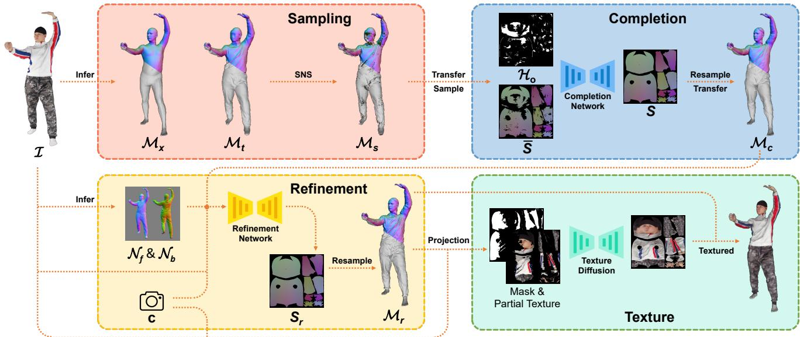  
Figure 2. Overview of SHERT for monocular image reconstruction. Given an RGB image I, SHERT first infers the detailed mesh $\mathcal { M } _ { t }$ and corresponding sub-SMPLX model $\mathcal { M } _ { x } .$ . It then applies SNS to obtain the partial semantic mesh $\mathcal { M } _ { s }$ (in Sec. 3.2). The Completion Net infers $\mathcal { M } _ { c }$ by filling the UV holes in $\mathcal { M } _ { s }$ (in Sec. 3.3). Image and normal maps are utilized to generate $\mathcal { M } _ { r } ,$ which contains sharper geometry details (in Sec. 3.4). Finally, SHERT uses a diffusion model to achieve text-driven texture inpainting and generation (in Sec. 3.5).

## 2.2. Non-rigid 3D Registration

Non-rigid 3D surface registration approaches [6, 10, 22, 30, 35, 45, 66, 68] usually compute a deformation that aligns a source surface with a target surface [15]. SHERT aims to transfer the semantic information of parametric human models to the corresponding detailed surfaces through registration. However, existing methods mainly focus on the precise registration of the source and target, while the target detailed human surfaces in real-world tasks often have incomplete and erroneous data.

## 3. Method

SHERT is capable of reconstructing a high-fidelity fully textured semantic human mesh based on a pair of detailed 3D surface and corresponding SMPL-X [46] model. Our results have high robustness and will not result in missing body parts in despite of the incomplete inputs. Furthermore, the semantic mesh ensures that each vertex has deterministic semantic information and predefined skinning weights, making it possible to replace and animate the human face, body, and hands. SHERT can also generate realistic human textures from texts and images. These features make it easy for users and designers to use or further edit our results. To achieve this, SHERT first subdivides the SMPL-X model to improve the accuracy in capturing human details (in Sec. 3.1) and then applies the semantic- and normalbased sampling to obtain a partially sampled mesh (in Sec. 3.2). We complete the partial result using a self-supervised mesh completion network (in Sec. 3.3), and finally enhance the geometry details through refinement (in Sec. 3.4). In addition, SHERT uses a diffusion model for text-driven human texture inpainting and generation (in Sec. 3.5).

## 3.1. Subdivided SMPL-X model

In this work, we use SMPL-X as the semantic guider. SMPL-X is a parameterized body model that combines SMPL [41] with the FLAME [37] head model and the MANO [52] hand model. It is parameterized with shape and pose, has 10, 475 vertices and 54 joints, including joints for the neck, jaw, eyeballs, and fingers. The SMPL-X model provides basic skinning weights and corresponding semantic information for each vertex.

SHERT defines the sub-SMPLX based on SMPL-X since 10, 475 vertices are not sufficient to accurately represent the details of the human body and clothing, such as facial details and clothing wrinkles. Taking into consideration both the expressiveness of the model and computational cost , we apply the mid-point subdivision algorithm twice on a standard SMPL-X model (with eyeballs removed) to obtain the sub-SMPLX with 149, 921 vertices and 299, 712 faces.

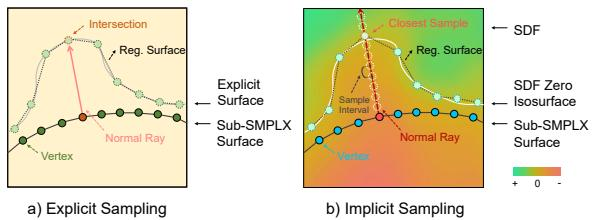  
Figure 3. Explicit and implicit sampling. a) SNS shoots a ray from the starting vertex along the vertex normal to locate the intersection point with the target surface. b) SNS takes samples at fixed intervals along the vertex normal ray and search for the point that is closest to the zero isosurface.

## 3.2. Semantic- and Normal-based Sampling (SNS)

Our objective is to accurately predict the non-rigid deformation between a source surface and a target surface. Given a source surface ${ \mathcal { M } } _ { x } ,$ which is represented as a sub-SMPLX in our work, and the target surface $M _ { t } .$ , we learn a mapping function $D : \mathcal { M } _ { x } ^ { 1 4 9 9 2 1 \times 3 } \to \mathcal { M } _ { s } ^ { 1 4 9 9 2 1 \times 3 }$ such that $\mathcal { M } _ { s }$ can be aligned with $\mathcal { M } _ { t }$ through the learned mapping in geometry, and ignoring the incorrect parts.

Specifically, we obtain a partially sampled mesh through a sampling scheme based on the vertex normals $N ^ { 1 4 9 9 2 1 \times 3 }$ Starting from a point on $\mathcal { M } _ { x } .$ , we search for the intersection point with the target surface $\mathcal { M } _ { t }$ along the vertex normal ray. We can extend the sampling scheme to implicit surfaces with constant step Ray Marching [28, 48], shown in Fig. 3 and Fig. 4.

It should be noted that SNS does not always return satisfactory results since the ray may not intersect with the target surface. We need to locate and label the vertices that have failed to register. In addition, due to the large geometric differences and the possibility of incorrect alignment, the sampling scheme may retrieve incorrect results, which should also be detected. In order to remove incorrect points and triangle meshes from the sampled results, we calculate θ (the angle between the normal vectors of the sampled triangle mesh and the corresponding sub-SMPLX triangle mesh), s (the area ratio between the sampled triangle mesh and the corresponding sub-SMPLX triangle mesh), and $r$ (the edge ratio between the longest and shortest edges of the sampled triangle mesh) for each triangle mesh in the sampled result. We then perform mesh culling by removing low-quality triangle meshes that have at least one indicator exceeding the threshold among the three mentioned above. Finally, we perform a connectivity check on the processed sampled mesh and remove the sets with a number of connected triangle meshes less than g. By default, we set $\theta = 2 _ { \mathrm { { ; } } }$ $s = 3 , r = 3$ , and $g = 5 0 0$

We found that culling meshes only in the current pose would result in unreasonable deformations in human animation tasks. Therefore, SNS repeats the processing above in the canonical space. This ensures that we remove almost all unreasonable sampling results and obtain the partial se-

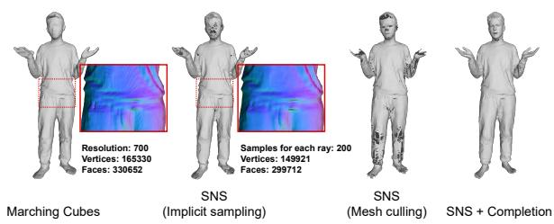  
Figure 4. SNS in the implicit field. We compare the performance of SNS and the Marching Cubes algorithm [42] in the implicit field predicted by the multi-view PIFu [54]. The results show that our SNS and completion network correctly reconstruct the implicit field and obtain a smoother surface compared to Marching Cubes.

mantic mesh $\mathcal { M } _ { s }$

## 3.3. Self-supervised Mesh Completion

In Sec. 3.2, the vertices that failed to register have resulted in holes in $M _ { s }$ . Currently, there are many mesh completion algorithms [11, 31–33, 40] that can fill in these mesh holes. However, these algorithms cannot be well adapted to our semantic reconstruction task due to the strong constraints on the number and relative positions of vertices in our representation in Sec. 3.1.

Therefore, we transform the partially sampled mesh into the UV domain [4, 16, 72] according to the semantic information. As a result, we convert the mesh completion task in 3D space into an inpainting task on a 2D image. Then, we design a self-supervised completion network that can fill in the holes of the partially sampled mesh. As shown in Fig. 5, by adding a random hole mask $\mathcal { H } _ { r }$ on the partial UV position map, we can obtain trainable pairs, which has a consistent distribution as the missing parts of the sampled mesh. The manually masked parts can provide the network with consistent supervision information as the input parts. This completion network is capable of generating robust meshes while maintaining both mesh quality and semantic consistency in the final results (refer to Fig. 6).

To further decrease the learning difficulties, we transform all incompletely sampled meshes to canonical space when facing the diverse range of poses and clothing styles. We believe that this approach has the potential to mitigate the challenges in problem-solving, as completion is no longer affected by pose and body shape. Meanwhile, since the sampled points are located on the normal ray of the sub-SMPLX vertices, we represent the deformation relative to sub-SMPLX as an offset based on the vertex normal. The transformed UV position map $\overline { S }$ can be presented as:

$$
\overline { { d } } = \frac { S _ { s a m p l e } - S _ { p o s e } } { N _ { p o s e } } ,\tag{1}
$$

$$
\overline { { S } } = S _ { c a n o } + N _ { c a n o } \cdot \overline { { d } } ,\tag{2}
$$

where $S _ { s a m p l e }$ denotes the partial $\mathrm { U V }$ position map of the sampled mesh. $S _ { p o s e }$ and $S _ { c a n o }$ refer to the UV position

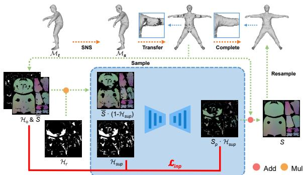  
Figure 5. Completion network. The completion network transforms the result of SNS into canonical space and predicts the holes in the UV domain.

maps of the original posed sub-SMPLX and the canonical sub-SMPLX respectively. $N _ { p o s e }$ and $N _ { c a n o }$ are the corresponding UV normal maps.

The complete UV position map S and the input combined hole mask $\mathcal { H } _ { s u p }$ are calculated by:

$$
\mathcal { H } _ { s u p } = \mathcal { H } _ { r } \cdot ( 1 - \mathcal { H } _ { o } ) + \mathcal { H } _ { o } ,\tag{3}
$$

$$
S = S _ { c a n o } + N _ { c a n o } \cdot [ d \cdot \mathcal { H } _ { o } + \overline { { d } } \cdot ( 1 - \mathcal { H } _ { o } ) ] ,\tag{4}
$$

where $\mathcal { H } _ { r }$ and $\mathcal { H } _ { o }$ denote the randomly added hole mask and the hole mask generated by SNS respectively. d $\in$ $\mathbb { R } ^ { H \times W \times 3 }$ is the estimated displacement UV map. The complete mesh $\mathcal { M } _ { c }$ is resampled from S and then transformed to the original pose space.

The primary loss used in our completion network is as follows:

$$
S _ { p } = S _ { c a n o } + N _ { c a n o } \cdot [ d \cdot \mathcal { H } _ { s u p } + \overline { { d } } \cdot ( 1 - \mathcal { H } _ { s u p } ) ] ,\tag{5}
$$

$$
\mathcal { L } _ { i n p } = \frac { \left| \left| ( S _ { p } - \overline { { S } } ) \cdot ( \mathcal { H } _ { s u p } - \mathcal { H } _ { o } ) \right| \right| _ { 2 } ^ { 2 } } { \sum _ { i , j } ( \mathcal { H } _ { s u p } - \mathcal { H } _ { o } ) _ { i , j } } .\tag{6}
$$

We find that completing the face, hands, and feet is much more difficult than other parts of the body, so we use the corresponding parts of sub-SMPLX for replacement. Furthermore, SHERT allows for the use of FLAME-based methods such as EMOCA [14] to replace the facial region in our completion results, enhancing the accuracy and realism of the facial details.

## 3.4. Self-supervised Mesh Refinement

After completing the mesh, we have already reconstructed a semantic mesh with extremely high levels of detail. However, some geometric details may be lost during the SNS and completion process. Therefore, we design an additional self-supervised refinement network to further optimize the mesh’s details (e.g. cloth wrinkles, subtle deformations of body movements) using the image and normal maps. The input normal maps can be obtained either by rendering the scanned model or by using prediction networks. Our refinement network follows a U-Net [53] architecture and is capable of predicting a displacement UV map, denoted as $\boldsymbol { z } \in \mathbb { R } ^ { H \times W \times 3 }$ , in order to optimize the complete mesh $\mathcal { M } _ { c } .$ Since the input image and normal maps are not in the UV domain, we utilize a separate network to extract the image domain features and then project them to UV domain.

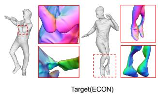

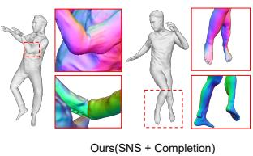

Figure 6. The robustness of SNS and Completion Network. We present our complete meshes, which are reconstructed using the predictions of ECON [64] from in-the-wild images. Distinguishing itself from previous registration methods, SHERT has the capability to effectively process scenarios where the inputs are incomplete, inaccurate, or contain errors by leveraging SMPL-X human priors.  
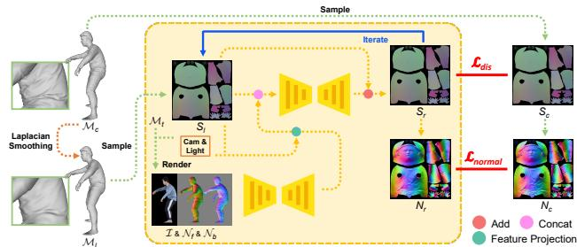  
Figure 7. Refinement network. The features extracted from the image and front-back normal maps are projected to the UV domain. These projected features are subsequently combined with the input UV position map to generate a refined mesh.

In order to guide the network in learning the potential correspondence between the input features and mesh details, we apply Laplacian Smoothing [20] on the existing complete meshes, as shown in Fig. 7. The smoothed mesh $\mathcal { M } _ { l }$ is used as input to the network, and the original mesh $\mathcal { M } _ { c }$ is used for supervision.

Given the image I, front-view normal map $\textstyle { \mathcal { N } } _ { f } .$ , backview normal map ${ \mathcal { N } } _ { b } .$ , and the corresponding complete UV position map $S _ { l } .$ , the projected feature F is typically represented as

$$
F = \mathcal { P } ( \mathcal { F } ( \mathcal { T } , \mathcal { N } _ { f } , \mathcal { N } _ { b } ) , S _ { l } , c ) ,\tag{7}
$$

where c represents the camera parameters, $\mathcal { F }$ denotes the image domain feature extraction network, and $\mathcal { P }$ is the projection function that can project the image domain features to the UV domain according to the camera parameters and the 3D coordinates of points on $S _ { l }$

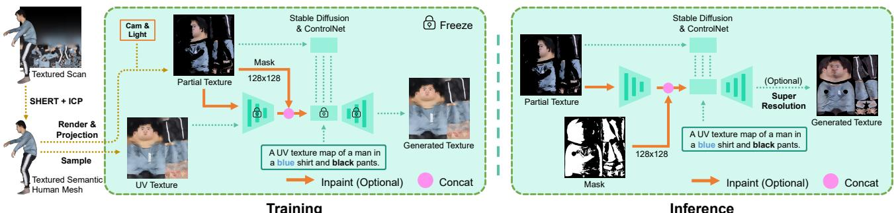  
Figure 8. Texture diffusion. We use two strategies to finetune the diffusion model for text-driven texture repainting and inpainting separately. During inference, instead of just using random noise, the encoded partial texture map and mask can be manually added to the latent features to preserve the original information of the input. Additionally, we use the super resolution method Real-esrgan [60], which can specifically optimize both the body and face, to further enhance the final outputs.

The UV position map $S _ { r }$ of the refined mesh $\mathcal { M } _ { r }$ is given by

$$
S _ { r } = S _ { l } + N _ { l } \cdot z ,\tag{8}
$$

where ${ \boldsymbol { z } } \in \mathbb { R } ^ { H \times W \times 3 }$ represents the predicted displacement UV map of the refine network, $S _ { l }$ and $N _ { l }$ are the UV position map and normal UV map of $\mathcal { M } _ { l }$ respectively.

The loss we used in refine network can be represented as

$$
\mathcal { L } _ { d i s } = M S E ( z - \frac { S _ { c } - S _ { l } } { N _ { l } } ) ,\tag{9}
$$

$$
\mathcal { L } _ { n o r m a l } = M S E ( N _ { r } - N _ { c } ) ,\tag{10}
$$

where $S _ { c }$ is the UV position map of $\mathcal { M } _ { c } . ~ N _ { r }$ and $N _ { c }$ denote the normal UV maps of $\mathcal { M } _ { r }$ and $\mathcal { M } _ { c }$ respectively.

Moreover, the refine network can be iteratively employed by users to enhance the mesh details according to their desired level (refer to Fig. 11).

## 3.5. Text-driven Texture Inpainting and Generation

In Sec. 3.4, all the reconstructed meshes share the same semantic information from SMPL-X. This means that when the models are unfolded to the UV domain, vertices with the same semantic information will be projected to a fixed UV position, resulting in a stable texture map that allows for repainting and transferring textures. To perform texture inpainting on incomplete human body textures and generate high-quality human body textures driven by text, we finetune the Stable Diffusion model [51] with ControlNet [71], similar to the approach taken by Dinar [59].

As our reconstructed semantic mesh closely matches the scanned model’s geometry, we can use the ICP algorithm [7] to register the vertex colors from the scanned model onto our result. This enables us to convert the texture maps into the SMPL-X format. As shown in Fig. 8, we obtain a partial texture map from the input image based on the semantic mesh and camera parameters and hope to generate the invisible parts. ControlNet enable us to add conditional inputs (partial texture maps) to the generation of the diffusion network at a low cost. We use two strategies to finetune the diffusion model, distinguished by whether to take the encoded partial texture map and mask as the additional inputs [27]. During the inference process, we can directly input partial texture maps into the ControlNet and generate various results by adding random noise. Alternatively, we can enhance the preservation of existing information in images by concatenating the encoded partial texture maps and masks with the latent features. Although Stable Diffusion has not worked with UV-parameterized images before, the well-designed UV parameterization keeps the shapes of the face, body, and limbs stable, ensuring a learnable space for the model. The texture map for the body and limbs focuses more on color and patterns rather than shapes, also resulting in excellent outcomes when cropped with a mask.

## 4. Experiments

## 4.1. Datasets and Networks

Training data. The completion and refinement networks are trained using the first 499 scans of THuman2.0 [69]. During the training of the completion network, we randomly choose one of the remaining 498 masks as a random hole mask. To enrich the inputs for the refinement network, we rotate the meshes every 60 degrees, resulting in a total of 2994 different orientations. We utilized the ICP [7] algorithm to transfer the color of the THuman2.0 scans to the vertices of our completed result, thereby generating 499 UV textures for training and obtaining 2994 visible UV masks from the rotated meshes. The complete UV textures and visible UV masks are randomly combined as inputs for our texture diffusion.

<table><tr><td rowspan="2">Method</td><td colspan="3">CAPE[43]</td><td colspan="3">THuman2.0[69]</td></tr><tr><td>P2S↓</td><td>Chamfer↓</td><td>Normal↓</td><td>P2S↓</td><td>Chamfer↓</td><td>Normal↓</td></tr><tr><td>PIFu[54] *</td><td>2.1137</td><td>1.6537</td><td>0.0755</td><td>2.5493</td><td>2.3640</td><td>0.1042</td></tr><tr><td>PIFuHD[55]</td><td>3.7846</td><td>3.5787</td><td>0.1002</td><td>3.0772</td><td>3.1808</td><td>0.1207</td></tr><tr><td>PaMIR[70] *</td><td>1.4520</td><td>1.2241</td><td>0.0610</td><td>1.5439</td><td>1.3311</td><td>0.1102</td></tr><tr><td>ICON[63]</td><td>0.8855</td><td>0.8609</td><td>0.0347</td><td>1.0361</td><td>1.0874</td><td>0.0607</td></tr><tr><td>ECON[64]</td><td>0.9403</td><td>0.9386</td><td>0.0374</td><td>1.1304</td><td>1.2081</td><td>0.0661</td></tr><tr><td>2K2K[23] †</td><td></td><td></td><td></td><td>2.5342</td><td>2.6165</td><td>0.1030</td></tr><tr><td>Ours (ICON-comp)</td><td>0.8550↑</td><td>0.8107↑</td><td>0.0359</td><td>1.0459</td><td>1.0465↑</td><td>0.0604↑</td></tr><tr><td>Ours (ICON-refine)</td><td>0.8633</td><td>0.8112</td><td>0.0380</td><td>1.0442 ↑</td><td>1.0468</td><td>0.0603↑</td></tr><tr><td>Ours (ECON-comp)</td><td>0.8561 ↑</td><td>0.8242↑</td><td>0.0378</td><td>1.1255↑</td><td>1.1420↑</td><td>0.0672</td></tr><tr><td>Ours (ECON-refine)</td><td>0.8581</td><td>0.8144↑</td><td>0.0398</td><td>1.0630↑</td><td>1.0430↑</td><td>0.0649↑</td></tr></table>

Table 1. Quantitative evaluation for monocular image reconstruction. We evaluate the performance of our completion results (comp) and refinement results (refine) by comparing them with state-of-the-art methods. ∗ methods are re-implemented in [63] to ensure a fair comparison. † method has only been tested with human-facing-forward images. ↑ and ↑ indicate the improvement achieved through completion and refinement, respectively.

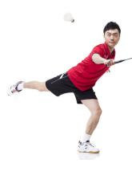  
Input

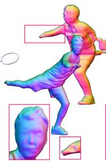  
PIFu

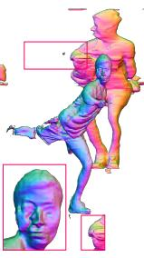  
PIFuHD

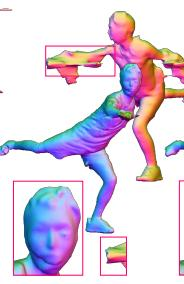  
PaMIR

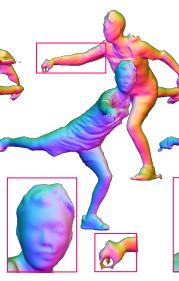  
ICON

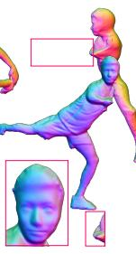  
2K2K

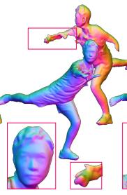  
ECON

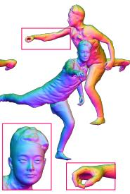  
Ours (ECON-based)

Figure 9. Qualitative comparison for monocular image reconstruction on in-the-wild image. For each method, we present two view of the reconstructed results. SHERT demonstrates the ability to handle challenging poses while providing clear details of facial and hand geometry.  
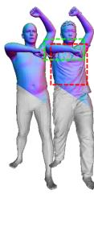

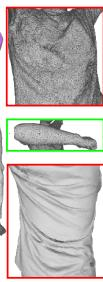  
Scan & Sub-SMPLX

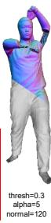

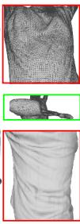  
N-ICP

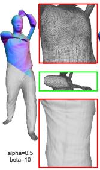  
RPTS

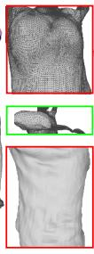  
SVR-0

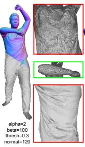  
Fast-RNRR

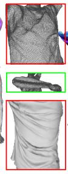  
DR

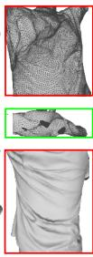  
MDA

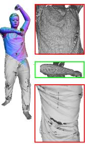  
SNS (Ours)

Testing data. We conduct quantitative and qualitative evaluations on CAPE [43], THuman2.0, and in-the-wild images. We use CAPE-NFP [63] (100 samples with 3 viewpoints for each), and the last 27 subjects of THuman2.0 scans (6 viewpoints, each differing by 60 degrees).

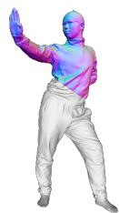  
Scan

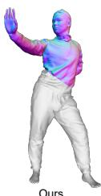  
Ours Completion

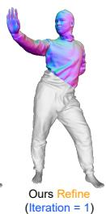

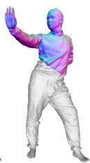  
Ours Refine (Iteration = 2)

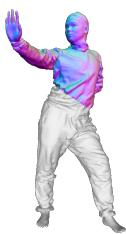  
Ours Refine (Iteration = 3)

Figure 10. Qualitative comparison for registration on THuman2.0. We compare the registration quality of various methods including N-ICP [6], RPTS [35], SVR-L [22], Fast-RNRR [68], DR [45], MDA [30] and ours SNS. The holes present in our result are the eliminated faces, as described in Sec. 3.2. The results indicate that SNS exhibits excellent performance in terms of model details, mesh quality, and registration robustness. The quantitative comparisons are shown in Tab. 2.  
Figure 11. The ablation results (with face substitution). We present the results after completion and refinement. With an increasing number of refinement iterations, the details of the mesh will be enhanced. Please zoom-in to see more details.
<table><tr><td>Method</td><td>GPU</td><td>P2S↓</td><td>Chamfer↓</td><td>G-avg↑</td><td>θ&lt;30°↓</td><td>Time</td></tr><tr><td>N-ICP [6]</td><td></td><td>0.213</td><td>0.163</td><td>0.506</td><td>55.2</td><td>7m 23s</td></tr><tr><td>RPTS [35]</td><td></td><td>0.488</td><td>0.360</td><td>0.565</td><td>48.3</td><td>1m 55s</td></tr><tr><td>SVR-L0 [22]</td><td></td><td>0.404</td><td>0.296</td><td>0.531</td><td>53.5</td><td>1h 23m 32s</td></tr><tr><td>Fast-RNRR [68]</td><td></td><td>0.115</td><td>0.097</td><td>0.597</td><td>31.1</td><td>1m 4s</td></tr><tr><td>DR [45]</td><td>√</td><td>0.339</td><td>0.347</td><td>0.581</td><td>47.7</td><td>16m 17s</td></tr><tr><td>MDA [30]</td><td>√</td><td>0.671</td><td>0.731</td><td>0.587</td><td>48.5</td><td>4m 48s</td></tr><tr><td>Ours (SNS)</td><td>-</td><td>0.107</td><td>0.078</td><td>0.729</td><td>17.3</td><td>23s</td></tr><tr><td>Ours (Comp)</td><td>√</td><td>0.139</td><td>0.167</td><td>0.662</td><td>28.9</td><td>27s (23 + 4)</td></tr></table>

Table 2. Quantitative evaluation for registration on THuman2.0. We test all the methods on the first subject of THuman2.0. Following the previous researches [21, 38], we adapt G-avg as a method for evaluating the mesh quality. We also report the metric θ<30◦, which denotes the percentage of triangle meshes in the given mesh that have an angle less than 30 degrees. Additionally, we present the metrics for our complete mesh.

Networks. The completion net and refinement net are both trained for 100 epochs with a learning rate of $1 \times 1 0 ^ { - 6 }$ . The resolutions of the input and output data, including the UV position maps, images, masks and front-back normal maps, are all $1 0 2 4 \times 1 0 2 4 \times 3$ . During inference, the ECON’s predicted front-back normals $( 5 1 2 \times 5 1 2 \times 3 )$ are upsampled to 1024 × 1024 × 3 using bilinear interpolation. The texture diffusion is trained for 1 epoch with a learning rate of 2 × $1 0 ^ { - 5 }$ . The sampler of texture diffusion is DDIM [58]. We use 30 steps by default and infer the texture UV map with a resolution of 1024 × 1024 × 3. All the networks are trained on three NVIDIA RTX 3090 GPUs.

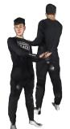

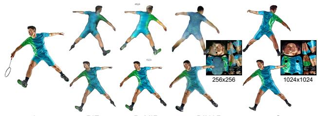  
PIFu  
PaMIR  
DINAR  
Ours

## 4.2. Evaluation

Quantitative comparisons. We conduct quantitative comparisons with mainstream state-of-the-art monocular image reconstruction approaches in Tab. 1. As in previous work [23, 55, 63, 64], we report the point-to-surface Euclidean distance (P2S, cm), the Chamfer Distance (cm), and the Normals difference (L2). To ensure a fair comparison, PIFu∗ [54] and PaMIR∗ [70] are re-implemented and retrained on THuman2.0, using the same settings as ICON [63]. The ground-truth SMPL/SMPL-X models are provided for evaluation. However, PIFu [54], PIFuHD [55] and 2K2K [23] do not utilize the parametric body priors, which may result in subpar performance. In Tab. 1, “ICONcomp” refers to the completion result achieved by leveraging ICON’s [63] prediction, while “ECON-refine” denotes the refinement mesh obtained using ECON’s [64] result and the predicted front-back normal maps. Additionally, we evaluate the registration quality of SNS against state-of-theart non-rigid registration methods, as presented in Tab. 2

Qualitative comparisons. We demonstrate a comparison between SHERT and state-of-the-art methods using in-thewild images, with a focus on monocular image reconstruction (refer to Fig. 9) and texture prediction (refer to Fig. 12). Additionally, we compare the registration quality of our SNS with state-of-the-art non-rigid registration approaches on Thuman2.0 (refer to Fig. 10).

## 4.3. Limitations

Due to the geometric limitations of SMPL-X, SHERT performs weaker in reconstructing loose clothing, shoes and hair compared to implicit-based reconstruction methods. It is also difficult to ensure consistent results of texture diffusion at the seams of UVs. See more in SupMat.

## 5. Applications

SHERT uses the skinning weights from SMPL-X to enable animated poses, expressions, and gestures on the reconstructed mesh through LBS [34] (refer to Fig. 13). It allows for both global texture repainting (refer to Fig. 14)

Figure 12. Qualitative comparison for texture prediction on inthe-wild image. We display the front and back view rendering results for each method. Since PIFu [54] and PaMIR [70] predict vertex colors, we only exhibit the texture maps of DINAR [59] and SHERT (ours). Please zoom-in to see more details.  
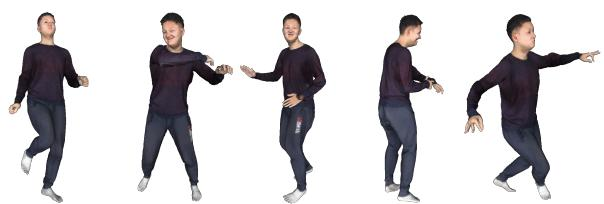  
Figure 13. Animation results. Please zoom-in to see more details.

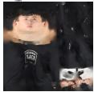  
Origin

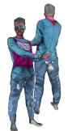

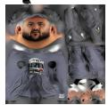

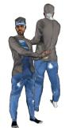

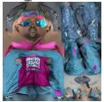  
sweatshirt, black pants

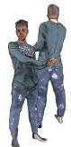  
pink sweatshirt, light blue pants, hiphop style

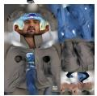  
gray jacket, blue jeans

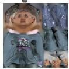  
woman, green sweatshirt

Figure 14. Global texture repainting. SHERT can repaint the texture through text prompts. Please zoom-in to see more details.  
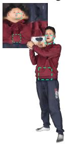  
Texture map & Render result

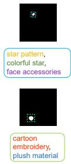  
Mask & Text prompt

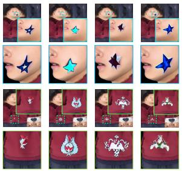  
Localized repainting & Render results

Figure 15. Localized texture repainting. SHERT can repaint the masked area through text prompts. Please zoom-in to see more details.

and the option for users to provide custom masks and text prompts for localized texture repainting (refer to Fig. 15).

## 6. Conclusion

We propose SHERT, which reconstructs a fully textured semantic human avatar from a detailed surface or a monocular image. It takes advantage of the geometric details of the target surface, along with semantic information and prior knowledge of the semantic guider. The reconstructed results have high-fidelity clothing details, high-quality triangle meshes, clear facial features, and complete hands geometry. SHERT is also capable of generating high-resolution texture maps with stable UV unwrapping. This approach bridges existing monocular reconstruction work and downstream industrial applications, and we believe it can promote the development of human avatars.

## Acknowledgments

This work was supported by the National Natural Science Foundation of China (62032011) and the Natural Science Foundation of Jiangsu Province (No. BK20211147).

## References

[1] Thiemo Alldieck, Marcus Magnor, Weipeng Xu, Christian Theobalt, and Gerard Pons-Moll. Video based reconstruction of 3d people models. In IEEE Conf. Comput. Vis. Pattern Recog.(CVPR), 2018. 1, 2

[2] Thiemo Alldieck, Marcus Magnor, Weipeng Xu, Christian Theobalt, and Gerard Pons-Moll. Detailed human avatars from monocular video. In IEEE Conf. 3D Vis.(3DV), 2018. 1

[3] Thiemo Alldieck, Marcus Magnor, Bharat Lal Bhatnagar, Christian Theobalt, and Gerard Pons-Moll. Learning to reconstruct people in clothing from a single rgb camera. In IEEE Conf. Comput. Vis. Pattern Recog.(CVPR), 2019.

[4] Thiemo Alldieck, Gerard Pons-Moll, Christian Theobalt, and Marcus Magnor. Tex2Shape: Detailed full human body geometry from a single image. In Int. Conf. Comput. Vis.(ICCV), 2019. 1, 2, 4

[5] Thiemo Alldieck, Mihai Zanfir, and Cristian Sminchisescu. Photorealistic monocular 3d reconstruction of humans wearing clothing. In IEEE Conf. Comput. Vis. Pattern Recog.(CVPR), 2022. 2

[6] Brian Amberg, Sami Romdhani, and Thomas Vetter. Optimal step nonrigid icp algorithms for surface registration. In IEEE Conf. Comput. Vis. Pattern Recog.(CVPR), 2007. 3, 7

[7] P.J. Besl and Neil D. McKay. A method for registration of 3- d shapes. IEEE Trans. Pattern Anal. Mach. Intell.(TPAMI), 1992. 6, 7

[8] Volker Blanz and Thomas Vetter. A morphable model for the synthesis of 3d faces. In 26th Annual Conference on Computer Graphics and Interactive Techniques (SIGGRAPH 1999), 1999. 3

[9] Chen Cao, Yanlin Weng, Shun Zhou, Yiying Tong, and Kun Zhou. Facewarehouse: A 3d facial expression database for visual computing. IEEE Trans. Vis. Comput. Graph.(TVCG), 2014. 3

[10] Kunyao Chen, Fei Yin, Bang Du, Baichuan Wu, and Truong Q. Nguyen. Efficient registration for human surfaces via isometric regularization on embedded deformation. IEEE Trans. Vis. Comput. Graph.(TVCG), 2022. 3

[11] Julian Chibane, Thiemo Alldieck, and Gerard Pons-Moll. Implicit functions in feature space for 3d shape reconstruction and completion. In IEEE Conf. Comput. Vis. Pattern Recog.(CVPR), 2020. 4

[12] Enric Corona, Albert Pumarola, Guillem Alenya, Gerard Pons-Moll, and Francesc Moreno-Noguer. SMPLicit: Topology-aware generative model for clothed people. In IEEE Conf. Comput. Vis. Pattern Recog.(CVPR), 2021. 2

[13] Enric Corona, Mihai Zanfir, Thiemo Alldieck, Eduard Gabriel Bazavan, Andrei Zanfir, and Cristian Sminchisescu. Structured 3d features for reconstructing controllable avatars. In IEEE Conf. Comput. Vis. Pattern Recog.(CVPR), 2023. 2

[14] Radek Danecek, Michael J. Black, and Timo Bolkart. EMOCA: Emotion driven monocular face capture and animation. In IEEE Conf. Comput. Vis. Pattern Recog.(CVPR), 2022. 3, 5

[15] Bailin Deng, Yuxin Yao, Roberto M. Dyke, and Juyong Zhang. A survey of non-rigid 3d registration. Computer Graphics Forum (Eurographics 2022 State-of-the-Art Reports), 2022. 3

[16] Jiankang Deng, Shiyang Cheng, Niannan Xue, Yuxiang Zhou, and Stefanos Zafeiriou. Uv-gan: Adversarial facial uv map completion for pose-invariant face recognition. In IEEE Conf. Comput. Vis. Pattern Recog.(CVPR), 2018. 4

[17] Yu Deng, Jiaolong Yang, Sicheng Xu, Dong Chen, Yunde Jia, and Xin Tong. Accurate 3d face reconstruction with weakly-supervised learning: From single image to image set. In IEEE Computer Vision and Pattern Recognition Workshops, 2019. 3

[18] Yao Feng, Haiwen Feng, Michael J. Black, and Timo Bolkart. Learning an animatable detailed 3D face model from in-the-wild images. ACM Trans. Graph.(TOG), 2021. 3

[19] Yao Feng, Jinlong Yang, Marc Pollefeys, Michael J Black, and Timo Bolkart. Capturing and animation of body and clothing from monocular video. In SIGGRAPH Asia 2022 Conference Proceedings, 2022. 2

[20] David A Field. Laplacian smoothing and delaunay triangulations. Communications in applied numerical methods, 1988. 5

[21] Pascal J Frey and Houman Borouchaki. Surface mesh quality evaluation. International journal for numerical methods in engineering, 1999. 7

[22] Kaiwen Guo, Feng Xu, Yangang Wang, Yebin Liu, and Qionghai Dai. Robust non-rigid motion tracking and surface reconstruction using l0 regularization. In Int. Conf. Comput. Vis.(ICCV), 2015. 3, 7

[23] Sang-Hun Han, Min-Gyu Park, Ju Hong Yoon, Ju-Mi Kang, Young-Jae Park, and Hae-Gon Jeon. High-fidelity 3d human digitization from single 2k resolution images. In IEEE Conf. Comput. Vis. Pattern Recog.(CVPR), 2023. 1, 2, 6, 8

[24] Tong He, Yuanlu Xu, Shunsuke Saito, Stefano Soatto, and Tony Tung. ARCH++: Animation-ready clothed human reconstruction revisited. In Int. Conf. Comput. Vis.(ICCV), 2021. 1, 2

[25] Yangyi Huang, Hongwei Yi, Yuliang Xiu, Tingting Liao, Jiaxiang Tang, Deng Cai, and Justus Thies. TeCH: Text-guided Reconstruction of Lifelike Clothed Humans. In International Conference on 3D Vision (3DV), 2024. 2

[26] Zeng Huang, Yuanlu Xu, Christoph Lassner, Hao Li, and Tony Tung. ARCH: Animatable reconstruction of clothed humans. In IEEE Conf. Comput. Vis. Pattern Recog.(CVPR), 2020. 1, 2

[27] Huggingface. Stable-diffusion-inpainting, 2022. https://hug gingface.co/runwayml/stable-diffusion-inpainting. 6

[28] Henrik Wann Jensen. Realistic image synthesis using photon mapping. AK Peters/crc Press, 2001. 4

[29] Boyi Jiang, Juyong Zhang, Yang Hong, Jinhao Luo, Ligang Liu, and Hujun Bao. BCNet: Learning body and cloth shape from a single image. In Eur. Conf. Comput. Vis.(ECCV), 2020. 2

[30] Yucheol Jung, Hyomin Kim, Gyeongha Hwang, Seung-Hwan Baek, and Seungyong Lee. Mesh density adapta-

tion for template-based shape reconstruction. In ACM SIG-GRAPH 2023 Conference Proceedings, 2023. 3, 7

[31] Michael Kazhdan and Hugues Hoppe. Screened poisson surface reconstruction. ACM Trans. Graph.(TOG), 2013. 4

[32] Michael Kazhdan, Matthew Bolitho, and Hugues Hoppe. Poisson surface reconstruction. In Proceedings of the fourth Eurographics symposium on Geometry processing, 2006.

[33] Vladislav Kraevoy and Alla Sheffer. Template-based mesh completion. In Symposium on Geometry Processing, 2005. 4

[34] John P Lewis, Matt Cordner, and Nickson Fong. Pose space deformation: a unified approach to shape interpolation and skeleton-driven deformation. In Proceedings of SIGGRAPH 2000, 2000. 8

[35] Kun Li, Jingyu Yang, Yu-Kun Lai, and Daoliang Guo. Robust non-rigid registration with reweighted position and transformation sparsity. IEEE Trans. Vis. Comput. Graph.(TVCG), 2018. 3, 7

[36] Tianye Li, Timo Bolkart, Michael Black, Hao Li, and Javier Romero. Learning a model of facial shape and expression from 4d scans. ACM Trans. Graph.(TOG), 2017. 3

[37] Tianye Li, Timo Bolkart, Michael. J. Black, Hao Li, and Javier Romero. Learning a model of facial shape and expression from 4D scans. ACM Trans. Graph.(TOG), 2017. 3

[38] Yuanqi Li, Jianwei Guo, Xinran Yang, Shun Liu, Jie Guo, Xiaopeng Zhang, and Yanwen Guo. Deep point cloud simplification for high-quality surface reconstruction. arXiv preprint arXiv:2203.09088, 2022. 7

[39] Tingting Liao, Xiaomei Zhang, Yuliang Xiu, Hongwei Yi, Xudong Liu, Guo-Jun Qi, Yong Zhang, Xuan Wang, Xiangyu Zhu, and Zhen Lei. High-fidelity clothed avatar reconstruction from a single image. In IEEE Conf. Comput. Vis. Pattern Recog.(CVPR), 2023. 1, 2

[40] Peter Liepa. Filling holes in meshes. In Proceedings of the 2003 Eurographics/ACM SIGGRAPH symposium on Geometry processing, 2003. 4

[41] Matthew Loper, Naureen Mahmood, Javier Romero, Gerard Pons-Moll, and Michael J. Black. SMPL: A skinned multiperson linear model. ACM Trans. Graph.(TOG), 2015. 2, 3

[42] William E Lorensen and Harvey E Cline. Marching cubes: A high resolution 3d surface construction algorithm. Seminal graphics: pioneering efforts that shaped thefield, 1998. 4

[43] Qianli Ma, Jinlong Yang, Anurag Ranjan, Sergi Pujades, Gerard Pons-Moll, Siyu Tang, and Michael J. Black. Learning to Dress 3D People in Generative Clothing. In IEEE Conf. Comput. Vis. Pattern Recog.(CVPR), 2020. 6, 7

[44] Aymen Mir, Thiemo Alldieck, and Gerard Pons-Moll. Learning to transfer texture from clothing images to 3d humans. In IEEE Conf. Comput. Vis. Pattern Recog.(CVPR), 2020. 2

[45] Baptiste Nicolet, Alec Jacobson, and Wenzel Jakob. Large steps in inverse rendering of geometry. ACM Trans. Graph.(TOG), 2021. 3, 7

[46] Georgios Pavlakos, Vasileios Choutas, Nima Ghorbani, Timo Bolkart, Ahmed A. A. Osman, Dimitrios Tzionas, and Michael J. Black. Expressive body capture: 3d hands, face,

and body from a single image. In IEEE Conf. Comput. Vis. Pattern Recog.(CVPR), 2019. 2, 3

[47] Pascal Paysan, Reinhard Knothe, Brian Amberg, Sami Romdhani, and Thomas Vetter. A 3d face model for pose and illumination invariant face recognition. In 2009 Sixth IEEE International Conference on Advanced Video and Signal Based Surveillance, 2009. 3

[48] Ken Perlin and Eric M Hoffert. Hypertexture. In Proceedings of the 16th annual conference on Computer graphics and interactive techniques, 1989. 4

[49] Leonid Pishchulin, Stefanie Wuhrer, Thomas Helten, Christian Theobalt, and Bernt Schiele. Building statistical shape spaces for 3d human modeling. Pattern Recognition, 2017. 2

[50] Lingteng Qiu, Guanying Chen, Jiapeng Zhou, Mutian Xu, Junle Wang, and Xiaoguang Han. Rec-mv: Reconstructing 3d dynamic cloth from monocular videos. In IEEE Conf. Comput. Vis. Pattern Recog.(CVPR), 2023. 2

[51] Robin Rombach, Andreas Blattmann, Dominik Lorenz, Patrick Esser, and Bjorn Ommer. High-resolution image syn-¨ thesis with latent diffusion models. In IEEE Conf. Comput. Vis. Pattern Recog.(CVPR), 2022. 6

[52] Javier Romero, Dimitrios Tzionas, and Michael J. Black. Embodied hands: Modeling and capturing hands and bodies together. ACM Trans. Graph.(TOG), 2017. 3

[53] Olaf Ronneberger, Philipp Fischer, and Thomas Brox. U-net: Convolutional networks for biomedical image segmentation. In Medical Image Computing and Computer-Assisted Intervention(MICCAI), 2015, 2015. 5

[54] Shunsuke Saito, Zeng Huang, Ryota Natsume, Shigeo Morishima, Angjoo Kanazawa, and Hao Li. PIFu: Pixel-aligned implicit function for high-resolution clothed human digitization. In Int. Conf. Comput. Vis.(ICCV), 2019. 1, 2, 4, 6, 8

[55] Shunsuke Saito, Tomas Simon, Jason Saragih, and Hanbyul Joo. PIFuHD: Multi-level pixel-aligned implicit function for high-resolution 3d human digitization. In IEEE Conf. Comput. Vis. Pattern Recog.(CVPR), 2020. 1, 2, 6, 8

[56] Jiaxiang Shang, Tianwei Shen, Shiwei Li, Lei Zhou, Mingmin Zhen, Tian Fang, and Long Quan. Self-supervised monocular 3d face reconstruction by occlusion-aware multiview geometry consistency. In Eur. Conf. Comput. Vis.(ECCV), 2020. 3

[57] Kaiyue Shen, Chen Guo, Manuel Kaufmann, Juan Zarate, Julien Valentin, Jie Song, and Otmar Hilliges. X-avatar: Expressive human avatars. In Computer Vision and Pattern Recognition (CVPR), 2023. 1, 2

[58] Jiaming Song, Chenlin Meng, and Stefano Ermon. Denoising diffusion implicit models. In Int. Conf. Learn. Represent., 2021. 7

[59] David Svitov, Dmitrii Gudkov, Renat Bashirov, and Victor Lempitsky. Dinar: Diffusion inpainting of neural textures for one-shot human avatars. In Int. Conf. Comput. Vis.(ICCV), 2023. 2, 6, 8

[60] Xintao Wang, Liangbin Xie, Chao Dong, and Ying Shan. Real-esrgan: Training real-world blind super-resolution with pure synthetic data. In Int. Conf. Comput. Vis.(ICCV), 2021. 6

[61] Donglai Xiang, Fabian Prada, Chenglei Wu, and Jessica Hodgins. Monoclothcap: Towards temporally coherent clothing capture from monocular rgb video. In IEEE Conf. 3D Vis.(3DV), 2020. 1

[62] Donglai Xiang, Fabian Prada, Timur Bagautdinov, Weipeng Xu, Yuan Dong, He Wen, Jessica Hodgins, and Chenglei Wu. Modeling clothing as a separate layer for an animatable human avatar. ACM Trans. Graph.(TOG), 2021. 2

[63] Yuliang Xiu, Jinlong Yang, Dimitrios Tzionas, and Michael J. Black. ICON: Implicit Clothed humans Obtained from Normals. In IEEE Conf. Comput. Vis. Pattern Recog.(CVPR), 2022. 1, 2, 6, 7, 8

[64] Yuliang Xiu, Jinlong Yang, Xu Cao, Dimitrios Tzionas, and Michael J. Black. ECON: Explicit Clothed humans Optimized via Normal integration. In IEEE Conf. Comput. Vis. Pattern Recog.(CVPR), 2023. 1, 2, 5, 6, 8

[65] Hongyi Xu, Eduard Gabriel Bazavan, Andrei Zanfir, William T. Freeman, Rahul Sukthankar, and Cristian Sminchisescu. GHUM & GHUML: Generative 3d human shape and articulated pose models. In IEEE Conf. Comput. Vis. Pattern Recog.(CVPR), 2020. 2

[66] Jingyu Yang, Ke Li, Kun Li, and Yu-Kun Lai. Sparse nonrigid registration of 3d shapes. Computer Graphics Forum, 2015. 3

[67] Xueting Yang, Yihao Luo, Yuliang Xiu, Wei Wang, Hao Xu, and Zhaoxin Fan. D-if: Uncertainty-aware human digitization via implicit distribution field. In IEEE Conf. Comput. Vis. Pattern Recog.(CVPR), 2023. 1, 2

[68] Yuxin Yao, Bailin Deng, Weiwei Xu, and Juyong Zhang. Quasi-newton solver for robust non-rigid registration. In IEEE Conf. Comput. Vis. Pattern Recog.(CVPR), 2020. 3, 7

[69] Tao Yu, Zerong Zheng, Kaiwen Guo, Pengpeng Liu, Qionghai Dai, and Yebin Liu. Function4d: Real-time human volumetric capture from very sparse consumer rgbd sensors. In IEEE Conf. Comput. Vis. Pattern Recog.(CVPR), 2021. 6

[70] Zheng Zerong, Yu Tao, Liu Yebin, and Dai Qionghai. PaMIR: Parametric model-conditioned implicit representation for image-based human reconstruction. IEEE Trans. Pattern Anal. Mach. Intell.(TPAMI), 2021. 1, 2, 6, 8

[71] Lvmin Zhang, Anyi Rao, and Maneesh Agrawala. Adding conditional control to text-to-image diffusion models. In Int. Conf. Comput. Vis.(ICCV), 2023. 6

[72] Tianshu Zhang, Buzhen Huang, and Yangang Wang. Objectoccluded human shape and pose estimation from a single color image. In IEEE Conf. Comput. Vis. Pattern Recog.(CVPR), 2020. 4

[73] Hao Zhu, Xinxin Zuo, Sen Wang, Xun Cao, and Ruigang Yang. Detailed human shape estimation from a single image by hierarchical mesh deformation. In IEEE Conf. Comput. Vis. Pattern Recog.(CVPR), 2019. 2

[74] Hao Zhu, Xinxin Zuo, Haotian Yang, Sen Wang, Xun Cao, and Ruigang Yang. Detailed avatar recovery from single image. IEEE Trans. Pattern Anal. Mach. Intell.(TPAMI), 2021. 2

[75] Heming Zhu, Lingteng Qiu, Yuda Qiu, and Xiaoguang Han. Registering explicit to implicit: Towards high-fidelity gar-

ment mesh reconstruction from single images. In IEEE Conf. Comput. Vis. Pattern Recog.(CVPR), 2022. 2

[76] Xiangyu Zhu, Zhen Lei, Xiaoming Liu, Hailin Shi, and Stan Z. Li. Face alignment across large poses: A 3d solution. In IEEE Conf. Comput. Vis. Pattern Recog.(CVPR), 2016. 3