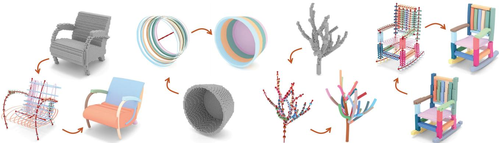
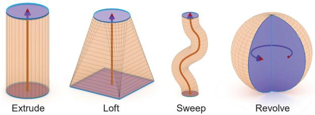
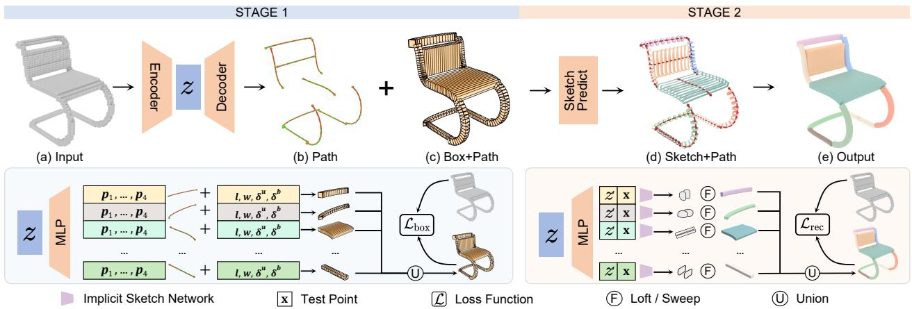
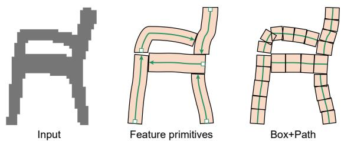
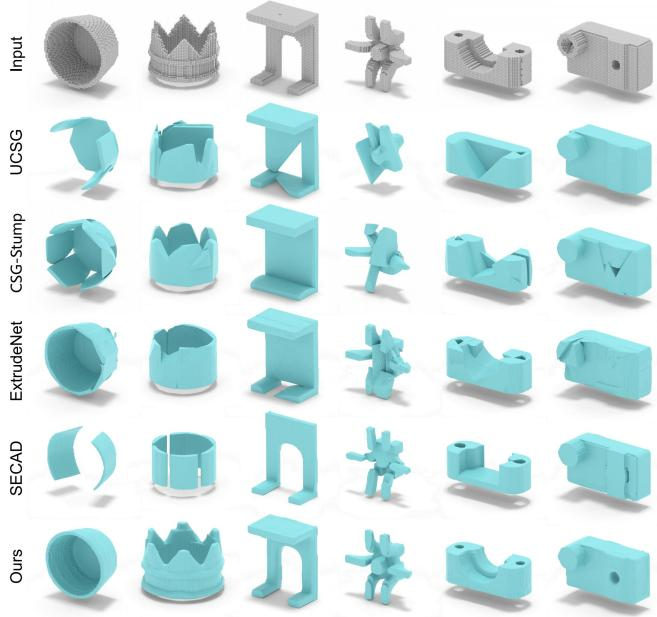
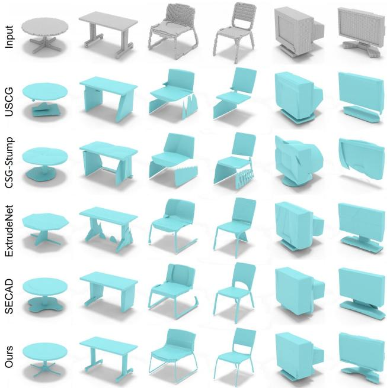
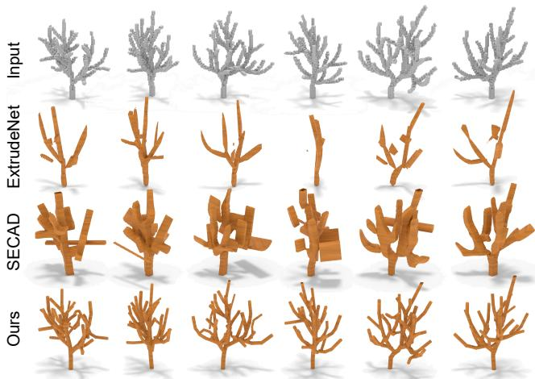
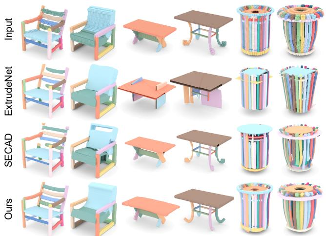
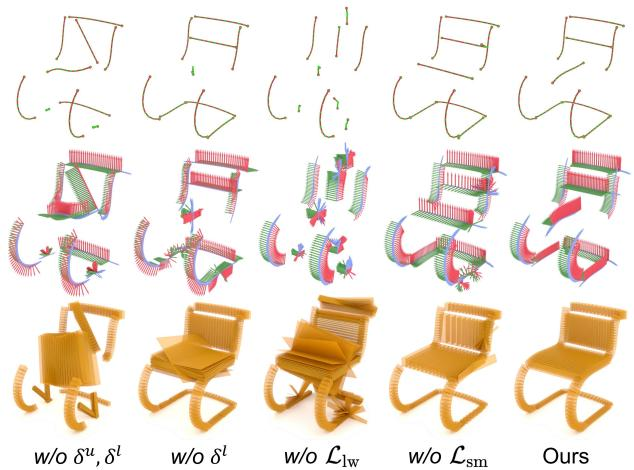

# SfmCAD: Unsupervised CAD Reconstruction by Learning Sketch-based Feature Modeling Operations

Pu Li1,2 Jianwei Guo1,2\* Huibin Li2,1 Bedrich Benes3 Dong-Ming Yan1,2

1MAIS, Institute of Automation, Chinese Academy of Sciences

2School of Artificial Intelligence, University of Chinese Academy of Sciences 3Computer Science, Purdue University

  
Figure 1. SfmCAD parses voxel shapes and reconstructs them into a parameterized set of sketch-based feature modeling operations: the input voxels, neural typed sketch+path representation, and the final CAD model (each part is randomly colored).

## Abstract

This paper introduces SfmCAD, a novel unsupervised network that reconstructs 3D shapes by learning the Sketchbased Feature Modeling operations commonly used in modern CAD workflows. Given a 3D shape represented as voxels, SfmCAD learns a neural-typed sketch+path parameterized representation, including 2D sketches offeature primitives and their 3D sweeping paths without supervision,for inferringfeature-based CAD programs. SfmCAD employs 2D sketchesfor local detail representation and 3D paths to capture the overall structure, achieving a clear separation between shape details and structure. This conversion into parametric forms enables users to seamlessly adjust the shape’s geometric and structural features, thus enhancing interpretability and user control. We demonstrate the effectiveness of our method by applying Sfm-CAD to many different types ofobjects, such as CAD parts, ShapeNet objects, and tree shapes. Extensive comparisons show that SfmCAD produces compact and faithful 3D reconstructions with superior quality compared to alternatives. The code is released at https://github.com/ BunnySoCrazy/SfmCAD.

## 1. Introduction

Reconstructing shapes into CAD representations is a fundamental problem in computer vision and graphics with numerous commercial applications in industrial design and manufacturing [39]. Recent years have seen an increased interest in leveraging deep learning techniques to learn geometric representations of 3D shapes, including implicit fields [2, 25, 28], geometric primitives [19, 22, 24, 37], boundary representation (B-Rep) [9, 17], or Constructive Solid Geometry (CSG) [3, 36, 49], each with its unique characteristics and applications, contributing to the rich tapestry of research and development in this field.

However, current CAD reconstruction methods are still lacking detail reconstruction accuracy, compactness, and interpretability of the obtained models. For example, a typical line of research is dedicated to reconstruction-oriented tasks, i.e., representing 3D shapes as parametric primitives, implicit fields, or B-rep. These methods deliver a high level of detail and accuracy by capturing intricate details and complex geometries with remarkable precision. However, constructing CAD models by assembling instances of primitives or by identifying faces, edges, and vertices is a tedious process [35]. Besides, the results often include complex and unintuitive operations that make the model difficult to interpret and edit. This lack of control poses significant challenges in scenarios where user interaction and shape manipulation are required.

A straightforward approach to CAD reconstruction is to learn CSG representation [14, 30, 36, 49] that implicitly recovers the CAD design history. A CSG 3D shape is expressed as a tree with leaves consisting of volumetric primitives (e.g., cubes, spheres, and cylinders) that are combined using Boolean operations in the CSG inner nodes. Despite the sought-after attribute of compact shape representation, these methods often fall short regarding reconstruction accuracy by using only a set of simple typed primitives.

We introduce SfmCAD, a novel neural model for reconstructing 3D shapes into their CAD representation. Compared to related work, SfmCAD improves the reconstruction accuracy and the level of model editability by decoupling 3D structures and local geometric details of the shape. SfmCAD is inspired by feature-based modeling, a predominant method for creating 3D models in modern CAD systems, which sequentially add features (e.g., holes, slots, bosses) that represent common manufacturing operations [6, 41, 42]. Specifically, we employ unsupervised learning to retrieve a neural typed sketch+path representation of 3D shapes. Taking 3D voxel data as input, SfmCAD learns implicit fields that embody the sketch profile and generates control points for a Bezier curve, constituting the´ sweeping path for the component’s geometry. The basic extrusion operation has been learned in a supervised [18, 38] or unsupervised [23, 31] manner. However, our sketch+path representation supports not only extrude but also sweep, loft, and revolve operations, thus enhancing the shape representation capabilities, as demonstrated in Fig. 1.

At the core of the SfmCAD is a two-stage learning strategy that operates in a coarse-to-fine manner to tackle the inherent complexity and time-intensiveness of simultaneous sketch profile and sweeping path learning. Initially, the network is trained to learn a coarse Box+Path representation of the shape, enabling a quick grasp of the shape’s path and broad structure using box-like geometric proxies. Then, an implicit network delves deeper into the geometric details of the shape, enhancing the reconstruction accuracy. We demonstrate the capability and versatility of our method by applying SfmCAD to many different types of objects, including CAD parts [16], ShapeNet objects [1], tree branches [20], and by comparing to previous works. We claim the following contributions:

1. We propose SfmCAD, a novel neural approach that parses 3D shapes as a set of industry-standard sketchbased CAD modeling operations. To the best of our knowledge, SfmCAD is the first unsupervised and universal neural network for learning the common CAD commands, including extrude, sweep, loft, and revolve.

2. We introduce novel decoupling of 3D structures and local geometric details, which are represented by 3D Bezier curves and implicit 2D sketches. This representa-´ tion ensures accurate reconstruction and ease of editing.

3. We propose a two-stage learning strategy, namely 3D Box+Path learning and 2D implicit sketch learning, which significantly accelerates the training speed in shape parser learning.

## 2. Related work

Geometric primitive extraction. Geometric primitive is a commonly used representation for approximating and abstracting 3D shapes [13]. Traditional methods based on RANSAC [32], Hough transform [10], or variational optimization [4, 46] have been used to detect and fit primitives on point clouds or polygonal meshes, but they often require careful parameter tuning for each shape.

To overcome the overwhelming complexity of traditional methods, deep neural networks addressed the primitive segmentation/detection from point clouds [19, 47], they fit parametric surfaces [22, 29, 37], or detect parametric curves and sharp corners [9, 24, 40] to achieve compact CAD reconstructions. Although achieving remarkable accuracy on reconstruction tasks, these methods only output individual primitives with limited types, which restricts their capability for reconstructing complex and more general 3D shapes. Learning CSG-based reconstruction. CSG reconstruction embodies a 3D shape of high complexity and nonconvexity with CSG boolean operations to represent the 3D shape construction process [5]. CSGNet [36] first develops a neural model that parses a shape into a sequence of CSG operations. More recent works follow the line of CSG parsing by advancing the inference without any supervision [14] or improving representation capability with a three-layer reformulation of the classic CSG-tree [30], or handling richer geometric and topological variations by introducing quadric surface primitives [49, 50]. However, CSG reconstruction tends to combine a large number of shape primitives that limit the user editing capabilities. Moreover, using only basic primitives (e.g., boxes, spheres) is insufficient for approximating complicated shapes, thus usually limiting the reconstruction accuracy of small details [50].

Learning feature-based reconstruction. Modern CAD workflows use feature-based modeling that decomposes a target shape into a sequence of CAD commands [34], such as drawing a sketch followed by CAD operations such as extrusion, loft, etc. This paradigm makes modeling more efficient and in tune with how designers and engineers work. Recent work has explored the potential of deep learning to generate 2D engineering sketches [7, 27, 33], or directly learn B-Rep CAD models [6, 11, 12, 17]. Several approaches propose generative models for CAD design, predicting a sequence of CAD modeling operations to produce editable CAD models, such as DeepCAD [42], Fusion360 [41], Zone graph [43], and SkexGen [44]. These works focus on parametric CAD generation and do not address the reconstruction task of CAD models with suitable geometric loss functions.

  
Figure 2. Sketch-based feature modeling operators supported in SfmCAD. The resulting 3D shape of each operation is called a feature primitive.

Most closely related to our work are the approaches that learn sketch+extrude operation $( e . g .$ ., Point2Cyl [38], ExtrudeNet [31], SECAD-Net [23]), in which a collection of extrusions are predicted to build CAD models. While expressive within their scopes, these methods are limited to only one type of CAD operation $( i . e . ,$ extrude) to simplify the search space. SfmCAD includes loft, revolve, and sweep reconstructions, broadening the shape representation capabilities. This approach enables us to test on a broader range of shapes beyond CAD.

## 3. Problem Statement and Overview

Sketch-based feature modeling creates 2D engineering sketches and then lifts them to 3D along a path using CAD operations [8, 21]. Here, we first introduce this typed sketch+path representation for sketch-based modeling and then give an overview of its generation from a voxel model.

## 3.1. Typed Sketch+Path Modeling

We define a profile as a closed curve, and its enclosed region is composed of one or multiple inner/outer loops. We define a sketch as the collection of one profile and its loops in a 2D plane. Let Z denote the sketch and C be a 3D path to extend the sketches to create a 3D solid shape. We define four principal operations that are commonly used in modern CAD workflow (see Fig. 2): Extrude extends Z along a linear path, Revolve produces a model by rotating Z around an axis, Sweep moves Z along a specified path to generate generalized cylinder shapes, and Loft allows for variations in the sketch, interpolating between multiple distinct sketches $\{ Z _ { 1 } , Z _ { 2 } , \ldots , Z _ { n } \}$ along the shortest distances between them to create complex shapes.

Considering the similarity between the above operations, i.e., lifting 2D sketches to a 3D shape along a 3D path, we use a general typed sketch+path to represent all of these operations, where the term ’typed’ indicates the specific type of operation. Without loss of generality, we call the 3D path a sweeping path and call the lofted or swept 3D shape a feature primitive. We further use a Bezier curve´ $\Upsilon ( t )$ to represent the sweeping path:

$$
\mathcal { C } = \Upsilon ( t ) = \sum _ { i = 0 } ^ { n } \binom { n } { i } ( 1 - t ) ^ { n - i } t ^ { i } \mathbf { P } _ { i } , \quad t \in [ 0 , 1 ]\tag{1}
$$

where $\mathbf { P } _ { i }$ is a control point. The Bezier cubic is expressive´ enough to approximate the shapes shown in the paper, but higher-order curves can be obtained by simply changing the number of control points output by the network.

Moreover, it is noteworthy that the Extrude and Revolve operations can be regarded as general variants of the sweep operation because a Bezier curve becomes a linear path (for´ Extrude) if all the control points are collinear and an n-piece (usually $n = 4 )$ cubic Bezier curve can approximate a cir-´ cular path (for Revolve) [45]. In the following, we focus on reconstructing Sweep and Loft operations, where Sweep contains Extrude and Revolve, and the Loft is restricted to contain only two sketches with a linear path between them.

## 3.2. Overview

Given a 3D voxel shape, we aim to reconstruct the CAD model by neurally decomposing the target shape into a sequence of typed sketch+path representation, which can be executed by the corresponding CAD commands to assemble a compact CAD model. Learning the path and sketch of a shape simultaneously is challenging and time-consuming. Thus, we propose a two-stage learning approach to improve the efficiency of network training. First, the network learns a Box+Path representation to enclose the input shape, capturing the sweeping path, basic geometry, and rotation angles. Then, we learn implicit sketches that refine the coarse box+path into a detailed shape representation.

Fig. 3 details the two-stage learning network. We begin with a 3D convolutional encoder that transforms the voxel input into a feature vector z, which is then processed through a multilayer perceptron (MLP), yielding matrices P and B. Here, P are the control points of the Bezier´ curves representing the sweeping paths (Fig. 3 (b)), and B encapsulates the box+path parameters (Fig. 3 (c)), including length, width, and sweep’s twist angles. Once the sweeping paths are derived from Stage 1, we focus on learning the geometric details surrounding each path. The feature z is then mapped to $N _ { p }$ local features via another MLP. These vectors are subsequently concatenated with test points and fed into an implicit sketch network. The output from this network includes two occupancy values that represent the top and bottom sketches (Fig. 3 (d)), respectively. We then obtain the final CAD reconstruction by sweeping or lofting the detected sketches along the paths (Fig. 3 (e)).

  
Figure 3. Network architecture for SfmCAD: Stage 1 encodes the input voxels into feature z via a 3D convolutional encoder. An MLP then processes z to generate the control point coordinates $\mathbf { P } _ { 1 } , \ldots , \mathbf { P } _ { 4 }$ for each Bezier curve, as well as the dimensions´ l, w and twist angles $\delta ^ { u } , \delta ^ { \tilde { b } }$ for each Box proxy B. In Stage 2, another MLP transforms feature z into local features ${ \mathbf z } ^ { \prime } ,$ , which are then concatenated with the testing point coordinate and fed into the implicit sketch network to predict the sketch SDF value. After extending the sketches along the paths, we combine all parts for the final reconstruction.

  
Figure 4. 2D illustration of our Box+Path representation (right) to approximate the input shape (left), which can be decomposed into a set of feature primitives (middle, the green arrows indicate the sweeping paths).

## 4. Methodology

Here, we first present the box+path representation, which can be efficiently learned to approximate the input shape by stacking a set of box-like proxies along the sweeping path. Then, we define the neural sketch+path to refine the coarse reconstruction. Finally, we introduce the two-stage learning network for inferring this coarse-to-fine reconstruction.

## 4.1. Box+Path Representation

Previous unsupervised methods [23, 30, 31] for computing the Signed Distance Function (SDF) for geometric primitives (e.g., cubes, spheres, cylinders) rely on linear transformations that convert global testing point coordinates into local ones. However, the inherent non-linearity of curved paths limits the direct application of linear methods. We introduce a linear approximation method for the curved SDF computation, which we term Box+Path representation. We will first discuss the Box-Path in a 2D context to provide a more intuitive understanding before expanding it to 3D.

Box+Path in 2D. Specifically, we approximate one feature primitive $\mathcal { P }$ using a discrete set of $N _ { s }$ rigid box proxies, i.e., $\mathcal { P } = \{ B _ { i } \} _ { i = 1 } ^ { N _ { s } }$ . The center position $\mathbf { c } _ { i }$ of each box $B _ { i }$ is obtained by uniformly sampling the Bezier curve´ Υ(t):

$$
\mathbf { c } _ { i } = \Upsilon \left( i / N _ { s } \right) , \quad i = 1 , \ldots , N _ { s }\tag{2}
$$

The height $h _ { i }$ and the normal vector (or heading direction) $\mathbf { n } _ { i }$ of each box are calculated as

$$
h _ { i } = | \mathbf { c } _ { i + 1 } - \mathbf { c } _ { i } | , \mathbf { n } _ { i } = \frac { \mathbf { c } _ { i + 1 } - \mathbf { c } _ { i } } { | \mathbf { c } _ { i + 1 } - \mathbf { c } _ { i } | }\tag{3}
$$

By incorporating a learnable width parameter $w ,$ the 2D Box+Path can be fully characterized.

Box+Path in 3D. When extended to 3D space, we introduce the tangent vector $\mathbf { t } _ { i }$ and the binormal vector b to parameterize the orientation of the i-th box proxy. To allow the sketch to rotate by a prescribed angle along the sweeping path, we should learn rotation angles $\delta ^ { u }$ and $\delta ^ { b }$ at the start and end points of the sweeping path. Then, the intermediate rotation angles $\delta _ { i }$ are obtained by linear interpolation along the sweeping path. Next, we compute the tangent vector $\mathbf { t } _ { i }$ as the cross product of the normal ${ \bf n } _ { i }$ and the positive z-axis unit vector $\mathbf { e } _ { z }$ . We then rotate $\mathbf { t } _ { i }$ around $\mathbf { n } _ { i } \mathbf { : }$

$$
\mathbf { t } _ { i } = R _ { \mathbf { n } _ { i } } ( \mathbf { n } _ { i } \times \mathbf { e } _ { z } , \delta _ { i } ) ,\tag{4}
$$

where $R _ { \mathbf { n } _ { i } } ( \mathbf { v } , \delta _ { i } )$ represents a counter-clockwise rotation of vector v with angle $\delta _ { i }$ around ${ \bf n } _ { i }$ . The binormal vector $\mathbf { b } _ { i }$ is obtained as a cross product of $\mathbf { n } _ { i } \times \mathbf { t } _ { i }$ . Altogether, the triplet $\{ \mathbf { n } _ { i } , \mathbf { t } _ { i } , \mathbf { b } _ { i } \}$ defines the orientation for each box along the curve path. The 3D Box+Path is fully characterized by incorporating learnable dimension parameters $l , w$

## 4.2. Neural Sketch+Path

We present differentiable methods for lofting or sweeping 2D sketches into 3D solid shapes to accurately reconstruct the feature primitives. The shape of each 2D sketch is defined by an implicit representation, where we use $\hat { S } _ { \mathbf { s k } }$ to represent the SDF of sketches. We now describe the differentiable operators that calculate the SDF of the 3D feature primitives corresponding to the sketches.

Differentiable Sketch-Extrude. In the context of generating the geometry of feature primitives from sketch and extrude operations, $\hat { S } _ { \mathrm { e x t r u d e } } ^ { i }$ denotes the i-th sketch-extrude operation, $\mathbf { x } _ { i _ { z } }$ represents the z-component of the i-th position vector, and $h _ { i }$ is the height of the i-th feature primitive. We introduce a set of intermediate functions $\mathcal { M } _ { 1 } , \mathcal { M } _ { 2 }$ , and $\mathcal { M } _ { 3 }$ to facilitate a clearer formulation:

$$
\begin{array} { r l } & { \mathcal { M } _ { 1 } ( \hat { S } _ { \mathbf { s k } } ^ { i } ) = \operatorname* { m a x } ( \hat { S } _ { \mathbf { s k } } ^ { i } , | \mathbf { x } _ { i _ { z } } | - h _ { i } ) , } \\ & { \mathcal { M } _ { 2 } ( \hat { S } _ { \mathbf { s k } } ^ { i } ) = \operatorname* { m a x } ( \hat { S } _ { \mathbf { s k } } ^ { i } , 0 ) , } \\ & { \qquad \mathcal { M } _ { 3 } = \operatorname* { m a x } ( | \mathbf { x } _ { i _ { z } } | - h _ { i } , 0 ) . } \end{array}
$$

The SDF of the i-th extrusion primitive is then given by:

$$
\hat { S } _ { \mathrm { e x t r u d e } } ^ { i } = \operatorname* { m i n } ( \mathcal { M } _ { 1 } ( \hat { S } _ { \mathrm { s k } } ^ { i } ) , 0 ) + \sqrt { \mathcal { M } _ { 2 } ( \hat { S } _ { \mathrm { s k } } ^ { i } ) ^ { 2 } + \mathcal { M } _ { 3 } ^ { 2 } }\tag{5}
$$

Differentiable Sketch-Loft. For the loft operation, we interpolate between two distinct sketches, $\hat { S } _ { { \bf s } { \bf k } } ^ { u _ { i } }$ and $\hat { S } _ { \mathbf { s k } } ^ { l _ { i } } .$ , at the upper and lower faces of the i-th feature primitive. Given the interpolation factor α as $| { \bf x } _ { i _ { z } } | / h _ { i }$ , the linearly interpolated sketch, $\hat { S } _ { { \bf s } { \bf k } } ^ { i _ { \alpha } }$ , is computed as:

$$
\hat { S } _ { \bf s \bf k } ^ { i _ { \alpha } } = ( 1 - \alpha ) \cdot \hat { S } _ { \bf s \bf k } ^ { l _ { i } } + \alpha \cdot \hat { S } _ { \bf s \bf k } ^ { u _ { i } } .\tag{6}
$$

We use the same intermediate variables as in the extrusion case, but with $\hat { S } _ { \bf s k } ^ { i }$ replaced by $\hat { S } _ { { \bf s } { \bf k } } ^ { i _ { \alpha } }$ . The SDF of the i-th loft primitive can be expressed similarly to Eq. 5:

$$
\hat { S } _ { \mathrm { l o f t } } ^ { i } = \operatorname * { m i n } ( \mathcal { M } _ { 1 } ( \hat { S } _ { \mathrm { s k } } ^ { i _ { \alpha } } ) , 0 ) + \sqrt { \mathcal { M } _ { 2 } ( \hat { S } _ { \mathrm { s k } } ^ { i _ { \alpha } } ) ^ { 2 } + \mathcal { M } _ { 3 } ^ { 2 } } .\tag{7}
$$

Differentiable Sketch-Sweep. For sweep operation, we decompose it into a series of $N _ { s }$ extrusions. We denote the predicted SDF for the $j \cdot$ -th extrude segment as $\hat { S } _ { \mathrm { e x t r u d e } } ^ { i } .$ The SDF of the i-th sweep primitive is then obtained by taking the minimum of the SDFs of all extrusion segments:

$$
\hat { S } _ { \mathrm { s w e e p } } ^ { i } = \operatorname* { m i n } _ { j \in 1 , \dots , N _ { s } } \hat { S } _ { \mathrm { e x t r u d e } } ^ { j } .\tag{8}
$$

Transformation to Parametric CAD. Following [23], we transform implicit sketches into parametric ones. With the control points of Bezier curves outputted by the network,´ we can achieve the sketch+path parametric reconstruction.

## 4.3. Two-stage Network Training

Stage 1: Box+Path learning. In this stage, the network predicts the control point coordinates $\{ \mathbf { P } _ { 1 } , . . . , \mathbf { P } _ { 4 } \}$ of the cubic Bezier curve and the parameters´ $\{ l _ { i } , w _ { i } , \delta ^ { u } , \delta ^ { b } \}$ describing the i-th Box+Path $B _ { i }$ . These parameters subsequently inform the computation of the remaining parameters $\{ h _ { i } , \mathbf { n } _ { i } , \mathbf { t } _ { i } , \mathbf { b } _ { i } \}$ , as detailed in Sect. 4.1. To align the path of B with the target shape path, we first compute the SDF, $\hat { S } _ { \mathrm { b o x } } ^ { i j }$ , for each box at the i-th primitive and j-th segment, where $i \in [ 1 , N _ { p } ]$ and $j \in [ 1 , N _ { s } ]$ , with $N _ { p }$ and $N _ { s }$ representing the total number of primitives and segments. Taking the union over the $\hat { S } _ { \mathrm { b o x } } ^ { i j }$ yields the SDF for the overall box+path $\hat { S } _ { B } \mathbf { . }$

$$
\hat { S } _ { B } = \bigcup _ { i = 1 } ^ { N _ { p } } \bigcup _ { j = 1 } ^ { N _ { s } } \hat { S } _ { \mathrm { b o x } } ^ { i j } ,\tag{9}
$$

where $\mathsf { U } ( x ) = \mathsf { s o f t m i n } ( \mu \cdot x )$ · x and $\mu$ is a hyperparameter. We then apply a differentiable converter Ψ similar to prior works [23, 31] to transform the $\hat { S } _ { B }$ into occupancy, yielding $\hat { \mathcal { O } } _ { B } = \Psi ( \hat { S } _ { B } )$ , where $\Psi ( x ) = ( \mathtt { t a n h } ( - \beta \cdot x ) + 1 ) / 2$ , and $\beta$ is a hyperparameter. We then compute the Mean Squared Error (MSE) loss between $\hat { \mathcal { O } } _ { B }$ and the ground truth occupancy O˜:

$$
\mathcal { L } _ { B } = \mathbb { E } _ { x \in \mathcal { X } } \left[ | | \hat { \mathcal { O } } _ { B } - \tilde { \mathcal { O } } | | _ { 2 } ^ { 2 } \right] ,\tag{10}
$$

where $\mathcal { X }$ is the set of all testing points. The exclusive use of $\mathcal { L } _ { B }$ may lead to potential challenges: (1) the emergence of the curve with acute angles, and (2) the dimensions of $\boldsymbol { B }$ vastly outstrip the path length. Both increase the risk of shape self-intersections, which are considered invalid in CAD. To address these issues, we introduce two additional regularization terms,

$$
\mathcal { L } _ { \mathrm { s m } } = \frac { 1 } { N _ { p } } \sum _ { i = 1 } ^ { N _ { p } } ( 1 - \operatorname* { m i n } _ { j = 1 , \dots , N _ { s } } ( \mathbf { n } _ { i , j } \cdot \mathbf { n } _ { i , j + 1 } ) )\tag{11}
$$

$$
\mathcal { L } _ { \mathrm { l w } } = \frac { 1 } { 2 N _ { p } } \sum _ { i = 1 } ^ { N _ { p } } \mathrm { R e L U } ( h _ { i } + w _ { i } - 2 \cdot \Theta ) ,\tag{12}
$$

where $\mathcal { L } _ { \mathrm { s m } }$ penalizes the sharpest curvature in the curve by maximizing the inner product between adjacent n, and ${ \mathcal { L } } _ { \mathrm { l w } }$ penalizes any length or width greater than a threshold Θ. Combine with balance factors $\lambda _ { 1 } , \lambda _ { 2 }$ , the overall loss of Stage 1 is:

$$
\mathcal { L } _ { \mathrm { b o x } } = \mathcal { L } _ { B } + \lambda _ { 1 } \mathcal { L } _ { \mathrm { s m } } + \lambda _ { 2 } . \mathcal { L } _ { \mathrm { l w } }\tag{13}
$$

Stage 2: Implicit sketch learning. Using the path learned in Stage 1, we progress towards fine reconstruction in Stage 2 by learning sketches. We initially utilize a Multi-Layer Perceptron (MLP) to convert the feature z into $N _ { p }$ local features z′. These local features are then concatenated with the local $\{ x , y \}$ coordinates of each point and fed into an implicit sketch network, which is essentially an MLP predicting the SDF value $\hat { S } _ { \bf s k } ^ { i }$ . For the sketch-loft operation, two implicit sketch networks are used to learn $\hat { S } _ { { \bf s } { \bf k } } ^ { u _ { i } }$ and $\hat { S } _ { \mathbf { s } \mathbf { k } } ^ { l _ { i } }$ . Following the computation methods outlined in Sect. 4.2, we can derive the predicted overall occupancy value $\hat { \mathcal { O } } _ { \mathrm { F } }$ by:

$$
\hat { \mathcal { O } } _ { \mathrm { F } } = \left\{ \begin{array} { l l } { \Psi ( \bigcup _ { i = 1 } ^ { N _ { p } } \hat { S } _ { \mathrm { s w e e p } } ^ { i } ) , } & { \mathrm { f o r ~ s w e e p ~ o p e r a t i o n } } \\ { \Psi ( \bigcup _ { i = 1 } ^ { N _ { p } } \hat { S } _ { \mathsf { l o f t } } ^ { i } ) , } & { \mathrm { f o r ~ l o f t ~ o p e r a t i o n } . } \end{array} \right.
$$

Finally, an MSE loss ${ \mathcal { L } } _ { \mathrm { r e c } }$ is computed against the ground truth O˜:

$$
\mathcal { L } _ { \mathrm { r e c } } = \mathbb { E } _ { x \in \mathcal { X } } \left[ | | \hat { \mathcal { O } } _ { \mathrm { F } } - \tilde { \mathcal { O } } | | _ { 2 } ^ { 2 } \right] .\tag{14}
$$

The direct computation of ${ \mathcal { L } } _ { \mathrm { r e c } }$ over the entire point set $\mathcal { X }$ requires the repetition of $\mathcal { X }$ corresponding to $\hat { S } _ { \mathrm { e x t r u d e } }$ for $N _ { p } \times N _ { s }$ times, which is time-consuming. To accelerate the training of the implicit sketch network, we propose a realtime sampling strategy, exploiting the sketch consistency trait inherent in the sweep operation. Specifically, we sample grid-like testing points $y _ { i }$ in the base sketch plane of the i-th path $\Upsilon _ { i }$ obtained in the first stage. The occupancy value of $y _ { i }$ is determined by inputting it into the implicit sketch network and applying the converter Ψ. Subsequently, $y _ { i }$ is moved along the curve for $N _ { s } - 1$ times, with its occupancy value directly replicated, yielding $\hat { \mathcal { O } } _ { \mathrm { F } _ { i } } ^ { * }$ . The ground truth occupancy value $\tilde { \mathcal { O } } _ { i } ^ { * }$ is provided by the input voxel. After performing this procedure for all paths and conducting a union operation, the loss function corresponding to realtime sampling is given by:

$$
\mathcal { L } _ { \mathrm { r e c } } ^ { * } = \mathbb { E } _ { y \in \mathcal { V } } \left[ | | \hat { \mathcal { O } } _ { \mathrm { F } } ^ { * } - \tilde { \mathcal { O } } ^ { * } | | _ { 2 } ^ { 2 } \right] ,\tag{15}
$$

where Y represents the set of testing points obtained through real-time sampling, and ∗ denotes computation using real-time sampling data.

Note that the SfmCAD is designed to choose between learning either loft or sweep operations, which is determined by its hyperparameters. However, enabling the network to concurrently learn both operations is also viable, with details provided in the supplementary materials.

## 5. Results and Evaluation

We evaluate the performance of SfmCAD on two reconstruction tasks: (1) holistic shapes of different categories and (2) semantically segmented shapes. We show the output editability of SfmCAD in the supplemental materials.

## 5.1. Setup

Implementation details. We implemented SfmCAD in Py-Torch by using an NVIDIA® TITAN RTX GPU. The Adam optimizer [15] is utilized with a learning rate 1e-4 and beta values of (0.5, 0.99). The hyperparameters in Sect. 4.3 are set to: $\mu = 2 0 , \beta = 5 0 , \Theta = 0 . 1 , \lambda _ { 1 } = 0 . 0 5 , \lambda _ { 2 } = 0 . 0 5$ . In our evaluations, we employ the best-performing operation (Loft/Sweep) for each category of holistic shapes and every part of segmented shapes. SfmCAD trains for 500 epochs per stage with a batch size of 24, followed by fine-tuning each test shape for 200 iterations per stage. All baseline methods are trained for 1,000 epochs and fine-tuned for 400 iterations for a fair comparison.

Evaluation metrics. We utilize three common metrics for 3D shape reconstruction: Chamfer Distance (CD), Normal

  
Figure 5. Visual comparison on ABC dataset.

Table 1. Quantitative comparison on ABC dataset.
<table><tr><td rowspan=1 colspan=3>Methods</td><td rowspan=1 colspan=3>CD↓</td><td rowspan=1 colspan=1>ECD↓</td><td rowspan=1 colspan=1>NC↑</td></tr><tr><td rowspan=4 colspan=3>UCSG-Net [14]CSG-Stump [30]ExtrudeNet [31]SECAD-Net [23]Ours</td><td rowspan=1 colspan=3>1.233</td><td rowspan=1 colspan=1>21.786</td><td rowspan=1 colspan=1>0.866</td></tr><tr><td rowspan=1 colspan=2>p [30]</td><td rowspan=1 colspan=3></td><td rowspan=1 colspan=1>0.6</td><td rowspan=1 colspan=1>0.671</td><td rowspan=1 colspan=1>7.751</td></tr><tr><td rowspan=1 colspan=3>0.5190.506</td><td rowspan=1 colspan=1>19</td><td rowspan=1 colspan=1>7.1117.286</td><td rowspan=1 colspan=1>0.8850.884</td></tr><tr><td rowspan=1 colspan=3>0.395</td><td rowspan=1 colspan=1>5.038</td><td rowspan=1 colspan=1>0.919</td></tr></table>

Consistency (NC), and Edge Chamfer Distance (ECD). All experiments generate the reconstructed shapes via Marching Cubes at a resolution of $2 5 6 ^ { 3 }$ . To calculate CD, we sample 8,192 points from the ground truth and predicted shape surfaces. For ECD, we employ a threshold of 0.1 for normal cross-products to identify points close to the edges on the ground truth surface and 0.5 for the predicted surface, considering the lack of sharpness in shapes generated by Marching Cubes. For better visual clarity, we magnify the CD and ECD by factors of $1 0 ^ { 3 }$ and $1 0 ^ { 2 }$

## 5.2. Reconstruction from Holistic Shape

We compare SfmCAD with UCSG-Net [14], CSG-Stump [30], ExtrudeNet [31] and SECAD-Net [23]. We test these methods on holistic shapes from different sources, including CAD parts in ABC [16], ShapeNet objects [1], and a synthetic tree dataset. The comparison against CAPRI-Net [49] is provided in the supplementary materials.

Evaluation on ABC dataset. We employ the voxel grids and sampling point data provided by [49]. The dataset included $5 { , } 0 0 0$ groups of data for training and 1,000 for testing. We select 100 shape subsets from the test set for evaluation. The visual results are shown in Fig. 5, while the quantitative results are presented in Tab. 1.

  
Figure 6. Visual comparison on ShapeNet dataset.

Table 2. Quantitative comparison on ShapeNet dataset.
<table><tr><td rowspan=1 colspan=1>Methods</td><td rowspan=1 colspan=1>CD↓</td><td rowspan=1 colspan=1>ECD↓</td><td rowspan=1 colspan=1>NC↑</td></tr><tr><td rowspan=5 colspan=1>UCSG-Net [14]CSG-Stump [30]ExtrudeNet [31]SECAD-Net [23]Ours</td><td rowspan=1 colspan=1>2.111</td><td rowspan=1 colspan=1>23.616</td><td rowspan=1 colspan=1>0.815</td></tr><tr><td rowspan=1 colspan=1>2.168</td><td rowspan=1 colspan=1>17.592</td><td rowspan=1 colspan=1>0.818</td></tr><tr><td rowspan=1 colspan=1>0.910</td><td rowspan=1 colspan=1>14.110</td><td rowspan=1 colspan=1>0.849</td></tr><tr><td rowspan=1 colspan=1>0.836</td><td rowspan=1 colspan=1>14.818</td><td rowspan=1 colspan=1>0.837</td></tr><tr><td rowspan=1 colspan=1>0.626</td><td rowspan=1 colspan=1>14.096</td><td rowspan=1 colspan=1>0.867</td></tr></table>

Table 3. Quantitative comparison on Tree dataset.
<table><tr><td rowspan=1 colspan=1>Methods</td><td rowspan=1 colspan=1>ExtrudeNet [31]</td><td rowspan=1 colspan=1>SECAD-Net [23]</td><td rowspan=1 colspan=1>Ours</td></tr><tr><td rowspan=1 colspan=1>CD↓</td><td rowspan=1 colspan=1>7.242</td><td rowspan=1 colspan=1>2.197</td><td rowspan=1 colspan=1>0.686</td></tr><tr><td rowspan=1 colspan=1>NC↑</td><td rowspan=1 colspan=1>0.608</td><td rowspan=1 colspan=1>0.622</td><td rowspan=1 colspan=1>0.722</td></tr></table>

Evaluation on ShapeNet dataset. We utilize three categories from ShapeNet: chair, table, and display. The voxel grids and sampling points are provided by [3]. We selected 120 shapes for evaluation, with 40 from each category. Visual and quantitative results are in Fig. 6 and Tab. 2.

Evaluation on tree branches. We use a procedural modeling approach of Palubicki et al. [26] to generate tree meshes voxelized into a resolution of 643. We adopt the method from [2] to obtain sampling points and occupancy values. This process results in 5,000 data groups, of which 4,500 are used for training and 500 for testing. We train all methods using increasingly denser voxel resolutions (163, 323, 643) and select 50 trees for numerical evaluation. Note given the cylindrical nature of tree branches, we adapt our Box+Path representation by substituting boxes with cylinders for the final reconstruction (see Fig. 7 and Tab. 3 for visual and quantitative results).

  
Figure 7. Visual comparison on Tree dataset.

Summary of comparative analysis. As demonstrated in Tables 1, 2, and 3, SfmCAD consistently outperforms other methods in terms of CD, ECD, and NC, suggesting that the sketch+path representation of SfmCAD offers more flexible shape expression capabilities than the geometric primitives used by UCSG-Net and CSG-Stump, as well as the simple sketch+extrusion operations employed by ExtrudeNet and SECAD. Figures 5, 6, and 7 further show SfmCAD’s ability to generate detailed reconstructions (such as thin structures) across diverse shape categories.

## 5.3. Reconstruction from Segmented Shape

Semantic segmentation provides information for reconstructing complex shapes. Previous CAD reconstruction methods [23, 31] could not utilize this information because their single-type primitives lack the flexibility to represent each part independently. In contrast, SfmCAD successfully reconstructs multiple primitives with its sketch+path representation capability.

We show the task of unsupervised CAD reconstruction utilizing semantic segmentation. The evaluation is conducted on PartNet dataset [48], which provides instancelevel 3D part information. We utilize three categories: chair, table, and trashcan. We voxelize the segmented parts and sampled occupancy values at resolutions 163, 323, 643 following the scheme by [2]. This process yields a total of 12,000 chair parts (1,229 complete), 12,000 table parts (1,491 complete), and 3,000 trashcan parts (234 complete). The train-test split for all categories was set as 5:1. We selected 90 complete shapes, including 40 tables, 40 chairs, and 10 trashcans, for evaluation.

All methods were trained on part shapes using increasingly denser voxel resolutions $( 1 6 ^ { 3 } , 3 2 ^ { 3 } , 6 4 ^ { 3 } )$ For each part, we set ExtrudeNet [31] and SECAD-Net [23] to output an extruded cylinder and SfmCAD to output a sketch+path shape. After reconstructing all parts, they were reassembled to obtain the final CAD models.

  
Figure 8. Visual comparison on PartNet dataset.

Table 4. Quantitative comparison on PartNet dataset.
<table><tr><td rowspan=1 colspan=1>Methods</td><td rowspan=1 colspan=1>CD↓</td><td rowspan=1 colspan=1>ECD↓</td><td rowspan=1 colspan=1>NC↑</td></tr><tr><td rowspan=2 colspan=1>ExtrudeNet [31]SECAD-Net [23]Ours</td><td rowspan=2 colspan=1>3.2511.8881.410</td><td rowspan=1 colspan=1>0.5490.472</td><td rowspan=2 colspan=1>0.7830.8180.814</td></tr><tr><td rowspan=1 colspan=1>0.446</td></tr></table>

Table 5. Ablation study on sweep twist angles and loss terms.
<table><tr><td>Settings</td><td> $\overline { { - \big ( \delta ^ { u } , \delta ^ { l } \big ) } }$ </td><td> $\overline { { - \delta ^ { l } } }$ </td><td> $- \mathcal { L } _ { \mathrm { l w } }$ </td><td> $- { \mathcal { L } } _ { \mathrm { s m } }$ </td><td>Ours</td></tr><tr><td>CD↓</td><td>4.092</td><td>3.367</td><td>4.804</td><td>3.268</td><td>3.142</td></tr><tr><td>ECD↓</td><td>0.173</td><td>0.139</td><td>0.164</td><td>0.154</td><td>0.133</td></tr><tr><td>NC↑</td><td>0.655</td><td>0.714</td><td>0.685</td><td>0.732</td><td>0.776</td></tr></table>

The quantitative results in Tab. 4 indicate that our method outperforms others. Compared to the closest competitor, SECAD-Net, SfmCAD improves the CD by 25.3% and the ECD by 5.5%. Fig. 8 illustrates that the sketch+extrusion reconstruction of ExtrudeNet and SECAD can only characterize the nonlinear shapes through sketches. In contrast, SfmCAD can model these complex shapes using sketches and free-form paths, enabling a more refined reconstruction.

## 5.4. Ablation Study

We conducted an ablation study by using 40 box+path reconstructions on chair class from PartNet to evaluate the efficiency of our network design and loss terms. Initially, we disable the two sweep twist angles $\delta ^ { u } , \delta ^ { l }$ or $\delta ^ { l } .$ . Then we separately discarded $\mathcal { L } _ { \mathrm { s m } }$ and ${ \mathcal { L } } _ { \mathrm { l w } }$ . The visual results in Fig. 9 and the quantitative results in Tab. 5 suggest that removing any of these settings negatively affects the reconstruction performance of SfmCAD.

  
Figure 9. Visual comparison between reconstruction results for ablation study. From top to bottom, each column shows the predicted 3D path, vector {n, t, b}, and the box+path representation.

## 6. Conclusion and Future Work

We have presented an unsupervised neural network for CAD reconstruction that infers high-level CAD modeling operations. We have also introduced a unique sketch+path representation that encapsulates the local geometric details and overall structural information of the 3D shape. A novel two-stage learning strategy, operating in a coarse-to-fine manner, was proposed to address the complexity of simultaneous sketch and path learning, thus improving the efficiency of network training. We evaluated SfmCAD using several different categories of objects and demonstrated its advantages by comparing it to state-of-the-art methods.

In future work, we plan to explore using 2D sketches and 3D part templates to enhance the efficiency of unsupervised CAD reconstruction. Besides, given the manipulable property of SfmCAD’s outputs, extending this work for generative CAD design or modeling would be meaningful.

Acknowledgments. We thank the anonymous reviewers for their valuable suggestions. This work is partially funded by the Strategic Priority Research Program of the Chinese Academy of Sciences (XDB0640000), Guangdong Science and Technology Program (2023B1515120026), National Natural Science Foundation of China (62172416, 62172415, U22B2034, 62262043, 62365014), and Youth Innovation Promotion Association of the Chinese Academy of Sciences (2022131). This work was supported by NRCS grant #NR233A750004G044 to Benes. The findings and conclusions should not be construed to represent any agency determination or policy.

## References

[1] Angel X Chang, Thomas Funkhouser, Leonidas Guibas, Pat Hanrahan, Qixing Huang, Zimo Li, Silvio Savarese, Manolis Savva, Shuran Song, Hao Su, et al. Shapenet: An information-rich 3d model repository. arXiv preprint arXiv:1512.03012, 2015. 2, 6

[2] Zhiqin Chen and Hao Zhang. Learning implicit fields for generative shape modeling. In IEEE Comp. Vision and Pat. Rec. (CVPR), pages 5939–5948, 2019. 1, 7

[3] Zhiqin Chen, Andrea Tagliasacchi, and Hao Zhang. BSP-Net: Generating compact meshes via binary space partitioning. In IEEE Comp. Vision and Pat. Rec. (CVPR), pages 45–54, 2020. 1, 7

[4] David Cohen-Steiner, Pierre Alliez, and Mathieu Desbrun. Variational shape approximation. In ACM SIGGRAPH 2004 Papers, pages 905–914. 2004. 2

[5] Tao Du, Jeevana Priya Inala, Yewen Pu, Andrew Spielberg, Adriana Schulz, Daniela Rus, Armando Solar-Lezama, and Wojciech Matusik. Inversecsg: Automatic conversion of 3d models to csg trees. ACM Trans. Graph., 37(6):1–16, 2018. 2

[6] Elona Dupont, Kseniya Cherenkova, Anis Kacem, Sk Aziz Ali, Ilya Arzhannikov, Gleb Gusev, and Djamila Aouada. Cadops-net: Jointly learning cad operation types and steps from boundary-representations. In International Conference on 3D Vision (3DV), pages 114–123. IEEE, 2022. 2

[7] Yaroslav Ganin, Sergey Bartunov, Yujia Li, Ethan Keller, and Stefano Saliceti. Computer-aided design as language. In Advances in Neural Information Processing Systems (NeurIPS), pages 5885–5897, 2021. 2

[8] Yulia Gryaditskaya, Felix Hahnlein, Chenxi Liu, Alla Shef-¨ fer, and Adrien Bousseau. Lifting freehand concept sketches into 3d. ACM Trans. Graph., 39(6):1–16, 2020. 3

[9] Haoxiang Guo, Shilin Liu, Hao Pan, Yang Liu, Xin Tong, and Baining Guo. Complexgen: CAD reconstruction by Brep chain complex generation. ACM Trans. Graph., 41(4): 1–18, 2022. 1, 2

[10] Rostislav Hulik, Michal Spanel, Pavel Smrz, and Zdenek Materna. Continuous plane detection in point-cloud data based on 3d hough transform. Journal of visual communication and image representation, 25(1):86–97, 2014. 2

[11] Pradeep Kumar Jayaraman, Aditya Sanghi, Joseph G Lambourne, Karl DD Willis, Thomas Davies, Hooman Shayani, and Nigel Morris. Uv-net: Learning from boundary representations. In IEEE Comp. Vision and Pat. Rec. (CVPR), pages 11703–11712, 2021. 2

[12] Pradeep Kumar Jayaraman, Joseph G Lambourne, Nishkrit Desai, Karl DD Willis, Aditya Sanghi, and Nigel JW Morris. Solidgen: An autoregressive model for direct b-rep synthesis. arXiv preprint arXiv:2203.13944, 2022. 2

[13] Adrien Kaiser, Jose Alonso Ybanez Zepeda, and Tamy Boubekeur. A survey of simple geometric primitives detection methods for captured 3d data. Comput. Graph. Forum, 38(1):167–196, 2019. 2

[14] Kacper Kania, Maciej Zieba, and Tomasz Kajdanowicz. UCSG-NET-Unsupervised discovering of constructive solid

geometry tree. In Advances in Neural Information Processing Systems (NeurIPS), pages 8776–8786, 2020. 2, 6, 7

[15] Diederik P Kingma and Jimmy Ba. Adam: A method for stochastic optimization. In International Conference on Learning Representations (ICLR), 2015. 6

[16] Sebastian Koch, Albert Matveev, Zhongshi Jiang, Francis Williams, Alexey Artemov, Evgeny Burnaev, Marc Alexa, Denis Zorin, and Daniele Panozzo. Abc: A big cad model dataset for geometric deep learning. In IEEE Comp. Vision and Pat. Rec. (CVPR), pages 9601–9611, 2019. 2, 6

[17] Joseph G Lambourne, Karl DD Willis, Pradeep Kumar Jayaraman, Aditya Sanghi, Peter Meltzer, and Hooman Shayani. BRepNet: A topological message passing system for solid models. In IEEE Comp. Vision and Pat. Rec. (CVPR), pages 12773–12782, 2021. 1, 2

[18] Joseph George Lambourne, Karl Willis, Pradeep Kumar Jayaraman, Longfei Zhang, Aditya Sanghi, and Kamal Rahimi Malekshan. Reconstructing editable prismatic cad from rounded voxel models. In SIGGRAPH Asia 2022 Conference Papers, pages 1–9, 2022. 2

[19] Eric-Tuan Le, Minhyuk Sung, Duygu Ceylan, Radomirˆ Mech, Tamy Boubekeur, and Niloy J Mitra. CPFN: Cascaded primitive fitting networks for high-resolution point clouds. In IEEE International Conference on Computer Vision (ICCV), pages 7457–7466, 2021. 1, 2

[20] Bosheng Li, Jacek Kałuzny, Jonathan Klein, Dominik L.˙ Michels, Wojtek Pałubicki, Bedrich Benes, and Soren Pirk.¨ Learning to reconstruct botanical trees from single images. ACM Trans. Grap., 40(6):1–15, 2021. 2

[21] Changjian Li, Hao Pan, Adrien Bousseau, and Niloy J Mitra. Sketch2cad: Sequential cad modeling by sketching in context. ACM Trans. Graph., 39(6):1–14, 2020. 3

[22] Lingxiao Li, Minhyuk Sung, Anastasia Dubrovina, Li Yi, and Leonidas J Guibas. Supervised fitting of geometric primitives to 3d point clouds. In IEEE Comp. Vision and Pat. Rec. (CVPR), pages 2652–2660, 2019. 1, 2

[23] Pu Li, Jianwei Guo, Xiaopeng Zhang, and Dong-Ming Yan. Secad-net: Self-supervised cad reconstruction by learning sketch-extrude operations. In IEEE Comp. Vision and Pat. Rec. (CVPR), pages 16816–16826, 2023. 2, 3, 4, 5, 6, 7, 8

[24] Yuanqi Li, Shun Liu, Xinran Yang, Jianwei Guo, Jie Guo, and Yanwen Guo. Surface and edge detection for primitive fitting of point clouds. In ACM SIGGRAPH 2023 Conference Proceedings, pages 1–10, 2023. 1, 2

[25] Lars Mescheder, Michael Oechsle, Michael Niemeyer, Sebastian Nowozin, and Andreas Geiger. Occupancy networks: Learning 3d reconstruction in function space. In IEEE Comp. Vision and Pat. Rec. (CVPR), pages 4460–4470, 2019. 1

[26] Wojciech Palubicki, Kipp Horel, Steven Longay, Adam Runions, Brendan Lane, Radom´ır Mech, and Przemyslawˇ Prusinkiewicz. Self-organizing tree models for image synthesis. ACM Trans. Graph., 28(3):1–10, 2009. 7

[27] Wamiq Para, Shariq Bhat, Paul Guerrero, Tom Kelly, Niloy Mitra, Leonidas J Guibas, and Peter Wonka. Sketchgen: Generating constrained cad sketches. In Advances in Neural Information Processing Systems (NeurIPS), pages 5077– 5088, 2021. 2

[28] Jeong Joon Park, Peter Florence, Julian Straub, Richard Newcombe, and Steven Lovegrove. DeepSDF: Learning continuous signed distance functions for shape representation. In IEEE Comp. Vision and Pat. Rec. (CVPR), pages 165–174, 2019. 1

[29] Despoina Paschalidou, Ali Osman Ulusoy, and Andreas Geiger. Superquadrics revisited: Learning 3d shape parsing beyond cuboids. In IEEE Comp. Vision and Pat. Rec. (CVPR), pages 10344–10353, 2019. 2

[30] Daxuan Ren, Jianmin Zheng, Jianfei Cai, Jiatong Li, Haiyong Jiang, Zhongang Cai, Junzhe Zhang, Liang Pan, Mingyuan Zhang, Haiyu Zhao, et al. CSG-stump: A learning friendly CSG-like representation for interpretable shape parsing. In IEEE International Conference on Computer Vision (ICCV), pages 12478–12487, 2021. 2, 4, 6, 7

[31] Daxuan Ren, Jianmin Zheng, Jianfei Cai, Jiatong Li, and Junzhe Zhang. Extrudenet: Unsupervised inverse sketchand-extrude for shape parsing. In Computer Vision–ECCV 2022: 17th European Conference, Tel Aviv, Israel, October 23–27, 2022, Proceedings, Part II, pages 482–498, 2022. 2, 3, 4, 5, 6, 7, 8

[32] Ruwen Schnabel, Roland Wahl, and Reinhard Klein. Efficient RANSAC for point-cloud shape detection. In Comput. Graph. Forum, pages 214–226, 2007. 2

[33] Ari Seff, Wenda Zhou, Nick Richardson, and Ryan P Adams. Vitruvion: A generative model of parametric cad sketches. In International Conference on Learning Representations (ICLR), 2022. 2

[34] Jami J Shah and Martti Mantyl¨ a.¨ Parametric and featurebased CAD/CAM: concepts, techniques, and applications. John Wiley & Sons, 1995. 2

[35] Vadim Shapiro. Solid modeling. Handbook of computer aided geometric design, 20:473–518, 2002. 1

[36] Gopal Sharma, Rishabh Goyal, Difan Liu, Evangelos Kalogerakis, and Subhransu Maji. CSGNet: Neural shape parser for constructive solid geometry. In IEEE Comp. Vision and Pat. Rec. (CVPR), pages 5515–5523, 2018. 1, 2

[37] Gopal Sharma, Difan Liu, Subhransu Maji, Evangelos Kalogerakis, Siddhartha Chaudhuri, and Radom´ır Mech.ˇ ParSeNet: A parametric surface fitting network for 3d point clouds. In European Conference on Computer Vision (ECCV), pages 261–276, 2020. 1, 2

[38] Mikaela Angelina Uy, Yen-Yu Chang, Minhyuk Sung, Purvi Goel, Joseph G Lambourne, Tolga Birdal, and Leonidas J Guibas. Point2Cyl: Reverse engineering 3D objects from point clouds to extrusion cylinders. In IEEE Comp. Vision and Pat. Rec. (CVPR), pages 11850–11860, 2022. 2, 3

[39] Tamas Varady and Ralph Martin. Reverse engineering. In Handbook of Computer Aided Geometric Design, pages 651–681. 2002. 1

[40] Xiaogang Wang, Yuelang Xu, Kai Xu, Andrea Tagliasacchi, Bin Zhou, Ali Mahdavi-Amiri, and Hao Zhang. PIE-Net: Parametric inference of point cloud edges. Advances in Neural Information Processing Systems (NeurIPS), pages 20167–20178, 2020. 2

[41] Karl DD Willis, Yewen Pu, Jieliang Luo, Hang Chu, Tao Du, Joseph G Lambourne, Armando Solar-Lezama, and Wo-

jciech Matusik. Fusion 360 gallery: A dataset and environment for programmatic cad construction from human design sequences. ACM Trans. Graph., 40(4):1–24, 2021. 2, 3

[42] Rundi Wu, Chang Xiao, and Changxi Zheng. Deepcad: A deep generative network for computer-aided design models. In IEEE International Conference on Computer Vision (ICCV), pages 6772–6782, 2021. 2

[43] Xianghao Xu, Wenzhe Peng, Chin-Yi Cheng, Karl DD Willis, and Daniel Ritchie. Inferring cad modeling sequences using zone graphs. In IEEE Comp. Vision and Pat. Rec. (CVPR), pages 6062–6070, 2021. 3

[44] Xiang Xu, Karl DD Willis, Joseph G Lambourne, Chin-Yi Cheng, Pradeep Kumar Jayaraman, and Yasutaka Furukawa. Skexgen: Autoregressive generation of cad construction sequences with disentangled codebooks. In International Conference on Machine Learning, 2022. 3

[45] Fujio Yamaguchi. Curves and surfaces in computer aided geometric design. Springer Science & Business Media, 2012. 3

[46] Dong-Ming Yan, Wenping Wang, Yang Liu, and Zhouwang Yang. Variational mesh segmentation via quadric surface fitting. Computer-Aided Design, 44(11):1072–1082, 2012. 2

[47] Siming Yan, Zhenpei Yang, Chongyang Ma, Haibin Huang, Etienne Vouga, and Qixing Huang. Hpnet: Deep primitive segmentation using hybrid representations. In IEEE International Conference on Computer Vision (ICCV), pages 2753– 2762, 2021. 2

[48] Fenggen Yu, Kun Liu, Yan Zhang, Chenyang Zhu, and Kai Xu. Partnet: A recursive part decomposition network for fine-grained and hierarchical shape segmentation. In CVPR, page to appear, 2019. 7

[49] Fenggen Yu, Zhiqin Chen, Manyi Li, Aditya Sanghi, Hooman Shayani, Ali Mahdavi-Amiri, and Hao Zhang. CAPRI-Net: Learning compact cad shapes with adaptive primitive assembly. In IEEE Comp. Vision and Pat. Rec. (CVPR), pages 11768–11778, 2022. 1, 2, 6

[50] Fenggen Yu, Qimin Chen, Maham Tanveer, Ali Mahdavi Amiri, and Hao Zhang. D2csg: Unsupervised learning of compact csg trees with dual complements and dropouts. In Advances in Neural Information Processing Systems (NeurIPS), 2023. 2