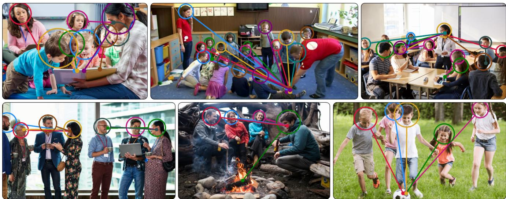
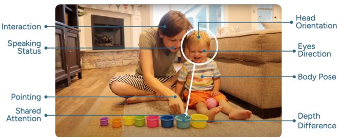
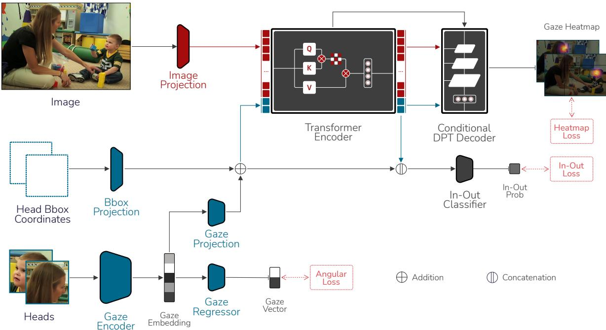
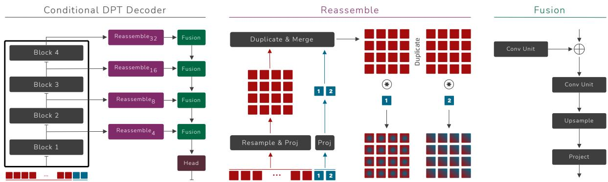
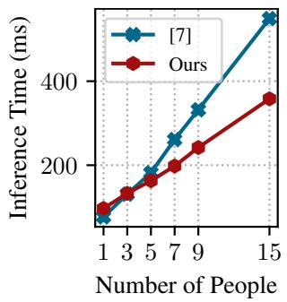
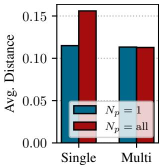
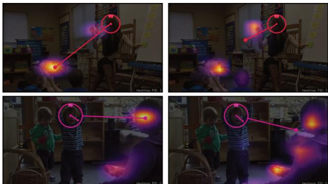

# Sharingan: A Transformer Architecture for Multi-Person Gaze Following

Samy Tafasca Anshul Gupta Jean-Marc Odobez Idiap Research Institute, Switzerland Ecole Polytechnique F ´ ed´ erale de Lausanne, Switzerland ´ stafasca, agupta, odobez @idiap.ch

  
Figure 1. Predictions of Sharingan on naturalistic images from the internet with different people, activities, interactions, postures, and environments (indoors and outdoors). We provide more qualitative samples in the supplementary material.

## Abstract

Gaze is a powerful form of non-verbal communication that humans develop from an early age. As such, modeling this behavior is an important task that can benefit a broad set of application domains ranging from robotics to sociology. In particular, the gaze following task in computer vision is defined as the prediction of the 2D pixel coordinates where a person in the image is looking. Previous attempts in this area have primarily centered on CNN-based architectures, but they have been constrained by the need to process one person at a time, which proves to be highly inefficient. In this paper, we introduce a novel and effective multi-person transformer-based architecture for gaze prediction. While there exist prior works using transformers for multi-person gaze prediction [38, 39], they use a fixed set oflearnable embeddings to decode both the person and its gaze target, which requires a matching step afterward to link the predictions with the annotations. Thus, it is difficult to quantitatively evaluate these methods reliably with

the available benchmarks, or integrate them into a larger human behavior understanding system. Instead, we are the first to propose a multi-person transformer-based architecture that maintains the original task formulation and ensures control over the people fed as input. Our main contribution lies in encoding the person-specific information into a single controlled token to be processed alongside image tokens and using its output for prediction based on a novel multiscale decoding mechanism. Our new archi tecture achieves state-of-the-art results on the GazeFollow, VideoAttentionTarget, and ChildPlay datasets and outperforms comparable multi-person architectures with a notable margin. Our code, checkpoints, and data extractions will be made publicly available soon.

## 1. Introduction

Gaze is an important form of communication and was extensively studied across different domains and applications such as consumer behavior understanding [4, 19, 36], sociology by analyzing different gaze behaviors (e.g. joint attention, eye contact) [10, 24–27], robotics through humanrobot interactions [1, 17, 32] and clinical research for the study of neurodevelopmental disorders [7, 20, 34], etc.

  
Figure 2. Illustration of aspects relevant to gaze following.

Unlike traditional works on gaze analytics proposed by the computer vision community which focused mainly on predicting 3D gaze directions from the eyes [33, 40] or the face [18] of a person, gaze following [29] tackles the task in a more general form where the goal is to infer the 2D location in the image where a person is looking without the need for any assumptions or wearable devices. This formulation is particularly interesting in the context of analyzing social scenes and human interactions given the important role that gaze behavior plays in social dynamics.

It is important to emphasize that this task is very difficult to solve. It hinges upon understanding two aspects simultaneously: (i) the target person (e.g. head pose) to infer a general gaze direction, and (ii) the context of the scene (e.g. social interaction) to identify regions of saliency (cf. Figure 2). Once this is achieved, the rest is essentially a selection process of the gaze target after merging information from the previous steps. This also explains why most architectures have a 2-tower design with one branch to process the scene and a second one to focus on the target person.

One major issue with this dual-stream approach is that the input instance is a person, not an image. Therefore, it requires multiple forward passes to predict gaze for all people in the same scene, which makes the inference process extremely inefficient. This is made even worse when other modalities are involved (e.g. depth [11, 35] or pose [12]). Moreover, most previous works focus on how to build the person-specific gaze representation, the scene saliency maps, and the fusion between them but pay very little attention to the decoding mechanism that predicts the final gaze heatmap. For example, [7, 11, 17] all use a decoding module based on a few convolutional layers followed by a set of transposed convolutions. The input to this module is often very low dimensional (e.g. 7 7) which forces the prediction to be based on coarse information.

In this work, we aim to tackle these challenges by addressing the multi-person gaze-following task while maintaining the original problem formulation. To this end, we propose Sharingan, a novel, effective, and efficient transformer-based architecture to predict the gaze target of multiple people simultaneously. A key component of this architecture is to represent the person’s gaze information by a single gaze token produced by a gaze backbone and processed alongside the image tokens. This is in stark contrast to previous methods that represent intermediate person-specific gaze information as a visual attention map [7] or gaze cone [11, 12, 21, 35]. We show in our ablations that this is not only unnecessary but can also hinder performance in the context of a transformer. Furthermore, we introduce Conditional DPT: a more sophisticated lightweight multi-scale gaze decoding mechanism that helps improve performance by providing a finer-grained understanding of the scene for gaze target selection. This also has the benefit of producing heatmaps that better capture uncertainty when it is difficult to decide where a person is looking (cf . qualitative results in the supplementary material).

Through extensive ablations and evaluations, we find that Sharingan achieves good performance on all public benchmarks, and even transfers well to other gaze-related tasks such as shared attention and mutual gaze.

## 2. Related Work

In this section, we present several relevant research topics.

Gaze Following. The task of gaze following was first introduced in the seminal work of Recasens et al. [29]. The idea is to predict the pixel-wise 2D location in the image corresponding to where a target person is looking. The main advantage of this formulation is the lack of constraints which allows methods trained this way to generalize to arbitrary settings (i.e. scene properties, camera parameters, image conditions, etc.). It was later extended by Chong et al. [7] to also include the prediction of whether the given person is looking inside the image frame or somewhere outside.

Traditional methods for gaze following [7, 11, 12, 16, 17, 21, 29] typically rely on convolutional networks and follow a 2-tower architecture. The first branch processes the scene image to highlight salient regions, while the second branch processes the head crop of the target person to infer a general gaze direction. A fusion mechanism then combines information from both parts to produce the final prediction.

The gaze following task is often framed as the prediction of a gaze heatmap where pixels with high intensity represent spatial areas with higher prediction confidence. We devote a section later to discuss the alternative formulation of regressing the 2D location directly (cf . Section 5).

Multi-Person Gaze Following. A major downside of the traditional formulation of gaze following is the need for multiple forward passes when predicting the gaze of different people in the same image. This problem motivated the need for architectures that can natively handle the prediction of gaze for multiple people with a single forward pass. Jin et al. [16] first proposed a simple convolutionbased architecture to handle the multi-person setting where a scene backbone computes a fixed person-agnostic feature representation. This is then fused repetitively with head features computed from the different people using another head backbone before decoding each into its corresponding gaze heatmap. Aside from the architectural differences and limited performance, one of the main drawbacks of this method is that the computation for each person is done independently from the others, which ignores potential interactions between people. Recently, Tu et al. [39] and Tonini et al. [38] proposed transformer-based architectures to perform multi-person gaze target prediction. Their methods only take the image as input and simultaneously predict both the head box and gaze target (among others) for every person in the scene. Their work is inspired by the DETR architecture [5], where the task is formulated as a set prediction problem. Instead of reinventing the wheel, our method focuses solely on the gaze prediction part (i.e. given that heads are easily and accurately obtainable using off-the-shelf detectors), and naturally adapts the transformer architecture to the original task formulation by introducing gaze tokens to capture person-specific gaze and head location information and can be directly decoded later into gaze predictions.

## 3. Sharingan Architecture

Our Sharingan architecture is illustrated in Figure 3. The main idea is to use a transformer that lets scene tokens and person-specific gaze tokens interact within an attention framework to jointly predict the 2D gaze heatmap of each individual. Thus, the inputs are the image and the head crops that we assume are available. We introduce below the different components of this architecture.

## 3.1. Image tokens

We follow a standard ViT architecture to produce image tokens. The input scene image $\mathbf { I } \in \mathbb { R } ^ { H \times W \times C }$ goes through a patch projection ${ \mathcal { P } } _ { \mathrm { i m g } }$ to produce image tokens that we equip with positional information $\mathbf { x } ^ { \mathrm { { i m g } } } \in \mathbf { \mathbb { R } } ^ { N \times D }$ , where $N$ is the number of patches, and D is the token dimension.

## 3.2. Gaze tokens

The main purpose of a gaze token is to map the gaze information of a person into a token embedded in the same space as the image tokens, which can interact with scene tokens to select the relevant content for prediction. For simplicity, we first introduce this process for a single person.

Single Person Case. Let $\mathbf { h } _ { \mathrm { c r o p } } \in \mathbb { R } ^ { h \times w \times C }$ denote the head crop of a person and ${ \bf h } _ { \mathrm { b b o x } } = ( x _ { \mathrm { m i n } } , y _ { \mathrm { m i n } } , x _ { \mathrm { m a x } } , y _ { \mathrm { m a x } } ) \in$ $[ 0 , 1 ] ^ { 4 }$ her head bounding box. The mapping works as follows. The head crop $\mathbf { h } _ { \mathrm { c r o p } }$ is fed to a gaze backbone $\mathcal { G }$ to produce a gaze embedding $\mathbf { g } ^ { \mathrm { e m b } } \in \mathbb { R } ^ { d _ { \mathrm { e m b } } }$ . This embedding is used in two ways. First, it goes through a gaze regressor $( i . e . \mathrm { M L P } ) \mathcal { O } _ { \mathrm { g v } }$ to predict a 2D gaze vector ${ \bf g } _ { \mathrm { v } } = \mathcal { O } _ { \mathrm { g v } } ( { \bf g } ^ { \mathrm { e m b } } )$ . This output is supervised using an angular gaze loss.

Secondly, the gaze embedding is projected to the token dimension using a learnable linear projection $\mathcal { P } _ { \mathrm { g a z e } }$ , resulting in the gaze token ${ \bf x } ^ { \mathrm { e m b } } = \mathcal { P } _ { \mathrm { g a z e } } ( { \bf g } ^ { \mathrm { e m b } } ) \in \breve { \mathbb { R } } ^ { D }$ . As we want to incorporate information about the person’s location (and size), we also project the head bounding box $\mathbf { h } _ { \mathrm { b b o x } }$ into a bounding box embedding $\mathbf { x } ^ { \mathrm { { b b o x } } }$ using a learnable linear projection $\mathcal { P } _ { \mathrm { b b o x } } \colon \mathrm { \mathbf { x } } ^ { \mathrm { b b o x } } = \mathrm { \mathcal { P } } _ { \mathrm { b b o x } } ( \mathbf { h } _ { \mathrm { b b o x } } ) \in \mathrm { \mathbb { R } } ^ { D }$ Finally, we add this embedding to the gaze token to obtain the final location-aware gaze token:

$$
\mathbf { x } ^ { \mathrm { g } } = \mathbf { x } ^ { \mathrm { e m b } } + \mathbf { x } ^ { \mathrm { b b o x } } \in \mathbb { R } ^ { D }\tag{1}
$$

Multi-person case. When $N _ { p }$ persons are detected, the architecture will produce a set of $N _ { p }$ gaze tokens, following the same process described above for each person. Thus, if $\mathbf { h } _ { \mathrm { b b o x } } ^ { i }$ and $\mathbf { h } _ { \mathrm { c r o p } } ^ { i }$ denote the bounding-box and head crop of person $i ,$ the above process will generate a gaze token $\mathbf { x } _ { i } ^ { \mathrm { g } }$ for this person. To simplify notation, we will also denote by $\mathbf { x } ^ { \mathrm { g } }$ the set of gaze tokens of all people in the scene, with $\mathbf { x ^ { g } } = \mathbf { x _ { 1 } ^ { g } } \oplus . . . \oplus \mathbf { x } _ { N _ { n } } ^ { \mathbf { g } }$ , where is the concatenation operator. Modality Encoding. Given the different nature of gaze tokens compared to image tokens, we need to encode modality-specific information to distinguish between them. Rather than using an explicit scheme, in practice we expect this modality information to be captured by the bias terms of the different projection operators $\mathcal { P } _ { \mathrm { g a z e } }$ and ${ \mathcal { P } } _ { \mathrm { i m g } }$

## 3.3. Transformer Encoder

The transformer encoder is a standard ViT [8]. It takes as input the concatenation of the scene tokens $\mathbf { x } ^ { \mathrm { i m g } }$ , the gaze token(s) $\mathbf { x } ^ { \mathrm { g } } ,$ , according to $\mathbf { x } = \mathbf { x } ^ { \mathrm { i m g } } \oplus \mathbf { x } ^ { \mathrm { g } } \in \mathbb { R } ^ { N _ { t } \times D }$ , where $N _ { t } ~ = ~ N + N _ { p }$ . The set of input tokens goes through a series of L transformer blocks to obtain an output sequence of similar shape, denoted by $\mathbf { x } ^ { \mathrm { o u t } } = \mathbf { x } ^ { ( L ) } \in \mathbb { R } ^ { \hat { N } _ { t } \times D }$

## 3.4. Gaze Decoder

The goal of the gaze decoder $\mathcal { D } _ { \mathrm { g a z e } }$ is to predict a set of gaze heatmaps. Our Conditional DPT (cf. Figure 4) takes four intermediate representations of the image tokens $\mathbf { x } _ { ( i ) } ^ { \mathrm { i m g } }$ and gaze tokens $\mathbf { x } _ { ( i ) } ^ { \mathrm { g } }$ and combines them progressively at different simulated resolutions, where lower resolutions have more channels and correspond to deeper layers of the encoder. This can be viewed as the isotropic equivalent of a Feature Pyramid Network [22].

Our design is inspired by DPT [28], which can only handle decoding image tokens alone. In our case, we need this decoding to be conditioned on each person. To this end, after each block of layers, the image tokens $\mathbf { x } _ { ( l _ { k } ) } ^ { \mathrm { i m g } } , k \in$ $\{ 4 , 8 , 1 6 , 3 2 \}$ are reassembled into an image-like representation at resolution $\textstyle { \bigl ( } { \frac { H } { k } } , { \frac { W } { k } } { \bigr ) }$ and dimension $d _ { k }$ . The gaze tokens $\mathbf { x } _ { ( l _ { k } ) } ^ { \mathrm { g } }$ at that layer are also projected to the same dimension. Next, we duplicate the image feature maps $N _ { p }$ times, and apply an element-wise dot-product between each gaze token and a copy of the image feature map. Finally, these person-specific image features are stacked, and we merge the batch and person dimensions to produce a final output of dimension $\begin{array} { r } { ( \bar { B } \times N _ { p } , d _ { k } , \frac { H } { k } , \frac { W } { k } ) } \end{array}$ . This tensor is passed to a fusion module where it is processed by a small residual convnet and added to the output from the previous fusion block. The result goes through another residual convnet, an upsampling stage to double the resolution, and a projection, leading to a tensor of dimension $\begin{array} { r } { ( B \times N _ { p } , d _ { \frac { k } { 2 } } , \frac { 2 \tilde { H } } { k } , \frac { 2 W } { k } ) } \end{array}$ . At the end of this process, we get a tensor of dimension $\begin{array} { r } { ( B \times N _ { p } , d _ { \mathrm { o u t } } , \frac { H } { 2 } , \frac { \dot { W } } { 2 } ) } \end{array}$ , which goes through a convolutional head that predicts the heatmaps by bringing the channel dimension down to 1 and resizing the spatial dimension to that of the gaze heatmap. Finally, we separate the batch and person dimensions such that the final shape of the output is $( B , N _ { p } , 1 , H _ { \mathrm { h m } } , W _ { \mathrm { h m } } )$ . The rationale behind this design is to gather information from different layers and resolutions, which is important for dense prediction tasks. In this case, it is particularly useful for gaze tokens where information from the early layers might retain more scene-independent gaze cues due to their proximity to the gaze encoder.

  
Figure 3. Overview of our Sharingan architecture. A. The input image is projected into image tokens (red squares). B. The head crops and head box coordinates are processed to generate location and size-aware person-specific tokens (blue squares) as follows. First, the head crop is fed to a gaze backbone to produce a gaze embedding used to (i) predict a normalized 2D gaze vector that is supervised using an angular loss; and (ii) produce a gaze token by projecting it to the token dimension. Second, head bounding box coordinates are projected to obtain an embedding which, added to the gaze token, produces a person gaze token. C. Image tokens and gaze tokens are fed to the transformer encoder, and the output tokens corresponding to input people are all decoded using a Conditional DPT decoder to predict each person’s gaze heatmaps. In addition, input and output gaze tokens are concatenated together to predict the in-vs-out label.

## 3.5. In-Out prediction

The In-Out classifier head $\mathcal { O } _ { \mathrm { M L P } }$ consists of an MLP with 7 layers. It is fed the concatenation of input and output gaze tokens to predict a binary in-vs-out label for each person.

$$
{ \bf 0 } = \mathcal { O } _ { \mathrm { M L P } } \big ( [ { \bf x } _ { ( L ) } ^ { \mathrm { g } } , { \bf x } ^ { \mathrm { g } } ] \big )\tag{2}
$$

## 3.6. Loss and implementation details

We train our model using a combination of three losses: Heatmap Loss $( \mathcal { L } _ { r e g } )$ . The heatmap loss is the pixel-wise MSE between the GT heatmap and the predicted heatmap: $\begin{array} { r } { \mathcal { L } _ { h m } = \sum _ { x , y } ^ { { W _ { h m } } , { H _ { h m } } } | | \mathcal { A } _ { x , y } ^ { \mathrm { g t } } - \dot { \mathcal { A } } _ { x , y } ^ { \mathrm { p r e d } } | | _ { 2 } ^ { 2 } } \end{array}$

Angular Loss $( \mathcal { L } _ { a n g } ) .$ . The angular loss drives the prediction of a normalized gaze direction vector. It maximizes the cosine of the angle between the predicted and ground truth gaze vectors according to: $\bar { \mathcal { L } } _ { a n g } ^ { \mathrm { ~ ~ } } = 1 - \mathbf { \bar { \tau } } < \bar { \mathbf { g } _ { \mathrm { v } } ^ { g t } } , \mathbf { g } _ { \mathrm { v } } ^ { p r e d } >$ where $< a , b >$ denotes the inner product between a and b. In-Out Loss $( \mathcal { L } _ { i o } )$ . The in-out loss is the standard binary cross-entropy for in-vs-out prediction.

Global loss. The final loss is a given by:

$$
\mathcal { L } = \lambda _ { r e g } \mathcal { L } _ { r e g } + \lambda _ { a n g } \mathcal { L } _ { a n g } + \lambda _ { i o } \mathcal { L } _ { i o }\tag{3}
$$

  
Figure 4. Overview of our proposed Conditional DPT decoder.

## 4. Experiments

## 4.1. Datasets

GazeFollow. GazeFollow [30] is an image-based dataset annotated mostly with head bounding boxes, 2D gaze points. Overall, it has around 130K annotated instances in 122K images. The test set comprises 4782 gaze instances, each of which is labeled by multiple annotators ( 10).

VideoAttentionTarget. VideoAttentionTarget [7] is a video-based dataset consisting of 1331 clips from 50 TV shows. It is also annotated with the head bounding boxes, 2D gaze points, and in vs out labels. Overall, it contains 164K instances in 71K frames.

ChildPlay. ChildPlay [35] is a video dataset consisting of 401 clips from 95 YouTube videos of children engaged in play activities. On top of the standard annotations, the authors extend the in vs out label to include other gaze classes (e.g. gaze shift), which we don’t use in this paper. Overall, it contains 257K instances in 120K frames.

## 4.2. Metrics

We use four metrics to evaluate our gaze following models. The first three are AUC, Distance, and AP which are all standard in the literature [7]. Particularly, the AUC adaptation introduced by [7] for datasets with a single point annotation is not very informative, so we decided to replace it with PLAH, which we define below.

PLAH. Recently introduced in [35], this metric computes the Precision of looking at people’s heads to incorporate semantic information in the evaluation of gaze models. Unlike [35], we consider a prediction positive if the predicted and annotated gaze points fall within the same head box.

## 4.3. Experimental Protocol

Context People. The training of Sharingan relies on processing multiple people at the same time $( c f .$ section 5), but available benchmarks often annotate 1 person per image. To circumvent this problem, we apply an off-the-shelf head detector1 trained on the CrowdHuman dataset [31]. We discard detections with a confidence score lower than 0.5 and detections with an IOU score higher than 0.5 with the annotated target person. During training, due to batch constraints, we set $N _ { p } ^ { t r }$ and keep it fixed. For each image, we use the person with the GT annotation and randomly sample $N _ { p } ^ { t r } - 1$ (detected) heads when available, otherwise we use padding for the box and head crop. Incidentally, the loss is computed and propagated solely from the annotated person. At evaluation, for each image i we set $N _ { p } ^ { i }$ to the number of all people in it and process them in a single forward pass using a batch size of 1. Note that $N _ { p } ^ { t r }$ is a property of the training process, not the architecture, and thus doesn’t restrict the $N _ { p } ^ { i }$ that can be used during inference. Unless stated otherwise, we use $N _ { p } ^ { t r } = 2$ in all experiments.

Implementation Details. Sharingan processes the input scene image and head crop at a resolution of $2 2 4 \times 2 2 4$ while the output heatmap is $6 4 \times 6 4$ . The gaze backbone is a ResNet-18 [13] pretrained on Gaze360 [18], and the transformer encoder is a ViT-base model [9] initialized with weights from a multimodal MAE [2].

Training. The models are trained for 20 epochs on Gaze-Follow. For VideoAttentionTarget and ChildPlay, following standard practices, we take the trained GazeFollow model, freeze everything except the gaze decoder and In-Out classifier, and fine-tune them separately for 2 epochs each. We use the AdamW optimizer [23] with a learning rate of 3e 5, and a cosine annealing schedule. The fine-tuning uses a learning rate of 1e  6 for the gaze decoder and $3 e \mathrm { ~ - ~ } 4$ for the In-Out classifier. We also make use of Stochastic Weight Averaging [15] to stabilize training on GazeFollow. The loss coefficients are $\lambda _ { r e g } = 1 0 0 0$ and $\lambda _ { a n g } = 3$

Validation. Since GazeFollow [30] and VideoAttentionTarget [7] do not propose any validation splits, we use the trainval splits proposed by [35]. The best model on the validation set is selected based on the distance metric.

## 4.4. Comparison with the State-of-the-art

We summarize our quantitative results on the GazeFollow and VideoAttentionTarget datasets in Table 1, and on Child-Play in Table 2, compared to previous works2. Our model sets a new state-of-the-art on all 3 datasets on most metrics and outperforms the only comparable multi-person method by 0.013 on the Avg. Dist. metric. Moreover, the only method that comes close to our results is [12], which we slightly outperform on GazeFollow in both Avg. Dist. and AUC. However, unlike Sharingan, this method uses 2 other modalities (i.e. depth, pose), has a very complex and costly training protocol (i.e. modality-specific backbones are pretrained separately for the task), and is resource-intensive during inference (i.e. single-person). Moreover, it generalizes poorly as evidenced by a cross-dataset evaluation3 (i.e. Dist. 0.113 vs 0.134 on VideoAttentionTarget, and 0.109 vs 0.142 on ChildPlay). Incidentally, the image version of this method is also significantly worse (i.e. 0.134 vs 0.113). In terms of multi-person comparison, we beat [16] by 0.013 and 0.02 in Avg. Dist. and Min. Dist. respectively.

We also see similar results on video datasets (VideoAttentionTarget and ChildPlay), and it is interesting to note that the model trained on GazeFollow is achieving remarkable cross-dataset performance without fine-tuning. Surprisingly, it is already improving on its multi-person competitor by a large margin (i.e. Dist. 0.113 vs 0.134), which is a testament to the generalization ability of our model. We also note that the model from [35] is on par with ours on the video datasets. We believe the reason is these datasets have high-quality images compared to GazeFollow, so the depthbased geometric prior in [35] proves useful, but that method remains multimodal and single-person. We provide more details, discussions, and experiments in the supplementary material to further assess robustness and generalization.

## 4.5. Ablation Experiments

Person Encoding. An important aspect of Sharingan is the way people are encoded into the architecture. Previous methods often represent the head location as a binary mask, and gaze information as a visual attention map [7] or gaze cone [11, 12, 35]. We modify Sharingan to experiment with 3 variants, and opt for single-person training to alleviate the computational cost from some of these formulations: 1. Instead of projecting the box coordinates, we use a head location mask that we tokenize and add the resulting head position embeddings to the image tokens (i.e. Head Mask Embed). 2. Using the same head mask embedding, we tokenize the head crop and append the head tokens to the image ones (i.e. Head Crop Tokens). 3. Instead of processing the head directly, we use the gaze backbone to regress a gaze vector which is used to build a gaze cone that we tokenize (i.e. Gaze Cone Tokens). Please note that formulations 2 and 3 double the number of tokens, and we decode the output image tokens into a gaze heatmap using a normal DPT [28]. As we can see from Table 3 (top), the location-aware gaze token is both efficient and performs the best.

<table><tr><td>Method</td><td>AUC↑</td><td>Avg. D. ↓</td><td>Min. D. ↓</td></tr><tr><td rowspan="3">Head Mask Embed Head Crop Tokens Gaze Cone Tokens</td><td>0.940</td><td>0.117</td><td>0.060</td></tr><tr><td>0.933</td><td>0.138</td><td>0.076</td></tr><tr><td>0.934</td><td>0.133</td><td>0.073</td></tr><tr><td>Gaze Token</td><td>0.944</td><td>0.113</td><td>0.057</td></tr><tr><td rowspan="3">Token to Heatmap Dot-Product Up &amp; Dot-Product</td><td>0.647</td><td>0.302</td><td>0.234</td></tr><tr><td>0.923</td><td>0.120</td><td>0.062</td></tr><tr><td>0.934</td><td>0.116</td><td>0.059</td></tr><tr><td>Conditional DPT</td><td>0.944</td><td>0.113</td><td>0.057</td></tr></table>

Table 3. Ablation results for person encoding (top) and gaze decoding (bottom).

Gaze Decoder. We also perform ablations to assess the suitability of our Conditional DPT gaze decoder by comparing it to other baselines as shown in Table 3 (bottom). The first baseline (i.e. Token to Heatmap) regresses a gaze heatmap directly from the output person token using an MLP. This is also the decoding approach undertaken by [39] and [38]. The second baseline (cf . Dot-Product) projects the tokens, then performs a dot-product between each person token and each image token before resizing the output to 64  64 to get the final heatmap. The third baseline (cf. Up & Dot-Product) upscales the image representation first, then performs the dot-product. We note that our Conditional DPT outperforms all the other methods, justifying the need for a more sophisticated decoding mechanism.

Angular Loss. Our experiments show that the angular loss doesn’t affect the final performance, but we decided to keep it anyway to always have a reliable gaze direction, even when the person is looking outside the frame.

## 5. Discussion

Model Efficiency. Unlike most previous methods, Sharingan’s ability to predict the gaze of multiple people at the same time makes it very efficient for real-world applications. Figure 5 (left) shows a fairly large improvement in inference time compared to a lightweight baseline when $N _ { p }$ increases. It’s worth noting that while Sharingan does most of its processing once within the transformer, the small gaze encoder and decoder themselves are executed for each person independently by combining the batch and person dimensions. This explains why the curve is not constant.

<table><tr><td rowspan="2">Method</td><td rowspan="2">Multi</td><td rowspan="2">Modality</td><td colspan="4">GazeFollow</td><td colspan="3">VideoAttentionTarget</td></tr><tr><td>AUC↑</td><td>Avg. Dist. ↓</td><td>Min. Dist. ↓</td><td>PLAH↑</td><td>Dist. ↓</td><td>PLAH↑</td><td>AP↑</td></tr><tr><td>Recasens [29]</td><td>x</td><td>I</td><td>0.878</td><td>0.190</td><td>0.113</td><td></td><td></td><td></td><td></td></tr><tr><td>Chong [6]</td><td>x</td><td>I+T</td><td>0.896</td><td>0.187</td><td>0.112</td><td></td><td>0.171</td><td></td><td>0.712</td></tr><tr><td>Lian [21]</td><td>x</td><td>I</td><td>0.906</td><td>0.145</td><td>0.081</td><td></td><td></td><td></td><td></td></tr><tr><td>Chong [7]</td><td>x</td><td>I+T</td><td>0.921</td><td>0.137</td><td>0.077</td><td></td><td>0.134</td><td></td><td>0.853</td></tr><tr><td>Fang [11]</td><td>x</td><td>I+D+E</td><td>0.922</td><td>0.124</td><td>0.067</td><td></td><td>0.108</td><td></td><td>0.896</td></tr><tr><td>Fang [11]</td><td>x</td><td>I+D</td><td></td><td></td><td></td><td></td><td>0.124</td><td></td><td>0.872</td></tr><tr><td>Jin [17]</td><td>x</td><td>I+D</td><td>0.920</td><td>0.118</td><td>0.063</td><td></td><td>0.109</td><td></td><td>0.897</td></tr><tr><td>Jin [17]</td><td>x</td><td>I</td><td>0.909</td><td>0.137</td><td>0.077</td><td></td><td></td><td></td><td></td></tr><tr><td>Tonini [37]</td><td>x</td><td>I+D</td><td>0.927</td><td>0.141</td><td></td><td></td><td>0.129</td><td></td><td></td></tr><tr><td>Gupta [12]</td><td>x</td><td>I+D+P</td><td>0.943</td><td>0.114</td><td>0.056</td><td></td><td>0.110</td><td></td><td>0.879</td></tr><tr><td>Gupta [12]</td><td>x</td><td>I</td><td>0.933</td><td>0.134</td><td>0.071</td><td></td><td>0.122</td><td></td><td>0.864</td></tr><tr><td>Bao [3]</td><td>x</td><td>I+D+P</td><td>0.928</td><td>0.122</td><td></td><td></td><td>0.120</td><td></td><td>0.869</td></tr><tr><td>Hu [14]</td><td>x</td><td>I+D+0</td><td>0.923</td><td>0.128</td><td>0.069</td><td></td><td>0.118</td><td></td><td>0.881</td></tr><tr><td>Tafasca [35]</td><td>x</td><td>I+D</td><td>0.936</td><td>0.125</td><td>0.064</td><td>0.622</td><td>0.109</td><td>0.752</td><td>0.834</td></tr><tr><td>Jin [16]</td><td>√</td><td>I</td><td>0.919</td><td>0.126</td><td>0.076</td><td></td><td>0.134</td><td></td><td>0.880</td></tr><tr><td>Sharingan†</td><td>√</td><td>I</td><td>0.944</td><td>0.113</td><td>0.057</td><td>0.667</td><td>0.113</td><td>0.748</td><td></td></tr><tr><td>Sharingan</td><td>√</td><td>I</td><td>0.944</td><td>0.113</td><td>0.057</td><td>0.667</td><td>0.107</td><td>0.738</td><td>0.891</td></tr></table>

Table 1. Results of our Sharingan architecture on the GazeFollow and VideoAttentionTarget datasets. The best scores for multi-person models are given in bold, while the best scores in general are underlined. The symbol means that the model was trained on GazeFollow and evaluated without fine-tuning. The modality column uses the codes I (image), T (time), D (depth), E (eyes), P (pose), and O (objects).

<table><tr><td>Method</td><td>Multi</td><td>Dist. ↓</td><td>PLAH↑</td><td>AP↑</td></tr><tr><td>Gupta [12]</td><td>x</td><td>0.113</td><td></td><td>0.983</td></tr><tr><td>Tafasca [35]</td><td>x</td><td>0.107</td><td>0.590</td><td>0.986</td></tr><tr><td>Sharingan†</td><td>√</td><td>0.109</td><td>0.600</td><td></td></tr><tr><td>Sharingan</td><td></td><td>0.106</td><td>0.600</td><td>0.990</td></tr></table>

Table 2. Results on the ChildPlay dataset.

  
Figure 5. (Left): Comparison of CPU inference time based on $N _ { p } .$ (Right): Comparison of single- and multi-person models by $N _ { p } ^ { i }$ during evaluation on GazeFollow.

Number of People. One consideration of particular importance in the context of Sharingan is the influence of the number of people on training and evaluation. Table 4 shows that increasing $N _ { p } ^ { t r }$ during training does not influence performance. We believe that since the gaze tokens are interchangeable and play a symmetric role (i.e. no order encoding), as long as $N _ { p } ^ { t r } > 1$ , the model will be forced to learn how to accommodate an arbitrary number of people in the scene during inference by sharing the learned image representations among them. However, the same cannot be said for the single-person setting $( N _ { p } ^ { t r } = 1 )$ , which is fundamentally different from multi-person $( N _ { p } ^ { t r } > 1 )$ . In this case, the model inevitably learns to tailor its image representations to a single person. To illustrate this behavior, we evaluate a single-person $( N _ { p } ^ { t r } = 1 )$ and a multi-person $( N _ { p } ^ { t r } = 2 )$ models twice: first using one person $( N _ { p } ^ { i } = 1 )$ and a second time by processing all people in the scene $( N _ { p } ^ { i } = a l l )$ . Figure 5 (right) shows that the multi-person model is perfectly able to do both single-person and multiperson prediction. However, the single-person model experiences a significant degradation when attempting multiperson prediction.

Heatmap vs 2D Point. Gaze following has always been framed as a heatmap prediction task. To the best of our knowledge, Lian et al. [21] were the only authors to experiment with a 2D point regression objective in their ablation study. In this section, we explore this formulation further to gain a deeper understanding of the task. To this end, we trained a Sharingan model by replacing the Conditional DPT decoder with a simple MLP to directly regress (x, y) coordinates from the output person token. Since the 2D Point model can only predict a single value, it can’t represent the entire distribution over the 2D space of the image. Instead, we believe that it converges to an expectation of this posterior probability. When this distribution is multimodal (i.e. more than one probable gaze target), the expectation becomes unlikely under that posterior distribution. We illustrate this behavior in Figure 6 by comparing the personspecific attention map from the last layer of the encoder of the 2D Point model to the predicted gaze heatmap from the Heatmap variant. It is clear that both models capture the different modes quite well, but the former outputs (x, y) coordinates resembling a weighted average of these modes, which ends up distant from all of them.

<table><tr><td></td><td>AUC</td><td>Avg. D. ↓</td><td>Min. D. ↓</td></tr><tr><td> $N _ { p } ^ { t r } = 2$ </td><td>0.944</td><td>0.113</td><td>0.057</td></tr><tr><td> $\bar { N _ { p } ^ { t r } } = 3$ </td><td>0.943</td><td>0.114</td><td>0.058</td></tr><tr><td> $N _ { p } ^ { t r } = 4$ </td><td>0.942</td><td>0.113</td><td>0.057</td></tr></table>

Table 4. Influence of the number of people during training on GazeFollow. The evaluation uses all available people.

This phenomenon leads to the results given in Table 5, showing that the 2D point model achieves better average distance and PLAH, but lags behind the Heatmap model in terms of minimum distance and RLAH. This is not surprising since the average distance of the GazeFollow test set is a distance to an average of modes (i.e. multiple annotated points), which loosely resembles the objective that the 2D Point model is optimizing for. Consequently, we believe that the average distance should never be the only metric for evaluating gaze following methods, a claim also supported by [3]. On the other hand, positive LAH predictions for the 2D Point model mean that it is very confident, which explains the better PLAH value. However, this also means that the number of false negatives will be high, hence the big gap in RLAH because the predicted point will often be slightly off-target when the model is not confident (e.g. marginally outside the head area when looking at a person).

Limitation. Sharingan processes both image and gaze tokens simultaneously in the transformer. This means that the same weights operate on both types of tokens, which makes it difficult to understand how the model is combining information. One idea worth exploring is to disentangle scene and person processing, and selectively fuse their information along the architecture. This may help improve the stability of predictions on videos, and allow people to interact together in a more meaningful way.

Figure 6. Comparison of Heatmap (i.e. left) and 2D Point regression model (i.e. right) models. The heatmap on the right is obtained by computing the attention weights (i.e. last encoder layer) of the person’s gaze token with the image tokens.
<table><tr><td></td><td>Avg. D.</td><td>Min. D.</td><td>PLAH</td><td>RLAH</td></tr><tr><td>2D Point</td><td>0.106</td><td>0.066</td><td>0.683</td><td>0.368</td></tr><tr><td>Heatmap</td><td>0.113</td><td>0.057</td><td>0.667</td><td>0.571</td></tr></table>

Table 5. Comparison between the heatmap and the 2D point training objectives on GazeFollow. RLAH is the recall of LAH.

## 6. Conclusion

In this paper, we introduced Sharingan, a novel and efficient transformer-based architecture for gaze target prediction that is designed to support an arbitrary number of people out of the box. Sharingan stands out for its efficiency both in training and inference, delivering SOTA results on public benchmarks. Furthermore, it demonstrates strong generalization when tested on other datasets and naturalistic scenes. We also validated architectural decisions through extensive ablation experiments and discussed key aspects related to the model and the task.

Beyond gaze following, Sharingan’s intuitive design makes it suitable for other research areas in human behavior understanding. Specifically, the architecture can be extended to perform a multi-faceted analysis of social scenes by integrating different modalities (e.g. depth, semantics), and producing more outputs (e.g. gestures, interactions). We intend to explore this direction further in future work.

Acknowledgement. This research has been supported by the AI4Autism project (Digital Phenotyping of Autism Spectrum Disorders in children, grant agreement no. CR-SII5 202235 / 1) of the the Sinergia interdisciplinary program of the SNSF.

## References

[1] Henny Admoni and Brian Scassellati. Social eye gaze in human-robot interaction: a review. Journal ofHuman-Robot Interaction, 6(1):25–63, 2017. 2

[2] Roman Bachmann, David Mizrahi, Andrei Atanov, and Amir Zamir. Multimae: Multi-modal multi-task masked autoencoders. In Computer Vision–ECCV 2022: 17th European Conference, Tel Aviv, Israel, October 23–27, 2022, Proceedings, Part XXXVII, pages 348–367. Springer, 2022. 5

[3] Jun Bao, Buyu Liu, and Jun Yu. Escnet: Gaze target detection with the understanding of 3d scenes. In Proceedings of the IEEE/CVF Conference on Computer Vision and Pattern Recognition, pages 14126–14135, 2022. 7, 8

[4] Bridget K Behe, Patricia T Huddleston, Kevin L Childs, Jiaoping Chen, and Iago S Muraro. Seeing through the forest: The gaze path to purchase. Plos one, 15(10):e0240179, 2020. 1

[5] Nicolas Carion, Francisco Massa, Gabriel Synnaeve, Nicolas Usunier, Alexander Kirillov, and Sergey Zagoruyko. End-toend object detection with transformers. In Computer Vision– ECCV 2020: 16th European Conference, Glasgow, UK, August 23–28, 2020, Proceedings, Part I 16, pages 213–229. Springer, 2020. 3

[6] Eunji Chong, Nataniel Ruiz, Yongxin Wang, Yun Zhang, Agata Rozga, and James M Rehg. Connecting gaze, scene, and attention: Generalized attention estimation via joint modeling of gaze and scene saliency. In Proceedings of the European conference on computer vision (ECCV), pages 383–398, 2018. 7

[7] Eunji Chong, Yongxin Wang, Nataniel Ruiz, and James M Rehg. Detecting attended visual targets in video. In Proceedings of the IEEE/CVF Conference on Computer Vision and Pattern Recognition, pages 5396–5406, 2020. 2, 5, 6, 7

[8] Alexey Dosovitskiy, Lucas Beyer, Alexander Kolesnikov, Dirk Weissenborn, Xiaohua Zhai, Thomas Unterthiner, Mostafa Dehghani, Matthias Minderer, Georg Heigold, Sylvain Gelly, et al. An image is worth 16x16 words: Transformers for image recognition at scale. arXiv preprint arXiv:2010.11929, 2020. 3

[9] Alexey Dosovitskiy, Lucas Beyer, Alexander Kolesnikov, Dirk Weissenborn, Xiaohua Zhai, Thomas Unterthiner, Mostafa Dehghani, Matthias Minderer, Georg Heigold, Sylvain Gelly, et al. An image is worth 16x16 words: Transformers for image recognition at scale. In International Conference on Learning Representations, 2020. 5

[10] Lifeng Fan, Yixin Chen, Ping Wei, Wenguan Wang, and Song-Chun Zhu. Inferring shared attention in social scene videos. In Proceedings of the IEEE conference on computer vision and pattern recognition, pages 6460–6468, 2018. 2, 5

[11] Yi Fang, Jiapeng Tang, Wang Shen, Wei Shen, Xiao Gu, Li Song, and Guangtao Zhai. Dual attention guided gaze target detection in the wild. In Proceedings of the IEEE/CVF Conference on Computer Vision and Pattern Recognition (CVPR), pages 11390–11399, 2021. 2, 6, 7

[12] Anshul Gupta, Samy Tafasca, and Jean-Marc Odobez. A modular multimodal architecture for gaze target prediction: Application to privacy-sensitive settings. In Proceedings of

the IEEE/CVF Conference on Computer Vision and Pattern Recognition, pages 5041–5050, 2022. 2, 6, 7

[13] Kaiming He, Xiangyu Zhang, Shaoqing Ren, and Jian Sun. Deep residual learning for image recognition. In Proceedings ofthe IEEE conference on computer vision and pattern recognition, pages 770–778, 2016. 5

[14] Zhengxi Hu, Kunxu Zhao, Bohan Zhou, Hang Guo, Shichao Wu, Yuxue Yang, and Jingtai Liu. Gaze target estimation inspired by interactive attention. IEEE Transactions on Circuits and Systems for Video Technology, 32(12):8524–8536, 2022. 7

[15] P Izmailov, AG Wilson, D Podoprikhin, D Vetrov, and T Garipov. Averaging weights leads to wider optima and better generalization. In 34th Conference on Uncertainty in Artificial Intelligence 2018, UAI 2018, pages 876–885, 2018. 5

[16] Tianlei Jin, Zheyuan Lin, Shiqiang Zhu, Wen Wang, and Shunda Hu. Multi-person gaze-following with numerical coordinate regression. In 2021 16th IEEE International Conference on Automatic Face and Gesture Recognition (FG 2021), pages 01–08. IEEE, 2021. 2, 3, 6, 7

[17] Tianlei Jin, Qizhi Yu, Shiqiang Zhu, Zheyuan Lin, Jie Ren, Yuanhai Zhou, and Wei Song. Depth-aware gaze-following via auxiliary networks for robotics. Engineering Applications ofArtificial Intelligence, 113:104924, 2022. 2, 7

[18] Petr Kellnhofer, Adria Recasens, Simon Stent, Wojciech Matusik, and Antonio Torralba. Gaze360: Physically unconstrained gaze estimation in the wild. In Proceedings of the IEEE/CVF International Conference on Computer Vision, pages 6912–6921, 2019. 2, 5

[19] Nayeon Kim and Hyunsoo Lee. Assessing consumer attention and arousal using eye-tracking technology in virtual retail environment. Frontiers in Psychology, 12:665658, 2021. 1

[20] Jing Li, Zejin Chen, Yihao Zhong, Hak-Keung Lam, Junxia Han, Gaoxiang Ouyang, Xiaoli Li, and Honghai Liu. Appearance-based gaze estimation for asd diagnosis. IEEE Transactions on Cybernetics, 52(7):6504–6517, 2022. 2

[21] Dongze Lian, Zehao Yu, and Shenghua Gao. Believe it or not, we know what you are looking at! In Asian Conference on Computer Vision, pages 35–50. Springer, 2018. 2, 7, 8, 5

[22] Tsung-Yi Lin, Piotr Dollar, Ross Girshick, Kaiming He,´ Bharath Hariharan, and Serge Belongie. Feature pyramid networks for object detection. In Proceedings of the IEEE conference on computer vision and pattern recognition, pages 2117–2125, 2017. 3

[23] Ilya Loshchilov and Frank Hutter. Decoupled weight decay regularization. In International Conference on Learning Representations, 2018. 5

[24] Manuel Jesus Marin-Jimenez, Andrew Zisserman, Marcin´ Eichner, and Vittorio Ferrari. Detecting people looking at each other in videos. International Journal of Computer Vision, 106(3):282–296, 2014. 2

[25] Manuel J Marin-Jimenez, Vicky Kalogeiton, Pablo Medina-Suarez, and Andrew Zisserman. Laeo-net: revisiting people looking at each other in videos. In Proceedings of the IEEE/CVF Conference on Computer Vision and Pattern Recognition, pages 3477–3485, 2019. 5

[26] Skanda Muralidhar, Remy Siegfried, Jean-Marc Odobez,´ and Daniel Gatica-Perez. Facing employers and customers: What do gaze and expressions tell about soft skills? In Proceedings ofthe 17th International Conference on Mobile and Ubiquitous Multimedia, MUM 2018, Cairo, Egypt, November 25-28, 2018, pages 121–126, 2018.

[27] Catharine Oertel, Patrik Jonell, Dimosthenis Kontogiorgos, Kenneth Funes Mora, Jean-Marc Odobez, and Joakim Gustafson. Towards an engagement-aware attentive artificial listener for multi-party interactions. Frontiers in Robotics and AI, 8:189, 2021. 2

[28] Rene Ranftl, Alexey Bochkovskiy, and Vladlen Koltun. Vi- ´ sion transformers for dense prediction. In Proceedings of the IEEE/CVF International Conference on Computer Vision, pages 12179–12188, 2021. 3, 6

[29] Adria Recasens⇤, Aditya Khosla⇤, Carl Vondrick, and Antonio Torralba. Where are they looking? In Advances in Neural Information Processing Systems (NIPS), 2015. ⇤ indicates equal contribution. 2, 7

[30] Adria Recasens, Carl Vondrick, Aditya Khosla, and Antonio Torralba. Following gaze in video. In Proceedings of the IEEE International Conference on Computer Vision, pages 1435–1443, 2017. 5

[31] Shuai Shao, Zijian Zhao, Boxun Li, Tete Xiao, Gang Yu, Xiangyu Zhang, and Jian Sun. Crowdhuman: A benchmark for detecting human in a crowd. arXiv preprint arXiv:1805.00123, 2018. 5

[32] Samira Sheikhi and Jean-Marc Odobez. Combining dynamic head pose–gaze mapping with the robot conversational state for attention recognition in human–robot interactions. Pattern Recognition Letters, 66:81–90, 2015. 2

[33] R. Siegfried and J.-M. Odobez. Robust unsupervised gaze calibration using conversation and manipulation attention priors. ACM Transactions on Multimedia Computing, Communications, and Applications, 18(1):1–27, 2022. 2

[34] S. Tafasca, A . Gupta, N. Kojovic, M. Gelsomini, T. Maillart, M. Papandrea, M. Schaer, and J.-M. Odobez. The ai4autism project: A multimodal and interdisciplinary approach to autism diagnosis and stratification. In Procedding of the Int. Conference on Multimodal Interaction workshop, Paris, 2023. 2

[35] Samy Tafasca, Anshul Gupta, and Jean-Marc Odobez. Childplay: A new benchmark for understanding children’s gaze behaviour. In Proceedings of the IEEE/CVF International Conference on Computer Vision, pages 20935–20946, 2023. 2, 5, 6, 7, 1

[36] Henri Tomas, Marcus Reyes, Raimarc Dionido, Mark Ty, Jonric Mirando, Joel Casimiro, Rowel Atienza, and Richard Guinto. Goo: A dataset for gaze object prediction in retail environments. In Proceedings ofthe IEEE/CVF Conference on Computer Vision and Pattern Recognition, pages 3125– 3133, 2021. 1

[37] Francesco Tonini, Cigdem Beyan, and Elisa Ricci. Multimodal across domains gaze target detection. In Proceedings of the 2022 International Conference on Multimodal Interaction, pages 420–431, 2022. 7

[38] Francesco Tonini, Nicola Dall’Asen, Cigdem Beyan, and Elisa Ricci. Object-aware gaze target detection. In Proceed-

ings of the IEEE/CVF International Conference on Computer Vision, pages 21860–21869, 2023. 1, 3, 6, 5

[39] Danyang Tu, Xiongkuo Min, Huiyu Duan, Guodong Guo, Guangtao Zhai, and Wei Shen. End-to-end human-gazetarget detection with transformers. In 2022 IEEE/CVF Conference on Computer Vision and Pattern Recognition (CVPR), pages 2192–2200. IEEE, 2022. 1, 3, 6, 5

[40] Yu Yu, Gang Liu, and Jean-Marc Odobez. Deep multitask gaze estimation with a constrained landmark-gaze model. In Proceedings of the European conference on computer vision (ECCV) workshops, pages 0–0, 2018. 2