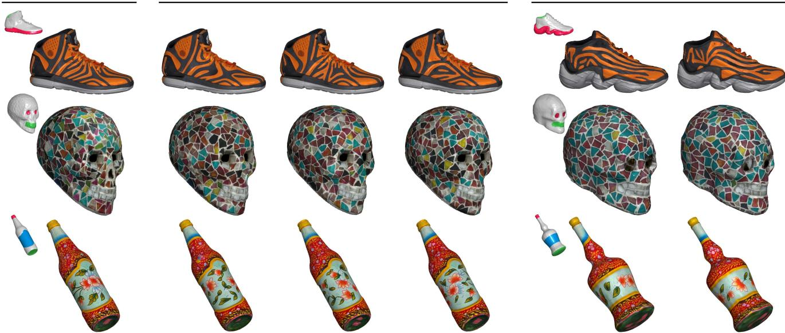
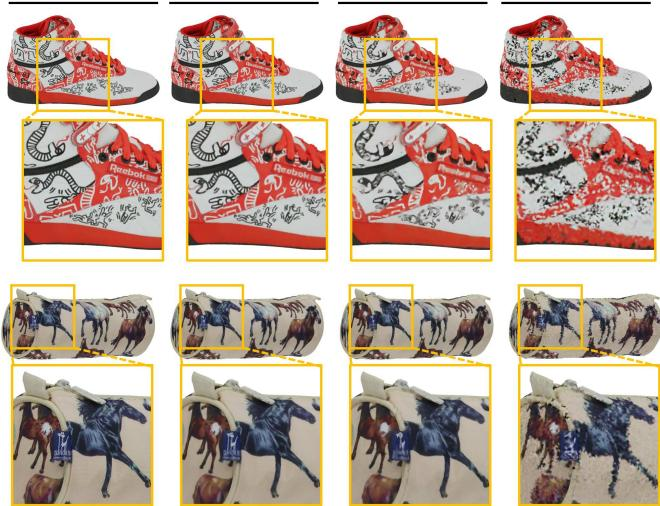
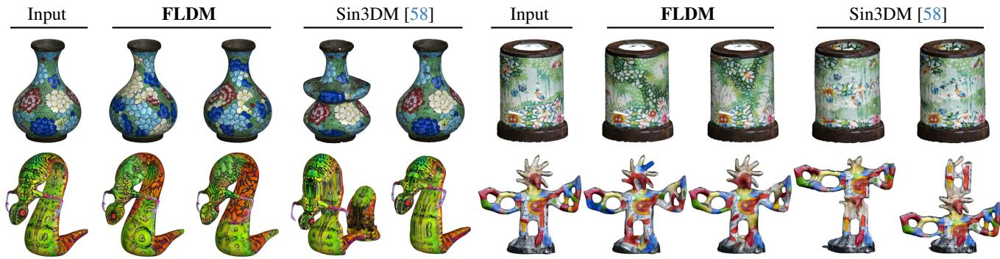
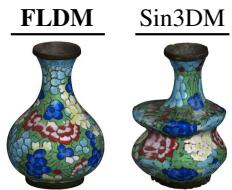
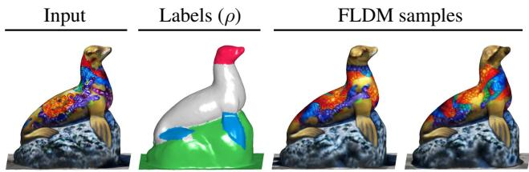
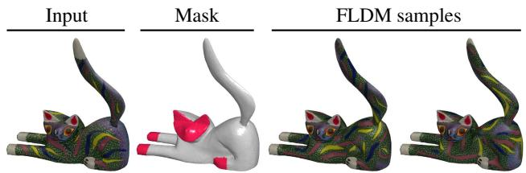
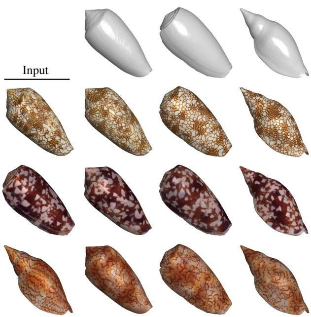
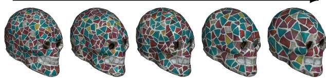

# Single Mesh Diffusion Models with Field Latents for Texture Generation

Thomas W. Mitchel1,2† Carlos Esteves1 Ameesh Makadia1

1Google Research 2PlayStation

Generated textures

  
Figure 1. Our latent diffusion models operate directly on the surfaces of 3D shapes, synthesizing new high-quality textures (center) after training on a single example (left). Both our novel latent representation and diffusion models are isometry-equivariant, facilitating a notion of generative texture transfer by sampling pre-trained models on new geometries (right). Above our models are conditioned on coarse semantic labels reflecting a subjective distribution of content, which delineate the sole and interior of the shoes, the eyes and mouths of the skulls, and the decals on the bottles.

## Abstract

We introduce a framework for intrinsic latent diffusion models operating directly on the surfaces of 3D shapes, with the goal of synthesizing high-quality textures. Our approach is underpinned by two contributions: Field Latents, a latent representation encoding textures as discrete vector fields on the mesh vertices, and Field Latent Diffusion Models, which learn to denoise a diffusion process in the learned latent space on the surface. We consider a singletextured-mesh paradigm, where our models are trained to generate variations of a given texture on a mesh. We show the synthesized textures are of superior fidelity compared thosefrom existing single-textured-mesh generative models. Our models can also be adaptedfor user-controlled editing tasks such as inpainting and label-guided generation. The efficacy of our approach is due in part to the equivariance

of our proposedframework under isometries, allowing our models to seamlessly reproduce details across locally similar regions and opening the door to a notion of generative texture transfer. Code and visualizations are available at https://single-mesh-diffusion.github. io/.

## 1. Introduction

The emergence of latent diffusion models (LDMs) [44] as powerful tools for 2D content creation has motivated efforts to replicate their success across different modalities. A particularly attractive direction is the synthesis of textured 3D assets, due to the high cost of building photorealistic objects which can require intricately configured scanning solutions [13] or expertise in 3D modeling.

The majority of 3D synthesis methods employing LDMs operate in an image-based setting where the 3D representation is optimized through differentiably rendered images, often in conjunction with score distillation sampling (SDS) [3, 4, 32, 41–43, 52, 53]. This design allows the models to leverage the full capabilities of pre-trained 2D LDMs. A second, alternative method is to rasterize both geometry and texture onto a 3D grid which are compressed into triplane latent features over which the DM operates [58]. However, in applications where texture synthesis takes precedence over 3D geometry, both approaches sacrifice fidelity in favor of a workable representation — models relying on planar renderings suffer from view inconsistencies when mapping back to the 3D shape while rasterization inherently aliases fine textural details.

Here, we observe that the discretization of a surface as a triangle mesh is itself a tractable and effective representational space. To this end, we present an original framework for intrinsic LDMs operating directly on the surfaces of shapes, with the goal of generating high-quality textures.

Our method consists of two distinct novel components, serving as the main contributions of our work. The first is a latent representation called Field Latents (FLs). Textures are mapped to tangent vector features at the vertices which are responsible for characterizing the local texture. The choice of tangent vector features over scalars allows for the capture of directional information related to the local texture which we show enables superior quality reconstructions. More generally, FLs offer an effective form of perceptual compression in which a high-resolution texture, analogous to a continuous signal defined over a surface, is mapped to a collection of discrete vector fields taking values at the vertices of a lower-resolution mesh. The second component is a Field Latent Diffusion Model (FLDM), which learns a denoising diffusion process in field latent space. Our FLDMs are built upon field convolutions [35], surface convolution operators designed specifically to process tangent vector features.

Although we outline a general framework for constructing diffusion models for surfaces, inspired by the success of single-image generative models [28, 38, 46, 54], we tailor and deploy our FLDM architecture in the single-texturedmesh setting. We address the problem of generating variations of a given texture on a mesh (Figure 1, left and center), as well as tasks supporting user control such as label-guided generation and inpainting. The single-textured-mesh setting also lets us circumvent the data scarcity issue. Largescale 3D datasets with high-quality textures have only recently become available [8, 9], with only a fraction of samples across disparate categories possessing complex nonuniform textures. Furthermore, many textured 3D assets that are handcrafted or derived from real-world scans are geometrically or stylistically unique, upon which large-scale models can be challenging to condition.

Experiments reveal our models enable flexible synthesis of high-resolution textures of qualitatively superior fidelity compared to existing single-textured-asset diffusion models, while simultaneously sidestepping the challenges of using 2D-to-3D approaches. Furthermore, both FLs and FLDMs are isometry-equivariant — each commute with distance-preserving shape deformations. As a result, we find that our approach can be used for generative texture transfer, wherein a FLDM trained on a single textured mesh can be sampled on a second similar mesh to texture it in the style of the first (Figure 1, right).

## 2. Related Work

Existing generative models that synthesize textured 3D assets typically map content to an internal 2D representation which is computationally preferable to working directly over 3D Euclidean space. Perhaps the most popular approach involves iteratively rendering objects from different viewpoints, enabling the use of pre-trained 2D LDMs (e.g. Stable Diffusion [44]) either indirectly as optimization priors [30, 32, 41, 42] or to directly apply a full denoising process [3, 4, 43, 53]. The former case, pioneered by DreamFusion [41], uses score distillation sampling (SDS), in which a neural radiance field is optimized such that the rendered images appear to be reasonable samples from a pre-trained LDM; in the latter, LDMs with depth conditioning are used to iteratively denoise the rendered images which are aggregatively projected to the texture map. However, SDS-based methods are computationally feasible only with low-resolution LDMs and small NeRFs, and are unable to synthesize fine details. Additionally, approaches that directly denoise and project must contend with artifacts arising from view inconsistencies and synthesized textures may contain unnatural tones or lighting effects as residuals from their image-trained LDM backbone.

Alternative representational spaces to drive textured 3D synthesis have also been explored. Texture Fields [17, 39] encode textures as 3D neural fields and triplane feature maps have emerged recently as an efficient domain for 3D geometry [56, 58, 63]. In particular, Sin3DM [58] encodes geometry and texture into an implicit triplane latent representation, then trains and samples a 2D DM on the resulting feature maps. However, geometry and texture must first be rasterized to a 3D grid before triplane convolutions can be employed, which can lead to aliasing of high-fidelity textures and geometric details due to memory constraints on the maximal grid resolution. To disentangle geometry from texture, several methods map textures to domains such as the image plane [6, 40, 51, 60] or sphere [7]. Point-UV diffusion [61] trains and samples 2D DMs directly in the UV-atlas, though this approach suffers on meshes with disconnected or fragmented UV mappings.

Similar to our approach, a third class of models encode textures as features at the simplices of a mesh. GAN-based methods Texturify [48] and Mesh2Tex [2] compress textures to attributes at the mesh facets, and differentiable rendering enables adversarial supervision in the image space.

Alternatively, Intrinsic Neural Fields (INFs) [27] introduces a latent representation wherein textures are encoded as eigenfunctions of the Laplacian taking values at the mesh vertices. However, features at points on faces are recovered through barycentric interpolation, which we will show leads to a breakdown in reconstruction fidelity at higher compression ratios. Recently, Manifold Diffusion Fields [14, 64] introduce the first fully intrinsic DMs defined over 2D Riemannian manifolds, and are based on a global attention mechanism which aggregates features at the vertices, limiting their applicability to coarse, low-resolution meshes due to complexity constraints. Here, our proposed FLDMs are also fully intrinsic but are built upon locally-supported convolutions defined over the manifold [35], allowing them to scale to higher-resolution meshes.

Our single-textured-mesh FLDMs are inspired by recent work in which DMs are trained to capture internal patch distributions from a single image with the goal of generating diverse samples with similar visual content [28, 38, 54]; In turn, these models can trace their lineage to the influential SinGAN architecture [46] and its derivatives [19, 21]. Here, we mirror the approach proposed by SinDiffusion [54] and denoise with a shallow convolutional UNet to control the receptive field and prevent the DM from overfitting to the texture. Similar to our setting, Sin3DM [58] was the first to train LDMs in a single-textured-mesh paradigm, however they take an extrinsic approach to generating geometry and texture, whereas our approach focuses only on synthesizing textures which we show qualitatively are of higher-fidelity than those produced by Sin3DM.

## 3. Method Overview

We introduce a framework for intrinsic LDMs operating directly on surfaces. The first component is a latent representation of mesh textures comprised of tangent vector features. At each vertex, the tangent features characterize the texture of a local neighborhood on the surface, and the collection of these features constitute a stack of vector fields we call Field Latents (FLs). The FL space is learned with a locally-supported variational autoencoder [25] (FL-VAE) which is described in Section 4.

The second key component is the Field Latent Diffusion Model (FLDM), which learns to denoise a diffusion process in the tangent space of a surface. Denoising networks are constructed with field convolutions (FCs), surface convolution operators acting on tangent vector fields [35]. We extend FCs to interleave scalar embeddings with the tangent vector features, enabling the injection of diffusion timesteps and optional conditioning, such as user-specified labels, into the denoising model.

In practice, FL-VAEs and FLDMs are applied to synthesize new textures from a single textured triangle mesh. We pre-train a single FL-VAE by superimposing planar meshes over a large high-quality image dataset, obtaining a generalpurpose latent space which can be used to train FLDMs on arbitrary textured meshes. To do so, a texture is first mapped to distributions in the tangent space at the vertices with the FL-VAE encoder, and an FLDM is trained to iteratively denoise tangent vector latent features. Afterwards, samples from the FLDM can be decoded with the FL-VAE decoder to synthesize new textures.

Importance of Isometry-Equivariance Our FL-VAEs and FLDMs are designed to be equivariant under isometries, i.e. they commute with distance-preserving shape deformations. Unlike images, points on a surface have no canonical orientation. The choice of local coordinates is ambiguous up to an arbitrary rotation, making it impossible to simply adapt standard image-based VAEs and diffusion models to surfaces. However, isometries manifest locally as rotations. Thus, designing our framework to be isometry-equivariant inherently solves the orientation ambiguity problem, enabling consistent, repeatable results. Isometry-equivariance also results in tangible benefits — our models are able to seamlessly reproduce textural details across locally similar areas of meshes. Furthermore, while existing models transfer textures with pointwise maps [11] or generatively via conditioning on a learned token [5, 43], we can simply sample our pre-trained FLDMs on new, similar meshes to texture them in the learned style.

## 4. Field Latents

As in Knoppel et al. [26] we associate tangent vectors with complex numbers. For a surface M and point $p \in M$ , we assign to the tangent space an arbitrary orthonormal basis such that for any $\mathbf { v } \in T _ { p } M$ we have $\mathbf { v } \equiv r e ^ { i \theta }$ , with $r = | \mathbf { v } |$ and θ the direction of v expressed in the frame. We make this convention explicit by denoting $\mathbb { C } _ { p } \equiv T _ { p } M$

To describe the FL-VAE, we require a notion of multidimensional Gaussian noise in the tangent bundle of a surface M. Specifically, we denote the Gaussian distribution over d copies of the tangent bundle $T M ^ { d }$ by $\mathcal { T N } _ { M } \left( 0 , I _ { d } \right)$ Samples $\epsilon \sim \mathcal { T N } _ { M } \left( 0 , I _ { d } \right)$ are vector fields in $T M ^ { d }$ such that at each point $p \in M$ , the coefficients of $\epsilon ( p ) \in \mathbb { C } _ { p } ^ { d }$ expressed in the orthonormal basis are themselves samples from the d dimensional standard normal distribution

$$
\epsilon ( p ) = \epsilon _ { 1 } + i \epsilon _ { 2 } , \epsilon _ { 1 } , \epsilon _ { 2 } \sim \mathcal { N } ( 0 , I _ { d } ) .\tag{1}
$$

In this work we are concerned with isometries $\gamma : M $ N, which enjoy the property that their push-forwards $d \gamma$ $T M \ \to \ T N$ , which define a smooth map between tangent spaces, manifest pointwise as rotations. From Equation (1) it is easy to see that $\mathcal { T N } _ { M } \left( 0 , I _ { d } \right)$ is symmetric under such transformations. Thus, it follows that sampling from $\mathcal { T N } _ { N } \left( 0 , I _ { d } \right)$ is equivalent to pushing forward samples from $\mathcal { T N } _ { M } \left( 0 , I _ { d } \right)$

$$
\begin{array} { r l r } { \epsilon ^ { \prime } = \gamma \epsilon } & { { } \quad \mathrm { f o r } \ } & { \epsilon ^ { \prime } \sim \mathcal { T N } _ { N } \left( 0 , I _ { d } \right) } \\ { \epsilon ^ { \prime } = \gamma \epsilon } & { { } \quad \mathrm { f o r } \ } & { \epsilon \sim \mathcal { T N } _ { M } \left( 0 , I _ { d } \right) } \end{array}\tag{2}
$$

with $\gamma \epsilon = [ d \gamma \cdot \epsilon ] \circ \gamma ^ { - 1 }$ denoting the standard action of diffeomorphisms on vector fields via left-shifts.

FL-VAE Encoder The encoder $\mathcal { E }$ is a network that, for any point $p \in M$ , takes n dimensional scalar functions $\psi \in L ^ { 2 } ( M , \mathbb { R } ^ { n } )$ (e.g. texture RGB values with $n = 3 )$ restricted to the surrounding geodesic neighborhood $B _ { p } \subset$ M to the parameters of d independent normal distributions in the tangent space at $p \mathrm { : }$

$$
\begin{array} { r l r } & { } & { \mathcal { E } _ { p } : L ^ { 2 } ( B _ { p } , \mathbb { R } ^ { n } ) \to \mathbb { C } _ { p } ^ { d } \times \mathbb { R } _ { \ge 0 } ^ { d } } \\ & { } & { \psi \mapsto ( \mu _ { p } ^ { \psi } , \sigma _ { p } ^ { \psi } ) } \end{array}\tag{3}
$$

Here, the means of the distributions $\mu _ { p } ^ { \psi }$ are themselves tangent vectors while the standard deviations $\sigma _ { p } ^ { \psi }$ are scalars. Latent codes characterizing the local restriction of $\psi$ are collections of tangent vectors $z _ { p } ^ { \psi } \in \mathbb { C } _ { p } ^ { d }$ drawn from the multivariate normal distribution parameterized by $( \mu _ { p } ^ { \psi } , \sigma _ { p } ^ { \psi } )$ Using the reparameterization trick [25] latent codes can be generated as $z _ { p } ^ { \psi } = \mu _ { p } ^ { \psi } + \sigma _ { p } ^ { \psi } \odot \epsilon ( p )$ with $\epsilon \sim \mathcal { T N } _ { M } \left( 0 , I _ { d } \right)$

FL-VAE Decoder The principal advantage in a tangent vector latent representation is that it naturally admits a descriptive coordinate function which can be queried to associate features with neighboring points. The decoder D is designed as a neural field operating over the local parameterization of the surface induced by the logarithm map about a point $p , \log _ { p } : B _ { p } \to \mathbb { C } _ { p }$ , with $\log _ { p } q$ encoding the position of $q \in B _ { p } ^ { \bar { \mathbf { \psi } } }$ in the tangent space of $p .$ Formally,

$$
\begin{array} { r l } & { { \mathscr { D } } _ { p } : \log _ { p } \left( B _ { p } \right) \times \mathbb { C } _ { p } ^ { d } \to \mathbb { R } ^ { n } } \\ & { \qquad \left( \log _ { p } q , z _ { p } ^ { \psi } \right) \mapsto \widehat { \psi } _ { p } ( q ) , } \end{array}\tag{4}
$$

with $\widehat { \psi } _ { p }$ denoting the prediction of $\psi$ made from the perspective of $p .$ Decoding follows a similar process as proposed in [18]. Specifically, given a tuple $\left( \log _ { p } q , z _ { p } ^ { \psi } \right)$ , the decoder constructs two features. First, an invariant scalar feature is obtained by vectorizing the upper-triangular part of the Hermitian outer product of the latent code with itself, $\displaystyle \mathrm { v e c } _ { j \geq i } \left( z _ { p } ^ { \psi } \left[ z _ { p } ^ { \psi } \right] ^ { * } \right) ^ { - } \in \mathbb { C } ^ { \frac { d ( d + 1 ) } { 2 } }$ . Second, a positionallyaware scalar feature $c _ { p q } ^ { \acute { \psi } } \in \mathbb { C } ^ { d }$ is formed by the natural coordinate function

$$
c _ { p q } ^ { \psi } \equiv \log _ { p } q \cdot \overline { { z _ { p } ^ { \psi } } } ,\tag{5}
$$

which corresponds to storing the inner product and determinant of each tangent vector with the position of $\dot { \mathbf { \zeta } } _ { q }$ relative to p given by $\log _ { p } q .$ . The neural field receives the concatenation of these two features and returns the prediction $\widehat { \psi } _ { p } ( q )$

Equivariance Recall we are concerned with constructing a latent representation equivariant under isometries — that for any $\psi \in L ^ { 2 } ( M , \mathbb { R } ^ { n } )$ and isometry $\gamma : M \to N$ we have

$$
\widehat { [ \gamma \psi ] } _ { \gamma ( p ) } = \gamma \widehat { \psi } _ { p } ,\tag{6}
$$

where $\gamma \psi = \psi \circ \gamma ^ { - 1 }$ denotes the standard action of diffeomorphisms by left-shifts. Thus, it follows from Equation (2) that a sufficient condition for Equation (6) to hold is if for all $\psi \in L ^ { 2 } ( M , \mathbb { R } ^ { n } )$ , isometries $\gamma : M \to N$ , and $p \in M$ the encoded mean $\mu _ { p } ^ { \psi }$ and standard deviation $\sigma _ { p } ^ { \psi }$ satisfy

$$
d \gamma | _ { p } \cdot \mu _ { p } ^ { \psi } = \mu _ { \gamma ( p ) } ^ { \gamma \psi } \qquad \mathrm { a n d } \qquad \sigma _ { p } ^ { \psi } = \sigma _ { \gamma ( p ) } ^ { \gamma \psi } ,\tag{7}
$$

with $d \gamma | _ { p }$ denoting the push-forward of $\gamma$ in the tangent space at $p ,$ which rotates the local coordinate system. A detailed proof appears in the supplement, sec. 8.1.

Architecture In practice, we discretize a surface M by a triangle mesh with vertices $V$ and faces $F .$ . Textures are scalar functions $\psi$ defined continuously over the faces and vertices, taking values in $\mathbb { R } ^ { 3 }$ . For each $p \in V$ , we consider its neighborhood to be the surrounding one-ring, the collection of faces in $F$ that share $p$ as a vertex. The encoder architecture is chosen so as to satisfy the conditions in Equation (7). A fixed number of points $\left\{ q _ { i } \right\}$ are uniformly sampled in the one-ring neighborhood at which the texture function is evaluated. The resulting scalar features $\{ \psi ( q _ { i } ) \}$ are interleaved with the logarithms $\{ \log _ { p } q _ { i } \}$ to construct tangent vector features which are concatenated with a token following [12]. The features are passed to eight successive VN-Transformer layers [1], modified to process tangent vector features. Afterwards, the token is extracted and used to predict the mean and standard deviation.

The neural field comprising the decoder consists of a five-layer real-valued MLP, to which the real and imaginary parts of the complex feature vector are passed. For any point in a triangle, the latent codes at the adjacent vertices provide three distinct predictions which are linearly blended with barycentric interpolation only at inference. This is in contrast to INF [27], wherein linearly blended features are passed to the neural field to make predictions. A comprehensive discussion of the FL-VAE architecture and training objective is provided in section 9.1 in the supplement.

## 5. Field Latent Diffusion Models

FLDMs define a noising process on surface vector fields, and learn a denoising diffusion probabilistic model (DDPM) [22] using an equivariant surface network. In principle they can be applied to any vector data on surfaces, and here we use them to learn feature distributions in FL space.

<table><tr><td>Method</td><td>PSNR ↑</td><td>DSSIM↓</td><td>LPIPS↓</td></tr><tr><td>FL-VAE FL-VAE (Bary.)</td><td>22.38 (20.59)</td><td>0.51 (0.83)</td><td>1.02 (1.81)</td></tr><tr><td>INFs [27]</td><td>21.33 (19.61) 18.86 (16.45)</td><td>0.66 (1.01) 1.16 (1.64)</td><td>1.31 (2.03) 2.15 (2.73)</td></tr></table>

Table 1. Texture reconstruction quality on meshes from the Google Scanned Objects dataset [13]. Reconstructions are evaluated on high-res (30K vertices) and low-res (5K vertices, in parenthesis) meshings of the objects. Metrics are computed in the texture atlases, with DSSIM and LPIPS scaled by a factor of 10.

Latent vector fields $Z \in T M ^ { d }$ can be produced by compressing a texture $\psi \in L ^ { 2 } ( M , \mathbb { R } ^ { 3 } )$ to a collection of tangent vector features at each point with the FL-VAE encoder as in Equation (3) and sampling from the distributions. The forward process progressively adds noise in the tangent space, dictated by a monotonically decreasing schedule $\{ \alpha _ { t } \} _ { 0 \leq t \leq T }$ with $\alpha _ { 0 } ~ = ~ 1$ and $\alpha _ { T } ~ = ~ 0$ . The noised vector fields can be expressed at an arbitrary time t in the discretized forward process with

$$
Z _ { t } = \sqrt { \alpha _ { t } } Z + \sqrt { 1 - \alpha _ { t } } \epsilon \in T M ^ { d } ,\tag{8}
$$

where $\epsilon \sim \mathcal { T N } _ { M } \left( 0 , I _ { d } \right)$ as in Equation (1).

The denoising function ε is a surface network trained to reverse the forward process. Specifically, it is a learnable map on the space of latent vector fields, conditioned on timesteps t and optional scalar embeddings $\rho \in$ $L ^ { 2 } ( M , \mathbb { R } ^ { m } )$ , with the goal of predicting the added noise,

$$
\varepsilon : T M ^ { d } \times \mathbb { R } _ { \geq 0 } \times L ^ { 2 } ( M , \mathbb { R } ^ { m } )  T M ^ { d } ,\tag{9}
$$

trained subject to the loss

$$
L _ { \mathrm { F L D M } } = \mathbb { E } _ { \epsilon \sim \mathcal { T N } _ { M } ( 0 , I _ { d } ) , 0 \le t \le T } \left\| \epsilon - \varepsilon ( Z _ { t } , t , \rho ) \right\| _ { 2 } ^ { 2 } .\tag{10}
$$

At inference, new latent vector fields are generated following the iterative DDPM denoising process. Beginning with representing the fully-noised vector fields at step T by a sample $\widetilde { Z } \sim \bar { \mathcal { T N } } _ { M } ( 0 , \dot { I } _ { d } ) , \widetilde { Z } _ { T } = \widetilde { Z } .$ , the trained denoising function ε is used to estimate the previous step in the forward process via the relation

$$
\begin{array} { r l } & { \widetilde { Z } _ { t - 1 } = C _ { 1 } \left( \alpha _ { t } , \alpha _ { t - 1 } \right) \widetilde { Z } _ { t } + C _ { 2 } \left( \alpha _ { t } , \alpha _ { t - 1 } \right) \varepsilon ( \widetilde { Z } _ { t } , t , \rho ) } \\ & { \qquad + C _ { 3 } \left( \alpha _ { t } , \alpha _ { t - 1 } \right) \epsilon , } \end{array}\tag{11}
$$

with $\epsilon = 0$ for $t = 1$ and $\epsilon \sim \mathcal { T N } _ { M } \left( 0 , I _ { d } \right)$ otherwise, and $C _ { i } ( \alpha _ { t } , \alpha _ { t - 1 } ) \in \mathbb { R }$ as defined in 9.1 of the supplement.

Equivariance From the equivalence of the distributions $\mathcal { T N } _ { M } \left( 0 , I _ { d } \right)$ and $\mathcal { T N } _ { N } \left( 0 , I _ { d } \right)$ under isometries as in Equation (2), it follows that for any isometry $\gamma : M \to N$ a sufficient condition for both the forward and reverse processes in Equations (8) and (11) to satisfy

$$
\gamma Z _ { t } = [ \gamma Z ] _ { t } \qquad \mathrm { a n d } \qquad \gamma \widetilde Z _ { t } = [ \gamma \widetilde Z ] _ { t } ,\tag{12}
$$

FL-VAE (Bary.)  
INFs [27]  
  
Figure 2. Visual comparison of textures compressed and reconstructed with the FL-VAE and INF [27] on 30K vertex meshes. Compared to barycentric coordinates, our proposed logarithmic coordinate function more richly extends latent features across the mesh, enabling the reconstruction of finer details. Zoom in to view.

for $0 \leq t \leq T$ is if the denoising network ε in Equation (9) has the property that for any vector field $Z \in T M ^ { d }$ 9

$$
\gamma \varepsilon ( Z , t , \rho ) = \varepsilon ( \gamma Z , t , \gamma \rho ) .\tag{13}
$$

A detailed proof is provided in sec. 8.2 of the supplement.

Denoising with Field Convolutions To satisfy the condition in Equation (12), our denoising network is constructed with field convolutions (FC) [35], which belong to a class of models that can operate on tangent vector fields [45, 57].

FCs convolve vector fields $Z \in T M ^ { C }$ with $C ^ { \prime } \times C$ filter banks $\mathbf { f } _ { c ^ { \prime } c } \in L ^ { 2 } ( \mathbb { C } , \mathbb { C } )$ , returning vector fields $Z * \mathbf { f _ { \delta \in \delta } }$ $T M ^ { C ^ { \prime } }$ . In conventional diffusion models, features inside the denoising network are conditioned on timesteps t via an additive embedding applied inside the convolution blocks. Unfortunately, no direct analogue exists for vector field features on surfaces — additive embeddings break equivariance and we find that multiplicative embeddings destabilize training. Thus, to enable conditioning of our denoising network ε on both timesteps t and optional user-input features $\rho \in L ^ { 2 } ( M , \mathbb { R } ^ { m } )$ , we inject embeddings directly into convolutions by extending FCs to convolve vector fields with filters $\mathbf { f } _ { c ^ { \prime } c } \in L ^ { 2 } ( \mathbb { C } \times \mathbb { R } ^ { e } , \mathbb { C } )$ , with e the embedding dimension. Critically, this formulation preserves equivariance without sacrificing stability.

Following [54], the denoising network ε takes the form of a shallow two-level U-Net but with field convolutions; the relatively small size of the network’s receptive field allows distributions of latent features to be learned without overfitting to the single textural example [28, 54, 58].

  
Figure 3. Visual comparison of unconditionally (label-free) generated textures from FLDMs and Sin3DM [58]. Our FLDM’s isometryequivariant construction allows for replication of textural details across locally similar regions. In contrast, Sin3DM’s extrinsic approach associates textural features with 3D space; Synthesized details appear as repetitions or extrusions of previous patterns along the major axes of the mesh, and we observe that novel textures cannot be created without modifying geometry. Zoom in to compare.

<table><tr><td>Method</td><td>SIFID↓</td><td>LPIPS ↑</td></tr><tr><td>FLDM</td><td>3.27</td><td>1.15</td></tr><tr><td>Sample (left)</td><td>0.71</td><td>0.94</td></tr><tr><td>Sin3DM [58]</td><td>6.58</td><td>2.20</td></tr><tr><td>Sample (right)</td><td>2.42</td><td>2.91</td></tr></table>

Table 2. Fidelity and diversity of unconditionally generated textures trained on selected Objaverse [8] and Scanned Objects [13] meshes. SIFID and LPIPS are scaled by factors of 105 and 10, respectively. Unlike our FLDMs, Sin3DM synthesizes new geometry which can inflate diversity scores. As an example, the individual metrics are shown for the FLDM and Sin3DM samples on the right. The latter attains a high LPIPS score, but exhibits poor textural diversity and quality.

## 6. Experiments

Pre-training the FL-VAE It is important to note that the FL-VAE proposed in Section 4 only interfaces with the mesh geometry through its local flattening in the image of the logarithm map. Thus, the FL-VAE operates independently of the local curvature, and a model pre-trained’ on flat textured meshes can be used to encode and decode textures on arbitrary 3D shapes.

In all of our experiments we use the same FL-VAE with a d = 8 dimensional latent space, pre-trained on the Open-ImagesV4 dataset [29]. Specifically, we generate 1K different planar meshes containing 10K vertices each. Each sample 512 × 512 image is overlaid by a randomly chosen triangulation, with the image serving as the “texture” defined over the mesh. The FL-VAE is then trained with the sum of reconstruction loss and KL divergence using the Adam [24] optimizer. We deliberately train the FL-VAE on coarser triangulations than we expect during inference on textured meshes. This forces the model to reconstruct high frequencies during training, which we find increases robustness to sampling density and triangulation quality, in addition to improving the fidelity of reconstructed FLDM samples.

Training single-textured-mesh FLDMs All diffusion experiments share the same training regime. During preprocessing, we create 500 copies of a given mesh each with 30K vertices and different triangulations to prevent the denoising network from learning the connectivity. Each copy shares the same UV-atlas as the original and the texture is mapped to vector field latent features at the vertices using the pre-trained FL-VAE encoder. FLDMs have a max timestep of T = 1000 and noise is added on a linear schedule. The denoising network is trained subject to the loss in Equation (10) using the Adam [24] optimizer.

## 6.1. Texture Compression and Reconstruction

First we quantitatively evaluate the capacity of our proposed FL-VAE for compressing and reconstructing textures. We compare FL-VAEs against two other approaches: the stateof-the-art INF [27] and a modified version of FL-VAEs serving as an ablation. INFs train a neural field per texture and predicts the texture values using the values of the Laplacian eigenfunctions extended over triangles through barycentric interpolation. Similarly, the modified FL-VAE (denoted FL-VAE Barycentric) omits our proposed logarithmic coordinate function in Equation (5) in favor of linearly interpolating the values of the invariant outer product features across triangles. It is otherwise identical to our proposed approach, including pre-training methodology. Thus, this also serves to compare the efficacy of our proposed coordinate function against barycentric interpolation in extending vertex features continuously over the mesh.

To evaluate, we select 16 objects exhibiting a range of complex textures with high-frequency details from the Google Scanned Objects dataset [13]. Two versions of the dataset are used, with objects remeshed to have 30K (highres) and 5K (low-res) vertices, respectively. The single pretrained FL-VAE is used to map the textures to distributions over the tangent space, and the mean is used to sample the reconstructed texture at the pixel indices in the texture atlas.

  
Figure 4. Label-guided generation. FLDMs can be conditioned on a subjective user-input labeling which generated textures will reflect. See Figure 1 for more examples. Zoom in to view.

A separate INF neural field is trained for each mesh, using the specified regime for high-res reconstruction [27].

Following INFs, we evaluate the quality of the reconstructed textures using the average PSNR, DSSIM [55], and LPIPS [62] metrics computed in texture atlases. The results are reported in Table 1, with several examples of reconstructions shown in Figure 2. Our proposed FL-VAE achieves the best results across all metrics at both resolutions, followed by the barycentric FL-VAE and INFs. The significant gap in performance between the barycentric FL-VAE and INFs is likely due to the reliance of the latter the on the Laplacian eigenfunctions as input features. Areas of fine textural detail may not necessarily overlap with regions where the eigenfunctions exhibit high variability, potentially contributing to the “raggedness” observed in INF reconstructions. Furthermore, the superior performance of our proposed FL-VAE relative to its barycentric counterpart suggests that our logarithmic coordinate function in Equation (5) provides a richer interpolant over the mesh faces. This directly increases the representational capacity of the latent features, enabling the reconstruction of finer textural details with the same number of features.

## 6.2. Unconditional (Label-Free) Generation

Label-free generation can be performed by training and sampling FLDMs conditioned only on the diffusion timescale $( i . e . ~ \rho = 0 )$ . We compare against Sin3DM [58] which to our knowledge is the only prior generative model designed to operate in a single-textured-mesh paradigm. We follow their proposed evaluation protocol, and train FLDMs and Sin3DM on 10 assets from the Objaverse [8] and Scanned Objects [13] datasets selected for texture complexity and diversity. For each asset, 64 textures are sampled from the trained models, which are rendered on the mesh from 24 different views. Fidelity is measured with the mean SIFID (Single Image Frechet Inception Distance) [´ 46] pairwise between the renderings and those of the input mesh from the same view; the mean LPIPS [62] between renders of samples from the same viewpoint measures diversity. We note that unlike FLDMs, which only synthesize new textures, Sin3DM synthesizes both textures and geometries, with the latter potentially inflating LPIPS scores.

The results are shown in Table 2, Figure 3, and in the supplement (Figure 8). Compared to Sin3DM, our FLDMs are able to synthesize higher-fidelity textures which is likely due in part to the former’s rasterization of textured geometry to a 3D grid before encoding to the latent space, potentially aliasing fine details. More generally, we observe that by operating over an extrinsic representation of textured geometry, Sin3DM intertwines texture with a mesh’s 3D embedding. Thus, new textural details appear as repetitions or extrusions of earlier patterns along the major axes of the models, as seen in the vase, snake, and sculpture samples in Figure 3. Furthermore, we observe that texture and position are so strongly linked that Sin3DM is unable to produce significant textural alterations without correspondingly modifying the geometry, as seen in the vase, snake, and lantern samples. Here, the advantage of our isometry-equivariant formulation becomes clear as our FLDMs can effectively replicate textural details across areas of the mesh that are locally similar, regardless of the relative configuration of these regions in the 3D embedding.

  
Figure 5. Inpainting with FLDMs. The input texture is preserved in the masked regions and new content is synthesized elsewhere with agreement on the boundaries. Zoom in to view.

## 6.3. Label-Guided Generation

Textured objects often exhibit distinct content specific to certain regions of the mesh which may not be geometrically unique; for example, in Figure 1 regions on the sole, body, and inside of the shoe lack distinguishing geometric features, as is the case with the eyes and mouth of the skull and the decal on the bottle. In such cases, a user may find it desirable for synthesized textures to reflect a sub jective distribution of content on the input mesh, which we facilitate by extending our denoising model to incorporate optional conditioning from user-designated mesh features $\rho \in L ^ { 2 } ( M , \mathbb { R } ^ { m } )$ . In the simplest case, the user can paint a coarse, semantic labeling to subjectively delineate salient regions, such as the flippers, head, and rock base of the seal sculpture in Figure 4. After training an FLDM conditioned on the labels, generated textures reflect the specified segmentation. Further examples are shown in Figure 1. Labeled areas contain different textural features, and conditioning ensures the FLDM samples respect these distributions, e.g. that teeth are synthesized only on the mouth.

## 6.4. Inpainting

In certain cases a user may wish to preserve the input texture in certain regions while synthesizing new content elsewhere. Texture inpainting is a well studied topic

FLDM samples across geometries

  
Figure 6. Generative texture transfer. Since our FL-VAE and FLDMs commute with isometries, we can encode a texture and train an FLDM on an input mesh (left), then sample the pre-trained FLDM on a new, similar mesh and decode the latents to texture it (center to right). Conditioning labels segmenting the shell apertures are not visible. Zoom in to view.  
FLDM samples on increasingly coarse remeshings

[15, 20, 31], and here we propose a straight-forward approach with FLDMs. Given a pre-trained FLDM conditioned on a user-input binary mask $m : M  \{ 0 , 1 \}$ specifying the regions to preserve (Figure 5), generative inpainting can be performed by modifying the iterative sampling process. Specifically, after estimating previous the latent features $\stackrel { \sim } { Z } _ { t - 1 } ^ { }$ as in Equation (11), the features in the mask region are replaced with the appropriately noised input latents from the forward process $Z _ { t - 1 }$ such that

$$
\widetilde { Z } _ { t - 1 } \mapsto m \cdot Z _ { t - 1 } + ( 1 - m ) \cdot \widetilde { Z } _ { t - 1 } .\tag{14}
$$

This approach encourages the inpainted texture to agree with the original at the mask boundaries due to convolutional structure of the denoising network, with this effect observed on the hind leg of sampled textures in Figure 5.

## 6.5. Generative Texture Transfer

Perhaps the most dramatic consequence of isometryequivariance is that it naturally facilitates a notion of generative texture transfer. Since the FL-VAE and FLDMs commute with isometries $\gamma \ : \ M \ \to \ N$ as in Equations (6) and (12), our models see $T M ^ { d }$ and $T N ^ { d }$ as functionally the same space. In practice, we find that long as surfaces M and N are approximately isometric, we can encode a texture and train an FLDM on M, then sample the model on N and decode the synthesized latents to texture it.

  
Figure 7. Controlling the scale of synthesized textures. Here, the FLDM trained on the textured skull in the center-left of Figure 1 is sampled on progressively coarser remeshings of a new skull geometry, dilating the size of the tesserae. Zoom in to view details.

Several examples are shown in Figure 6. An FLDM is pre-trained with label conditioning on each of the textured shells in the first column and sampled with corresponding labels on the others to texture them in the same style. Additional examples are shown on the right side of Figure 1. Notably, our model successfully transfers between different topologies, as the skull meshes are genus zero and three. More generally, we are able to transfer textures between highly dissimilar shapes (see supplement for examples).

## 6.6. Controlling Textural Scale

An additional feature of our FLDMs is that they offer user-control over the scale of sampled textures. Internally, FLDMs normalize the filter support by dividing the distances between adjacent vertices by the radius of the mean vertex area element $\widetilde { r } = \sqrt { A / ( \pi | V | ) }$ , where A is the surface area of the mesh and |V| is the number of vertices. Thus, the scale of the synthesized textural details can be controlled by increasing or decreasing the resolution of the mesh upon which the pre-trained FLDM is sampled. An example shown in Figure 7, where the FLDM trained on the textured skull on the center left of Figure 1 is sampled on progressively coarser remeshings of a new skull geometry. As the number of vertices decreases, the average one-ring occupies an increasingly larger fraction of the surface area, dilating the size of the synthesized textural details.

## 7. Conclusion and Limitations

We present an original framework for latent diffusion models operating directly on the surfaces to generate highquality textures. Our approach consists of two main contributions: a novel latent representation mapping textures to vector fields called Field Latents and Field Latent Diffusion Models which learn to denoise a diffusion process in the latent space on the surface. We apply our method in a single-textured-mesh paradigm, and generate variations of textures with state-of-the-art fidelity. Limitations of our approach include the relatively long training time of FLDMs and an inability to reflect directional information in synthesized textures. The latter could potentially be addressed by conditioning FLDMs on user-specified vector fields, with embeddings formed via dot products with network features.

## References

[1] Serge Assaad, Carlton Downey, Rami Al-Rfou, Nigamaa Nayakanti, and Ben Sapp. Vn-transformer: Rotationequivariant attention for vector neurons. arXiv preprint arXiv:2206.04176, 2022. 4, 3

[2] Alexey Bokhovkin, Shubham Tulsiani, and Angela Dai. Mesh2tex: Generating mesh textures from image queries. arXiv preprint arXiv:2304.05868, 2023. 3

[3] Tianshi Cao, Karsten Kreis, Sanja Fidler, Nicholas Sharp, and Kangxue Yin. Texfusion: Synthesizing 3d textures with text-guided image diffusion models. In ICCV, pages 4169– 4181, 2023. 2

[4] Dave Zhenyu Chen, Yawar Siddiqui, Hsin-Ying Lee, Sergey Tulyakov, and Matthias Nießner. Text2tex: Text-driven texture synthesis via diffusion models. arXiv preprint arXiv:2303.11396, 2023. 2

[5] Qimin Chen, Zhiqin Chen, Hang Zhou, and Hao Zhang. Shaddr: Real-time example-based geometry and texture generation via 3d shape detailization and differentiable rendering. arXiv preprint arXiv:2306.04889, 2023. 3

[6] Zhiqin Chen, Kangxue Yin, and Sanja Fidler. Auv-net: Learning aligned uv maps for texture transfer and synthesis. In CVPR, pages 1465–1474, 2022. 2

[7] An-Chieh Cheng, Xueting Li, Sifei Liu, and Xiaolong Wang. Tuvf: Learning generalizable texture uv radiance fields. arXiv preprint arXiv:2305.03040, 2023. 2

[8] Matt Deitke, Dustin Schwenk, Jordi Salvador, Luca Weihs, Oscar Michel, Eli VanderBilt, Ludwig Schmidt, Kiana Ehsani, Aniruddha Kembhavi, and Ali Farhadi. Objaverse: A universe of annotated 3d objects, 2022. 2, 6, 7

[9] Matt Deitke, Ruoshi Liu, Matthew Wallingford, Huong Ngo, Oscar Michel, Aditya Kusupati, Alan Fan, Christian Laforte, Vikram Voleti, Samir Yitzhak Gadre, Eli VanderBilt, Aniruddha Kembhavi, Carl Vondrick, Georgia Gkioxari, Kiana Ehsani, Ludwig Schmidt, and Ali Farhadi. Objaverse-xl: A universe of 10m+ 3d objects, 2023. 2

[10] Congyue Deng, Or Litany, Yueqi Duan, Adrien Poulenard, Andrea Tagliasacchi, and Leonidas J Guibas. Vector neurons: A general framework for so (3)-equivariant networks. In ICCV, pages 12200–12209, 2021. 2

[11] Nicolas Donati, Etienne Corman, Simone Melzi, and Maks Ovsjanikov. Complex functional maps: A conformal link between tangent bundles. In Computer Graphics Forum, pages 317–334. Wiley Online Library, 2022. 3, 7

[12] Alexey Dosovitskiy, Lucas Beyer, Alexander Kolesnikov, Dirk Weissenborn, Xiaohua Zhai, Thomas Unterthiner, Mostafa Dehghani, Matthias Minderer, Georg Heigold, Sylvain Gelly, et al. An image is worth 16x16 words: Transformers for image recognition at scale. arXiv preprint arXiv:2010.11929, 2020. 4

[13] Laura Downs, Anthony Francis, Nate Koenig, Brandon Kinman, Ryan Hickman, Krista Reymann, Thomas B. McHugh, and Vincent Vanhoucke. Google scanned objects: A highquality dataset of 3d scanned household items, 2022. 1, 5, 6, 7

[14] Ahmed A Elhag, Joshua M Susskind, and Miguel An-

gel Bautista. Manifold diffusion fields. arXiv preprint arXiv:2305.15586, 2023. 3

[15] Julien Fayer, Bastien Durix, Simone Gasparini, and Geraldine Morin. Texturing and inpainting a complete tubu-´ lar 3d object reconstructed from partial views. Computers & Graphics, 74:126–136, 2018. 8

[16] Marc Finzi, Samuel Stanton, Pavel Izmailov, and Andrew Gordon Wilson. Generalizing convolutional neural networks for equivariance to lie groups on arbitrary continuous data. In ICML, pages 3165–3176. PMLR, 2020. 4

[17] Jun Gao, Tianchang Shen, Zian Wang, Wenzheng Chen, Kangxue Yin, Daiqing Li, Or Litany, Zan Gojcic, and Sanja Fidler. Get3d: A generative model of high quality 3d textured shapes learned from images. NeurIPS, 35:31841– 31854, 2022. 2

[18] James Gardner, Bernhard Egger, and William Smith. Rotation-equivariant conditional spherical neural fields for learning a natural illumination prior. NeurIPS, 35:26309– 26323, 2022. 4

[19] Niv Granot, Ben Feinstein, Assaf Shocher, Shai Bagon, and Michal Irani. Drop the gan: In defense of patches nearest neighbors as single image generative models. In CVPR, pages 13460–13469, 2022. 3

[20] Artur Grigorev, Artem Sevastopolsky, Alexander Vakhitov, and Victor Lempitsky. Coordinate-based texture inpainting for pose-guided human image generation. In CVPR, pages 12135–12144, 2019. 8

[21] Tobias Hinz, Matthew Fisher, Oliver Wang, and Stefan Wermter. Improved techniques for training single-image gans. In Proceedings ofthe IEEE/CVF Winter Conference on Applications ofComputer Vision, pages 1300–1309, 2021. 3

[22] Jonathan Ho, Ajay Jain, and Pieter Abbeel. Denoising diffusion probabilistic models. NeurIPS, 33:6840–6851, 2020. 5, 3

[23] Shi-Min Hu, Zheng-Ning Liu, Meng-Hao Guo, Jun-Xiong Cai, Jiahui Huang, Tai-Jiang Mu, and Ralph R Martin. Subdivision-based mesh convolution networks. ACM Transactions on Graphics (TOG), 41(3):1–16, 2022. 4

[24] Diederik P. Kingma and Jimmy Ba. Adam: A method for stochastic optimization, 2017. 6, 5

[25] Diederik P Kingma and Max Welling. Auto-encoding variational bayes. arXiv preprint arXiv:1312.6114, 2013. 3, 4

[26] Felix Knoppel, Keenan Crane, Ulrich Pinkall, and Peter¨ Schroder. Globally optimal direction ¨ fields. ACM TOG, 32 (4):1–10, 2013. 3

[27] Lukas Koestler, Daniel Grittner, Michael Moeller, Daniel Cremers, and Zorah Lahner. Intrinsic neural ¨ fields: Learning functions on manifolds. In ECCV, pages 622–639. Springer, 2022. 3, 4, 5, 6, 7

[28] Vladimir Kulikov, Shahar Yadin, Matan Kleiner, and Tomer Michaeli. Sinddm: A single image denoising diffusion model. In ICML, pages 17920–17930. PMLR, 2023. 2, 3, 5, 4

[29] Alina Kuznetsova, Hassan Rom, Neil Alldrin, Jasper Uijlings, Ivan Krasin, Jordi Pont-Tuset, Shahab Kamali, Stefan Popov, Matteo Malloci, Alexander Kolesnikov, et al. The open images dataset v4: Unified image classification, object

detection, and visual relationship detection at scale. IJCV, 128(7):1956–1981, 2020. 6, 3

[30] Zhen Liu, Yao Feng, Michael J Black, Derek Nowrouzezahrai, Liam Paull, and Weiyang Liu. Meshdiffusion: Score-based generative 3d mesh modeling. arXiv preprint arXiv:2303.08133, 2023. 2

[31] A Maggiordomo, P Cignoni, and M Tarini. Texture inpainting for photogrammetric models. In Computer Graphics Forum. Wiley Online Library, 2023. 8

[32] Gal Metzer, Elad Richardson, Or Patashnik, Raja Giryes, and Daniel Cohen-Or. Latent-nerf for shape-guided generation of 3d shapes and textures. In CVPR, pages 12663–12673, 2023. 2

[33] Thomas W. Mitchel. Extending Convolution Through Spatially Adaptive Alignment. PhD thesis, Johns Hopkins University, 2022. 4

[34] Thomas W. Mitchel, Benedict Brown, David Koller, Tim Weyrich, Szymon Rusinkiewicz, and Michael Kazhdan. Efficient spatially adaptive convolution and correlation, 2020. 4

[35] Thomas W Mitchel, Vladimir G Kim, and Michael Kazhdan. Field convolutions for surface cnns. In ICCV, pages 10001– 10011, 2021. 2, 3, 5, 4

[36] Thomas W Mitchel, Szymon Rusinkiewicz, Gregory S Chirikjian, and Michael Kazhdan. Echo: Extended convolution histogram of orientations for local surface description. In Computer Graphics Forum, pages 180–194. Wiley Online Library, 2021. 4

[37] Thomas W Mitchel, Noam Aigerman, Vladimir G Kim, and Michael Kazhdan. Mobius convolutions for spherical cnns.¨ In ACM SIGGRAPH 2022 Conference Proceedings, pages 1–9, 2022. 4

[38] Yaniv Nikankin, Niv Haim, and Michal Irani. Sinfusion: Training diffusion models on a single image or video. arXiv preprint arXiv:2211.11743, 2022. 2, 3

[39] Michael Oechsle, Lars Mescheder, Michael Niemeyer, Thilo Strauss, and Andreas Geiger. Texture fields: Learning texture representations in function space. In ICCV, pages 4531– 4540, 2019. 2

[40] Dario Pavllo, Jonas Kohler, Thomas Hofmann, and Aurelien Lucchi. Learning generative models of textured 3d meshes from real-world images. In ICCV, pages 13879– 13889, 2021. 2

[41] Ben Poole, Ajay Jain, Jonathan T Barron, and Ben Mildenhall. Dreamfusion: Text-to-3d using 2d diffusion. arXiv preprint arXiv:2209.14988, 2022. 2

[42] Guocheng Qian, Jinjie Mai, Abdullah Hamdi, Jian Ren, Aliaksandr Siarohin, Bing Li, Hsin-Ying Lee, Ivan Skorokhodov, Peter Wonka, Sergey Tulyakov, et al. Magic123: One image to high-quality 3d object generation using both 2d and 3d diffusion priors. arXiv preprint arXiv:2306.17843, 2023. 2

[43] Elad Richardson, Gal Metzer, Yuval Alaluf, Raja Giryes, and Daniel Cohen-Or. Texture: Text-guided texturing of 3d shapes. arXiv preprint arXiv:2302.01721, 2023. 2, 3

[44] Robin Rombach, Andreas Blattmann, Dominik Lorenz, Patrick Esser, and Bjorn Ommer. High-resolution image syn-¨

thesis with latent diffusion models. In CVPR, pages 10684– 10695, 2022. 1, 2

[45] Klaus Hildebrandt Ruben Wiersma, Elmar Eisemann. Cnns on surfaces using rotation-equivariant features. ACM TOG, 39(4), 2020. 5, 4

[46] Tamar Rott Shaham, Tali Dekel, and Tomer Michaeli. Singan: Learning a generative model from a single natural image. In ICCV, pages 4570–4580, 2019. 2, 3, 7

[47] Nicholas Sharp, Souhaib Attaiki, Keenan Crane, and Maks Ovsjanikov. Diffusionnet: Discretization agnostic learning on surfaces. ACM TOG, XX(X), 2022. 3, 4

[48] Yawar Siddiqui, Justus Thies, Fangchang Ma, Qi Shan, Matthias Nießner, and Angela Dai. Texturify: Generating textures on 3d shape surfaces. In ECCV, pages 72–88. Springer, 2022. 3

[49] Saurabh Singh and Shankar Krishnan. Filter response normalization layer: Eliminating batch dependence in the training of deep neural networks. In CVPR, pages 11237–11246, 2020. 2

[50] Jiaming Song, Chenlin Meng, and Stefano Ermon. Denoising diffusion implicit models. arXiv preprint arXiv:2010.02502, 2020. 3

[51] David Svitov, Dmitrii Gudkov, Renat Bashirov, and Victor Lempitsky. Dinar: Diffusion inpainting of neural textures for one-shot human avatars. In ICCV, pages 7062–7072, 2023. 2

[52] Zhibin Tang and Tiantong He. Text-guided high-definition consistency texture model, 2023. 2

[53] Tianfu Wang, Menelaos Kanakis, Konrad Schindler, Luc Van Gool, and Anton Obukhov. Breathing new life into 3d assets with generative repainting, 2023. 2

[54] Weilun Wang, Jianmin Bao, Wengang Zhou, Dongdong Chen, Dong Chen, Lu Yuan, and Houqiang Li. Sindiffusion: Learning a diffusion model from a single natural image. arXiv preprint arXiv:2211.12445, 2022. 2, 3, 5, 4

[55] Zhou Wang, Alan C Bovik, Hamid R Sheikh, and Eero P Simoncelli. Image quality assessment: from error visibility to structural similarity. IEEE transactions on image processing, 13(4):600–612, 2004. 7

[56] Jiacheng Wei, Hao Wang, Jiashi Feng, Guosheng Lin, and Kim-Hui Yap. Taps3d: Text-guided 3d textured shape generation from pseudo supervision. In CVPR, pages 16805– 16815, 2023. 2

[57] Ruben Wiersma, Ahmad Nasikun, Elmar Eisemann, and Klaus Hildebrandt. Deltaconv: anisotropic operators for geometric deep learning on point clouds. ACM Transactions on Graphics (TOG), 41(4):1–10, 2022. 5, 4

[58] Rundi Wu, Ruoshi Liu, Carl Vondrick, and Changxi Zheng. Sin3dm: Learning a diffusion model from a single 3d textured shape. arXiv preprint arXiv:2305.15399, 2023. 2, 3, 5, 6, 7

[59] Wenxuan Wu, Zhongang Qi, and Li Fuxin. Pointconv: Deep convolutional networks on 3d point clouds. In CVPR, pages 9621–9630, 2019. 4

[60] Rui Yu, Yue Dong, Pieter Peers, and Xin Tong. Learning texture generators for 3d shape collections from internet photo sets. In BMVC, 2021. 2

[61] Xin Yu, Peng Dai, Wenbo Li, Lan Ma, Zhengzhe Liu, and Xiaojuan Qi. Texture generation on 3d meshes with point-uv diffusion. In ICCV, pages 4206–4216, 2023. 2

[62] Richard Zhang, Phillip Isola, Alexei A Efros, Eli Shechtman, and Oliver Wang. The unreasonable effectiveness of deep features as a perceptual metric. In CVPR, pages 586–595, 2018. 7

[63] Xuanmeng Zhang, Jianfeng Zhang, Rohan Chacko, Hongyi Xu, Guoxian Song, Yi Yang, and Jiashi Feng. Getavatar: Generative textured meshes for animatable human avatars. In ICCV, pages 2273–2282, 2023. 2

[64] Peiye Zhuang, Samira Abnar, Jiatao Gu, Alex Schwing, Joshua M Susskind, and Miguel Angel Bautista. Diffusion´ probabilistic fields. In ICLR, 2022. 3